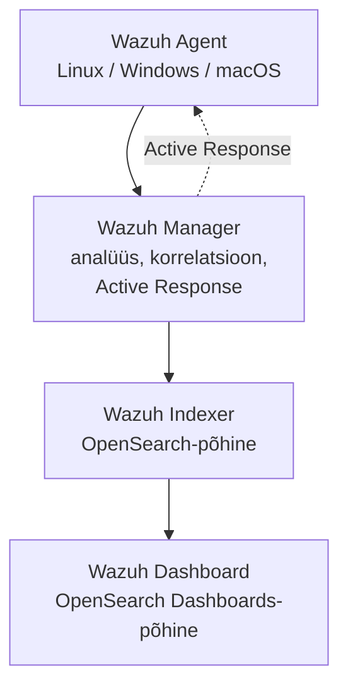

---
tags:
  - Day4
  - SIEM
  - Wazuh
  - Kafka
  - OpenSearch
  - lugemismaterjal
---

# Päev 4: Kesksed logimissüsteemid ja SIEM

**Kursus:** Kaasaegne IT-süsteemide monitooring ja jälgitavus
**Kestus:** ~45 min lugemist · pärastlõuna loeng + arutelu
**Tase:** Kesktase — eeldame, et logimine on selge (Päev 2 Loki, Päev 3 ELK + OpenSearch)
**Eeldused:** Päev 2 (Loki, label vs sisu) · Päev 3 (Elasticsearch, OpenSearch, klaster, otsing)

## 🎯 Õpiväljundid

Pärast seda loengut oskad:

- **eristada** tavalist logimist ja SIEM-i — mida SIEM logide peale juurde annab
- **paigutada** EDR, XDR, SOAR ja MDR ühte pilti (kihid, mitte konkurendid)
- **kirjeldada** Wazuhi nelja komponenti ja selgitada, kuidas Active Response töötab
- **põhjendada**, miks Kafka kesksetes logitorudes puhvrina eksisteerib
- **valida** keskse logimislahenduse vahel (Loki / ELK / OpenSearch / SIEM) oma organisatsiooni kriteeriumide alusel

---

## 1. Logist juhtumini — mida SIEM juurde annab

Päev 2 ja 3 nägid logide **kogumist ja otsimist**. Loki ütleb sulle "viis ebaõnnestunud ssh-katset hostis `web-01`". See on fakt. Aga see fakt üksinda ei ütle, kas tegu on kasutaja näpukaga või rünnakuga.

SIEM (Security Information and Event Management) võtab sama voo ja lisab **korrelatsiooni**: "juhtum #4821, kõrge prioriteet — viis ebaõnnestunud ssh-katset, järgnes edukas sisselogimine, seejärel `useradd`. Muster sobib brute-force'i ja uue konto loomisega. Reageeri." Vahe pole andmetes — vahe on selles, et SIEM teab **reegleid**, mille järgi üksikud sündmused mustriks kokku panna.

Praktikas tähendab see nelja asja peale tavalise logihalduse: logid eri allikatest kokku, **normaliseerimine** ühtsesse vormi (et `failed password` Linuxist ja `4625` Windowsist oleksid võrreldavad), **korrelatsioonireeglid**, ja **alarmid juhtumitena**, mitte üksiksündmustena. Eesti Panga või Fujitsu suuruses majas, kus NIS2 nõuab juhtumikäsitlust ja logide säilitamist, on see vahe seaduslik, mitte ainult mugavus.

---

## 2. EDR, XDR, SOAR, MDR — kihid, mitte konkurendid

Turvasõnavara plahvatab akronüümidest. Need pole üksteise asendajad, vaid eri kihid samas pildis:

| Termin | Mis | Näide |
|--------|-----|-------|
| **EDR** | Agent hosti peal, jälgib protsesse ja faile *seest* | CrowdStrike Falcon, Microsoft Defender for Endpoint |
| **SIEM** | Logid kokku, normaliseerimine, korrelatsioon, alarmid | Splunk ES, Microsoft Sentinel, Wazuh |
| **XDR** | EDR + SIEM ühes UI-s | Palo Alto Cortex, Microsoft Defender XDR |
| **SOAR** | Playbook'id, mis juhtumi peale automaatselt käivituvad (blokeeri IP, peata protsess, loo pilet) | (sageli SIEM-i moodul) |
| **MDR** | Teenus — keegi teine peab su SOC-i | (väline pakkuja) |

Tüüpiline keskmine maja: EDR + SIEM. Suuremad lisavad SOAR-i automatiseerimiseks. Need, kel pole oma 24/7 turvavalvet, ostavad MDR-i teenusena. Sysadminina kohtad kõige sagedamini SIEM-i — see on koht, kuhu su logid niikuinii voolavad.

---

## 3. Wazuh — üks avatud SIEM otsast lõpuni

Wazuh on praktiline näide, sest see on avatud lähtekoodiga ja sa nägid juba päev 3-l selle alust. **Wazuhi indekseerija on OpenSearch-põhine** — sama Lucene-mootor, mille sa eile tühja platvormina üles ehitasid. Siin näed, mis selle peal reaalselt töötab.

Neli komponenti:



**Agent** kogub endpoint'ist logid, faili-muutused, protsessid ja paketi-inventari. **Manager** võtab vastu, rakendab reegleid ja korreleerib. **Indexer** salvestab (OpenSearch). **Dashboard** on OpenSearch Dashboards-põhine — eilsest tuttav, mis aitab kohe orienteeruda.

Mida Wazuh teeb peale tavalise logikogumise:

- **FIM** (File Integrity Monitoring) — jälgib katalooge nagu `/etc` või `System32`; muutus tekitab alarmi
- **Vulnerability Detector** — vastendab paketi-inventari CVE-andmebaasiga, asendab paljudel juhtudel eraldi skaneerija
- **SCA** (Security Configuration Assessment) — kontrollib konfiguratsiooni CIS benchmark'ide vastu
- **Active Response** — mini-SOAR: reegel käivitub, server saadab agendile käsu (blokeeri IP, peata protsess)

**Active Response praktikas (tänane demo):** ründaja-VM teeb sihtmasina vastu hulga ssh-katseid. Wazuhi reegel matchib ja tekitab alarmi, mis on seotud MITRE ATT&CK tehnikaga `T1110` (Brute Force). Active Response reegel käivitub ja agent blokeerib ründaja IP — automaatselt, ilma inimese sekkumiseta. See on koht, kus logimine muutub reageerimiseks.

---

## 4. Kuidas keskset logimist või SIEM-i valida

Sa oled nüüd näinud nelja maailma: Loki (Päev 2), ELK ja OpenSearch (Päev 3), ja SIEM (täna). Need pole järjestatud "halvast paremaks" — neil on erinev fookus.

| | Fookus | Tugevus | Kompromiss |
|--|--------|---------|------------|
| **Loki** | Logid + sildid, Grafana-ökosüsteem | Odav, lihtne, mahub väikse RAM-iga | Ei tee täisteksti-otsingut sisu peal |
| **ELK / OpenSearch** | Täisindeks, analüütika | Võimas otsing ja agregeerimine | Raskem, RAM-näljane |
| **SIEM (Wazuh jt)** | Turvajuhtumid, korrelatsioon | Reeglid, ATT&CK, Active Response | Eraldi platvorm hooldada |

Valikukriteeriumid, mille järgi tööl tegelikult otsustad: **maksumus** (litsents + taristu), **keerukus** (kes seda hooldab), **skaala** (kui palju logimahtu päevas), **otsinguvõimekus** (sildi-filter vs täistekst), ja **turvafookus** (kas vajad korrelatsiooni ja juhtumikäsitlust, või piisab otsingust). Enamik maju ei vali ühte — neil on logimiseks üks ja turvaks teine, ning Kafka nende vahel puhvrina.

---

## 5. Kafka logitorudes — miks puhver

Kui logimaht kasvab — Eesti Panga või Fujitsu skaalal tuhandeid sõnumeid sekundis — tekib probleem: kui logikoguja (ELK, Loki, SIEM) hetkeks aeglustub või taaskäivitub, lähevad sõnumid kaotsi. **Kafka** istub vahel puhvrina:

```
producers (rakendused, agendid) → Kafka → consumers (ELK / Loki / SIEM)
```

Producer'id kirjutavad Kafkasse oma tempos; consumer'id loevad oma tempos. Kui consumer maas, jäävad sõnumid Kafkas alles, kuni ta naaseb. See lahti-sidumine on põhjus, miks suure mahuga logitorud on peaaegu alati Kafka peale ehitatud. Kafka installimine ja häälestamine on omaette teema — siin on oluline mõista **miks** ta torus on, mitte kuidas teda püsti panna.

---

## Kokkuvõte — mis on täna tähtis

**SIEM lisab logidele korrelatsiooni.** Logimine ütleb "viis ebaõnn katset", SIEM ütleb "juhtum, muster, reageeri".
**EDR/XDR/SOAR/MDR on kihid, mitte konkurendid.** Tüüpiline maja: EDR + SIEM.
**Wazuhi indekseerija on OpenSearch.** Eilne platvorm, tänane sisu peal.
**Active Response on mini-SOAR.** Reegel → automaatne vastus (blokeeri IP, peata protsess).
**Kafka on puhver, mitte logikoguja.** Lahti-sidumine producer'i ja consumer'i vahel suurel mahul.
**Valik sõltub fookusest.** Loki = odav logi, ELK/OS = võimas otsing, SIEM = turvajuhtumid. Kriteeriumid: maksumus, keerukus, skaala, otsing, turvafookus.

---

## 💭 Mõtle

1. Kas su organisatsioon on **NIS2** mõjualas? Kui jah — mida see logide säilitamisele ja juhtumikäsitlusele tähendab?
2. Su logid praegu — kas nad on "ainult logid" (otsid käsitsi kui midagi juhtub), või on korrelatsioon/SIEM olemas? Kui ehitaksid Wazuhi piloodi, millised hostid esimesena?
3. Kas su keskkonnas on logimahtu nii palju, et Kafka-puhver oleks õigustatud — või jõuab koguja otse vastu võtta?

---

## Allikad

### Ametlik dokumentatsioon

| Allikas | URL |
|---------|-----|
| Wazuh dokumentatsioon | <https://documentation.wazuh.com/> |
| Wazuh — Active Response | <https://documentation.wazuh.com/current/user-manual/capabilities/active-response/> |
| MITRE ATT&CK — T1110 Brute Force | <https://attack.mitre.org/techniques/T1110/> |
| Apache Kafka dokumentatsioon | <https://kafka.apache.org/documentation/> |

### Kontekst

| Allikas | URL |
|---------|-----|
| NIS2 direktiiv (EUR-Lex) | <https://eur-lex.europa.eu/eli/dir/2022/2555> |
| OpenSearch (Päev 3 side) | <https://opensearch.org/docs/latest/> |

---

*Järgmine: Päev 5 — Tempo + OpenTelemetry + LGTM kokkuvõte.*
