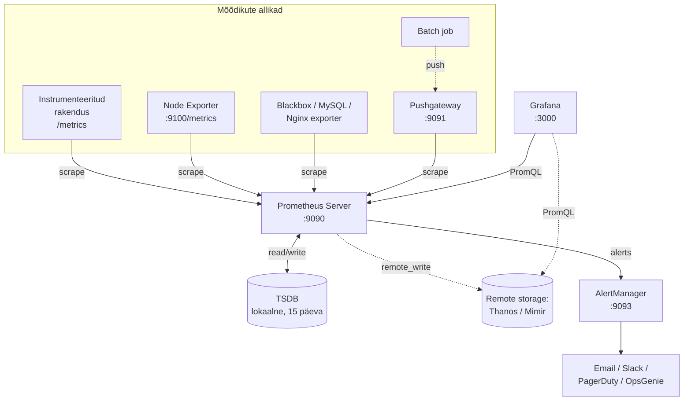
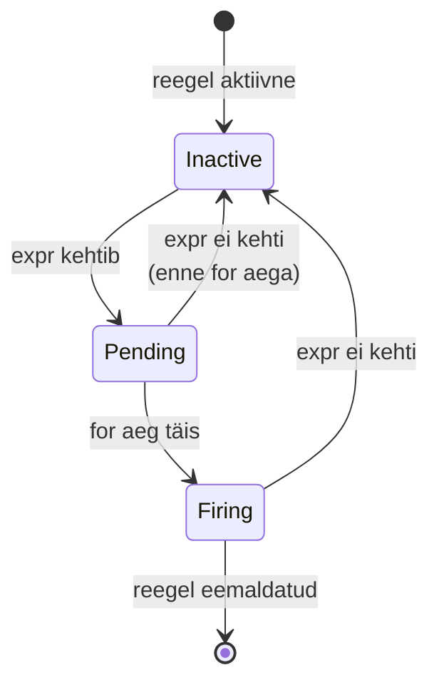

# Päev 1: Prometheus ja Grafana

**Kestus:** ~50 minutit iseseisvat lugemist
**Eeldused:** [Loeng 1: Observability](paev1-observability.md) loetud, Linux CLI põhitõed, võrgunduse alused
**Versioonid laboris:** Prometheus 3.x (LTS, november 2024+), Grafana 11.x, Alertmanager 0.27+
**Viited:** [prometheus.io/docs](https://prometheus.io/docs/) · [OpenMetrics spec](https://openmetrics.io/) · [Grafana docs](https://grafana.com/docs/grafana/latest/)

---

## Õpiväljundid

Pärast selle materjali läbitöötamist osaleja:

1. **Selgitab** Prometheuse pull-mudeli põhjuseid ja piire (sh kasutusjuhud, kus see ei sobi)
2. **Tõlgendab** aegrea andmemudelit, sealhulgas label'ite rolli ja kardinaalsuse mõju salvestuskulule
3. **Eristab** nelja mõõdikutüüpi (counter, gauge, histogram, summary) ning teab, millal kumba valida
4. **Loeb ja kirjutab** PromQL instant- ja range-vektori päringuid, rakendab `rate()`, agregeerimist ja vektorite ühildamist
5. **Konfigureerib** alert-reeglid `for:`-väljaga ja selgitab olekute `Inactive → Pending → Firing` semantikat
6. **Kavandab** Grafana dashboardi Prometheus andmeallikaga, kasutades muutujaid (variables) ja thresholds
7. **Põhjendab** millal kasutada Prometheus-e föderatsiooni, `remote_write`-i või Thanos/Mimir ökosüsteemi

---

## 1. Kontekst: miks Prometheus tekkis ja mida see lahendab

### 1.1 Tehniline kontekst

2012. aasta paiku seisis SoundCloud silmitsi skaleerumisprobleemiga. Monoliitrakendustelt liikumine mikroteenustesse lõi olukorra, kus senised seiretööriistad (Nagios, Munin, Ganglia) enam ei sobinud:

- **Konfiguratsioon oli staatiline** — igast sihtmärgist tuli manuaalselt teada anda
- **Push-mudel varjas vigu** — kui agent vaikis, polnud selge, kas probleem oli agentides, võrgus või rakenduses
- **Dimensionaalsus puudus** — mõõdikud olid nimede tasandil (`server1.cpu.idle`), mitte label'ite kaupa
- **Päringukeeled olid jäigad** — agregeerimine ja dimensionaalne analüüs olid kas puudu või aeglased

Julius Volz ja Matt T. Proud disainisid süsteemi, mis võttis vastu Google'i sisemise seiretööriista (Borgmon) põhimõtteid. 2015. aastal avaldati 1.0, 2016. aastal liitus projekt CNCF-iga Kubernetese järel teise graduated projektina, 2024. aasta novembris ilmus versioon 3.0 — esimene suur väljalase seitsme aasta jooksul.

**Meie laboris: Prometheus 3.x.** Olulised erinevused versioonist 2.x:

- UTF-8 tugi mõõdikunimedes ja label'ite väärtustes (mõjutab rahvusvahelisi deploy'e)
- Stabiilne [natiivsete histogrammide](https://prometheus.io/docs/specs/native_histograms/) tugi (v3.8 alates)
- Täiustatud OTLP (OpenTelemetry Protocol) vastuvõtt
- Mitmed PromQL paranevused vektormatchingus

### 1.2 Kus Prometheus **ei sobi**

Ootuste kalibreerimine hoiab ära hilisemad pettumused. Prometheus ei ole:

| Mida vajad | Mida kasutada |
|------------|---------------|
| Pikaajaline (aastad) mõõdikute säilitus | Thanos, Mimir, Cortex, VictoriaMetrics |
| Logihaldus ja täistekstiotsing | Loki, ELK, OpenSearch, Splunk |
| Distribueeritud jälgimine (traces) | Tempo, Jaeger, Zipkin + OpenTelemetry |
| 100% täpsusega arvestus / arveldus | Eraldi transaktsioonisüsteem (event log + OLAP) |
| Sündmuste audit (kes, mida, millal) | Auditlogimine eraldi süsteemis |
| Reaalajas (alla sekundilise latentsuse) mõõtmised | Streaming-süsteem (Kafka + Flink/Spark) |

Sellest tulenevalt kasutavad reaalsed tootmiskeskkonnad **mitut tööriista koos**. Selle kursuse viie päeva jooksul näed kõiki neid klasse.

---

## 2. Arhitektuur

Prometheus ei ole monoliitne rakendus — see on komponentide kogum, millest igaüks lahendab ühe ülesande.



### 2.1 Komponendid ja nende vastutusalad

**Prometheus Server** on kesksüda. Ta täidab nelja funktsiooni:

1. **Service discovery** — leiab, milliseid sihtmärke scrape'ida (staatiline konfiguratsioon, Kubernetes, Consul, EC2, file-based jne)
2. **Scraping** — saadab HTTP GET päringuid `/metrics` endpointile
3. **Storage** — salvestab andmed kohalikku TSDB-sse (ja/või remote storage-sse)
4. **Evaluation** — hindab alert- ja recording-reegleid regulaarselt

Vaikimisi scrape interval on 15 sekundit, alert evaluation interval sama. Need on **sõltumatud** — scrape võib toimuda sagedamini kui alert evaluation.

**Exporter-id** on tõlkijad. Süsteem (Linux kernel, MySQL, Redis) ei räägi Prometheuse keelt. Exporter on väike deemon, mis loeb süsteemi statistikat selle natiivsest liidesest (`/proc`, SNMP, SQL query, HTTP API) ja pakub seda Prometheuse tekstiformaadis `/metrics` endpointis.

Levinuimad exporterid:

| Exporter | Otstarve | Port |
|----------|----------|------|
| **node_exporter** | Linuxi host mõõdikud (CPU, mälu, ketas, võrk) | 9100 |
| **windows_exporter** | Windows-i ekvivalent | 9182 |
| **blackbox_exporter** | Välised (black-box) testid: HTTP, ICMP, TCP, DNS | 9115 |
| **mysqld_exporter** | MySQL / MariaDB | 9104 |
| **postgres_exporter** | PostgreSQL | 9187 |
| **nginx-prometheus-exporter** | Nginx stub_status | 9113 |
| **cadvisor** | Docker konteinerite mõõdikud | 8080 |
| **kube-state-metrics** | Kubernetese objektide olek | 8080 |

**Pushgateway** on erijuhtum — ainult lühiajaliste batch-tööde jaoks. Cronjob, mis käivitub 30 sekundiks ja lõpeb, ei jõua Prometheuse scrape'i oodata. Batch-töö saadab oma mõõdikud Pushgateway'le, Prometheus loeb neid sealt. Tähtis: **see ei ole üldine push-API** — Pushgateway hoiab viimast talle saadetud väärtust tähtajatult, kuni keegi ei kustuta.

> **Ametlik hoiatus ([When to use the Pushgateway](https://prometheus.io/docs/practices/pushing/)):** enamikus olukordades on Pushgateway anti-muster. Kui sul on pikaajaline teenus — lisa sinna `/metrics` endpoint ja lase Prometheusel seda scrape'ida.

**AlertManager** tegeleb **kõigega pärast** alerti tuvastamist:

- **Deduplikatsioon** — sama alert mitmest Prometheuse instantsist → üks teavitus
- **Grupeerimine** — kümme seotud alerti → üks kokkuvõttev teade
- **Marsruutimine** — andmebaasialertid DBA meeskonnale, võrgu omad võrgumeeskonnale
- **Summutamine (silencing)** — planeeritud hooldus → ignoreerida X tundi
- **Inhibeerimine** — kui DC on maas, ära saada iga üksiku teenuse alertit

**Grafana** on eraldiseisev projekt (Grafana Labs), mitte osa Prometheuse ökosüsteemist. Prometheusel on oma minimalistlik UI, aga tootmises kasutatakse peaaegu alati Grafanat.

### 2.2 Pull-mudel: disainivalik ja selle tagajärjed

Küsimus "kumb on parem — pull või push?" ei ole ühene. Prometheus valib pull-i ja see valik kannab konkreetseid tagajärgi.

| Aspekt | Pull (Prometheus) | Push (Zabbix agent, Graphite) |
|--------|-------------------|------------------------------|
| **Sihtmärkide registreerimine** | Tsentraalne (scrape_configs või SD) | Iga agent teab serveri aadressi |
| **"Kas mu agent töötab?"** | `up == 0` kohe nähtav | Võib jääda märkamatuks |
| **Debug** | `curl /metrics` annab sama pildi mida Prometheus näeks | Vaja uurida agendi logisid |
| **Firewall** | Prometheus peab sihtmärgini jõudma | Agent peab serverini jõudma |
| **NAT-i taga sihtmärgid** | Problemaatiline (vaja reverse proxy) | Töötab otse |
| **Üürike batch-töö** | Vaja Pushgateway'd | Loomulik sobivus |
| **Kardinaalsuse kontroll** | Server määrab sagedust ja sihtmärke | Iga agent võib kaos tekitada |

**Operatiivne tagajärg:** pull-mudel teeb `up` mõõdiku esimeseks diagnostikatööriistaks. Kui `up == 0`, tead kohe, et Prometheus ei suutnud sihtmärgiga kontakti saada. See `up` ei pärine sihtmärgist endast — Prometheus genereerib selle ise iga scrape-i tulemusena.

---

## 3. Aegrea andmemudel

Iga **aegrida** (time series) Prometheuses on unikaalselt identifitseeritud mõõdiku nime ja label'ite kombinatsiooni poolt.

```
http_requests_total{method="POST", handler="/api/users", status="201"} 1543 @1713436800
│                  │                                                     │     │
└── mõõdiku nimi   └── label'id (key-value)                               │     └── ajatempel (Unix ms)
                                                                          └── väärtus (float64)
```

Oluline: **erinev label'ite kombinatsioon loob uue aegrea.** Kaks järgmist rida on erinevad aegread:

```
http_requests_total{method="GET",  status="200"}   — aegrida A
http_requests_total{method="POST", status="200"}   — aegrida B
```

### 3.1 Label'id — jõud ja oht

Label'id võimaldavad ühe mõõdiku all esitada tuhandeid dimensioonilisi variante:

```
http_requests_total
         │
         ├── {method="GET",  status="200"}  ─── aegrida #1
         ├── {method="GET",  status="500"}  ─── aegrida #2
         ├── {method="POST", status="201"}  ─── aegrida #3
         └── {method="POST", status="500"}  ─── aegrida #4
```

**Kardinaalsus** (cardinality) = unikaalsete aegridade arv ühe mõõdiku kohta. See on Prometheuse produktsioonis peamine probleem #1.

**Reegel:** iga label peab olema madala kardinaalsusega ja piiratud väärtuste hulgaga.

| ✅ Sobivad label'id | ❌ Ei tohi label'iks panna |
|--------------------|---------------------------|
| `method` (GET, POST, ...) — ~5 väärtust | `user_id` — miljonid |
| `status_code` — ~40 võimalikku | `email`, `ip_address` |
| `environment` (prod, staging, dev) | `request_id`, `trace_id` |
| `region` (eu-north-1, ...) | Täielik URL (teekonna parameetritega) |
| `service` (auth, billing, ...) | Ajatempel / kellaaeg |

**Ressursikulu ligikaudu:** iga aegrida tarbib ~3 kB RAM-i (aktiivses olekus) ja ~1-3 baiti mõõtmise kohta (kokkupakituna kettal). Kui üks mõõdik on 100 000 aegrida × 15 sekundi interval × 24h = palju. Prometheus 2.x default [sample_limit](https://prometheus.io/docs/prometheus/latest/configuration/configuration/#scrape_config) on piiramatu — vaja on käsitsi seada, et kaitsta serverit kardinaalsuse plahvatuse eest.

### 3.2 Hea label'i disaini reegleid

1. **Ära kasuta label'eid üksiku üksuse identifitseerimiseks.** Unikaalsed ID-d kuuluvad logidesse.
2. **Konstantne aja jooksul.** Kui label väärtus muutub tihti (nt versiooni string rakenduse iga deploy-ga), tekib aegridade plahvatus.
3. **Äriloogika kuulub mõõdiku sisse, mitte label'ite nime.** `requests_total{type="login"}`, mitte `login_requests_total`.
4. **Piira kardinaalsust sihtmärgi poolel.** Rakenduste instrumentaalne kood peab teadma, millised label-väärtused on lubatud.

---

## 4. Mõõdikutüübid

Prometheus toetab nelja põhitüüpi. Valik mõjutab nii salvestust kui ka seda, milliseid PromQL operatsioone saab rakendada.

### 4.1 Counter — ainult kasvav

Näited: `http_requests_total`, `node_cpu_seconds_total`, `process_cpu_seconds_total`.

Counter nullistub ainult protsessi taaskäivitamisel. PromQL-i funktsioonid (`rate()`, `increase()`) tuvastavad selle automaatselt ja käsitlevad õigesti.

**Konventsioon:** counter'i nimi lõpeb tavaliselt `_total`-iga. OpenMetrics spec ([openmetrics.io](https://openmetrics.io/)) formaliseerib selle.

### 4.2 Gauge — vabalt liikuv

Näited: `node_memory_MemAvailable_bytes`, `node_filesystem_free_bytes`, `go_goroutines`, temperatuur, kasutajate arv.

Gauge'iga kasutad väärtust otse — ei mingit `rate()`. Agregeerimisel (nt `avg`, `sum`) tuleb ise aru saada, kas see on semantiliselt õige.

### 4.3 Histogram — jaotus bucket'ites

Histogram mõõdab **jaotust**, mitte ühte väärtust. Tüüpiline kasutus: vastamisaeg, päringu suurus.

Histogram exposes kolme aegrida perekonda:

```
http_request_duration_seconds_bucket{le="0.1"}   — mitu päringut alla 100ms
http_request_duration_seconds_bucket{le="0.5"}   — mitu alla 500ms
http_request_duration_seconds_bucket{le="1.0"}   — mitu alla 1s
http_request_duration_seconds_bucket{le="+Inf"}  — kõik (sama mis _count)
http_request_duration_seconds_count              — päringute arv kokku
http_request_duration_seconds_sum                — kõikide kestuste summa
```

`le` = less than or equal, bucket'i ülemine piir.

**Protsentiilid arvutad serveri pool agregeeritud andmetest:**

```promql
histogram_quantile(0.95,
  sum by(le, service) (rate(http_request_duration_seconds_bucket[5m]))
)
```

**Eelis:** histogrammid on **agregeeritavad üle instanside**. Kui sul on 10 serverit, saad kõigi koondp95 välja arvutada.

**Bucket'ite valik on kriitiline.** Vaikimisi Prometheus'e klient-teekides on [`0.005, 0.01, 0.025, 0.05, 0.1, 0.25, 0.5, 1, 2.5, 5, 10`] sekundit. Kui su teenus vastab 50-200 ms-ga, pole enamik neist bucket'eist kasutatavad. Kohanda vastavalt SLO-le.

### 4.4 Summary — kliendipoolsed protsentiilid

Summary arvutab protsentiilid **klient-rakenduses endas**:

```
rpc_duration_seconds{quantile="0.5"}   0.012
rpc_duration_seconds{quantile="0.95"}  0.089
rpc_duration_seconds{quantile="0.99"}  0.234
rpc_duration_seconds_count             14521
rpc_duration_seconds_sum               78.3
```

**Piirang:** summary **ei ole agregeeritav üle instanside.** Kahe serveri p95 keskmine ≠ koondp95.

**Reegel:** eelista histogrammi, välja arvatud siis, kui vajad kõrget protsentiilide täpsust ja kõik päringud käivad ühe instansi kaudu.

### 4.5 Natiivsed histogrammid (Prometheus 3.x)

Klassikalise histogrammi puudus on **bucket'ite staatilisus** — valid valed piirid ja su andmed on kasutud. Natiivne histogramm (Prometheus 3.8+ stabiilne) lahendab selle: bucket'ite piirid tuletatakse automaatselt eksponentsiaalse skaala järgi.

```promql
histogram_quantile(0.95, sum(rate(http_request_duration_seconds[5m])))
```

Märka: `_bucket` sufiks puudub. Native histogrammid on tulevik, aga ökosüsteem (klient-teegid, dashboard template'id) on veel mõlemaga ühilduv. Vaata [spetsifikatsiooni](https://prometheus.io/docs/specs/native_histograms/).

---

## 5. `/metrics` endpoint ja exposition format

Prometheus ei räägi oma protokolli — ta loeb lihtsat tekstiformaati HTTP kaudu.

```
# HELP http_requests_total Kõik vastu võetud HTTP päringud.
# TYPE http_requests_total counter
http_requests_total{method="GET",handler="/api/users",status="200"} 1543
http_requests_total{method="POST",handler="/api/users",status="201"} 217

# HELP node_memory_MemAvailable_bytes Memory information field MemAvailable.
# TYPE node_memory_MemAvailable_bytes gauge
node_memory_MemAvailable_bytes 4.147483648e+09
```

Metadata read:

- `# HELP <nimi> <kirjeldus>` — inimloetav selgitus
- `# TYPE <nimi> <tüüp>` — üks neljast tüübist

Formaat on spetsifitseeritud OpenMetrics-is ([openmetrics.io](https://openmetrics.io/)), mis on CNCF-i projekt. Ajalooliselt oli see Prometheuse-spetsiifiline; nüüd on see laiem standard, mida järgivad ka teised süsteemid (OpenTelemetry).

Kontrolli sihtmärki käsurealt:

```bash
curl -s http://localhost:9100/metrics | head -30
```

See annab täpselt sama pildi, mida Prometheus scrape-imisel näeks.

---

## 6. PromQL — päringukeel

PromQL on deklaratiivne keel aegrea andmete päringuteks. Erineb SQL-ist fundamentaalselt — töötab vektoritega, mitte ridadega.

### 6.1 Instant vs range vektor

**Instant vektor** — väärtused **ühel ajahetkel** (praegu või `@` operaatoriga ajaloo hetkel):

```promql
node_cpu_seconds_total{mode="idle"}
```

Tagastab n-aegrida × üks väärtus = vektor.

**Range vektor** — väärtused **ajavahemiku kohta**, iga aegrea jaoks rida väärtusi:

```promql
node_cpu_seconds_total{mode="idle"}[5m]
```

Tagastab n-aegrida × m-väärtust akna kohta.

**Funktsioonid nagu `rate()` võtavad range vektori ja tagastavad instant vektori.**

### 6.2 Filtreerimine label'ite järgi

```promql
http_requests_total{status="500"}              # täpne vaste
http_requests_total{status!="200"}             # mitte võrdne
http_requests_total{status=~"5.."}             # regex — kõik 5xx
http_requests_total{status!~"2..|3.."}         # mitte 2xx/3xx
```

Erijuhud:

- `{}` ilma label'iteta ei ole lubatud (peab olema vähemalt üks matcher)
- Mõõdiku nimi on tegelikult sisemine label `__name__`. Seega `http_requests_total{}` = `{__name__="http_requests_total"}`

### 6.3 `rate()` — counter'i kasvukiirus

Counter'i absoluutväärtus (nt 1 543 892) ei ütle midagi kasulikku. `rate()` arvutab **keskmise muutuse sekundis** ajaakna jooksul:

```promql
# Päringuid sekundis, keskmine viimase 5 minuti jooksul
rate(http_requests_total[5m])
```

**Reegel:** aja-aken peab olema **vähemalt 4× scrape interval**. 15-sekundilise scrape-iga `[1m]` on minimaalselt toimiv (4 mõõtmist), `[5m]` annab silutud graafiku. Liiga kitsas aken → tühi tulemus või mürarikas graafik.

**`rate()` vs `irate()` vs `increase()`:**

| Funktsioon | Mida teeb | Millal kasutada |
|------------|-----------|-----------------|
| `rate(x[5m])` | Keskmine / sek üle 5 min | Dashboardid, alert-id, üldine trend |
| `irate(x[5m])` | Kiirus viimase kahe mõõtmise vahel | Kitsa resolutsiooniga graafikud, spike'ide tuvastus — aga mürarikkam |
| `increase(x[5m])` | Kogukasv 5 min jooksul (sek-i asemel) | "Mitu päringut viimase 5 minutiga tuli?" |

### 6.4 Agregeerimine

```promql
# Kõigi instanside summa
sum(rate(http_requests_total[5m]))

# Grupeeritud status-koodi järgi (by säilitab ainult nimetatud label'id)
sum by(status) (rate(http_requests_total[5m]))

# Grupeeritud, välja arvatud instance (without eemaldab nimetatud label'id)
sum without(instance) (rate(http_requests_total[5m]))
```

Agregeerimisoperatorid: `sum`, `min`, `max`, `avg`, `stddev`, `stdvar`, `count`, `count_values`, `bottomk`, `topk`, `quantile`, `group`.

**Top 5 kõige koormatum endpoint:**

```promql
topk(5, sum by(handler) (rate(http_requests_total[5m])))
```

### 6.5 Binaarsed operaatorid ja vektor-matching

Kahe vektori kombineerimine vajab **matching reegleid**. Vaikimisi ühildatakse kõikide label'ite järgi, mis mõlemal pool on.

```promql
# Näide: veaprotsent = vead / koguarv
sum by(service) (rate(http_requests_total{status=~"5.."}[5m]))
/
sum by(service) (rate(http_requests_total[5m]))
```

Mõlemas vektor-väljendis on sama label `service` — need ühildatakse automaatselt.

**Kui label'id erinevad**, kasuta `on(...)` või `ignoring(...)`:

```promql
instance_cpu_cores * on(instance) group_left node_load1
```

`group_left` / `group_right` võimaldavad ühildada n-to-1 (üks pool on "paljudega" pool). See on PromQL-i rikkalikum osa — detailid dokus: [Vector matching](https://prometheus.io/docs/prometheus/latest/querying/operators/#vector-matching).

### 6.6 CPU kasutuse klassikaline päring

```promql
100 - (
  avg by(instance) (
    rate(node_cpu_seconds_total{mode="idle"}[5m])
  ) * 100
)
```

Lugemine samm-sammult:

1. `node_cpu_seconds_total{mode="idle"}` — counter iga (instance, cpu) jaoks, ainult idle-aeg
2. `[5m]` — range vektor
3. `rate(... [5m])` — keskmine idle-sekundit sekundis (0-1 vahel)
4. `avg by(instance) (...)` — keskmine üle kõigi CPU-de ühe masina kohta
5. `* 100` — protsent idle
6. `100 - ...` — protsent kasutuses

### 6.7 Histogram päringud

P95 latentsus iga teenuse kohta:

```promql
histogram_quantile(0.95,
  sum by(service, le) (
    rate(http_request_duration_seconds_bucket[5m])
  )
)
```

Kriitiline: `le` peab säilima `by` klauslis, muidu `histogram_quantile` ei saa bucketteid õigesti töödelda.

### 6.8 Recording rules — eelarvutus

Keerulised päringud on aeglased. Recording rule arvutab tulemuse regulaarselt ja salvestab selle uue aegreana:

```yaml
# recording.rules.yml
groups:
  - name: recording_examples
    interval: 30s
    rules:
      - record: instance:node_cpu_utilization:ratio
        expr: 1 - avg by(instance) (rate(node_cpu_seconds_total{mode="idle"}[5m]))

      - record: service:http_error_rate:ratio
        expr: |
          sum by(service) (rate(http_requests_total{status=~"5.."}[5m]))
          /
          sum by(service) (rate(http_requests_total[5m]))
```

**Konventsioon nimetuses** (Prometheus doc-ist): `level:metric:operation` — `instance:node_cpu_utilization:ratio` tähendab "per-instance näitaja, CPU kasutus, suhe 0-1".

Kasu: Grafana dashboard, mis päringut korduvalt teeb, saab tuhandeid kordi kiiremini kasutada eelarvutatud mõõdikut.

---

## 7. Alerting

### 7.1 Alert-reegli anatoomia

```yaml
groups:
  - name: node_health
    interval: 30s
    rules:
      - alert: HighCpuUsage
        expr: 100 - (avg by(instance) (rate(node_cpu_seconds_total{mode="idle"}[5m])) * 100) > 80
        for: 2m
        labels:
          severity: warning
          team: platform
        annotations:
          summary: "Kõrge CPU: {{ $labels.instance }} ({{ $value | printf \"%.0f\" }}%)"
          runbook_url: "https://wiki.example.com/runbooks/high-cpu"
```

**Väljade selgitus:**

- `alert` — unikaalne nimi
- `expr` — PromQL-väljend; kui tagastab tühja vektori, tingimus ei kehti; kui tagastab vähemalt ühe rea, iga sellest rea label'ite kombinatsioon on eraldi aktiivne alert
- `for` — kestus, mille jooksul `expr` peab katkematult tõene olema enne Firing oleku algust
- `labels` — staatilised label'id, mis lisatakse alertile (AlertManager kasutab neid marsruutimiseks)
- `annotations` — inimloetavad väljad; `{{ $labels.X }}` ja `{{ $value }}` on Go template süntaks

### 7.2 Oleku üleminekud



**`for:` on kriitiline valehäirete vältimiseks.** Ilma `for:`-ta saadab Prometheus alerti iga 15-sekundilise spike peale. Praktikas: `for: 1m` minimaalne, `for: 5m-10m` tüüpiline.

### 7.3 Alert-design parimad praktikad

1. **Iga alert peab olema actionable.** Kui sa ei tea, mida teha, kui alert saabub — see on vale alert.
2. **Symptom-based, not cause-based.** Kasutaja probleem (kõrge vastamisaeg) on parem alert kui süsteemi detail (CPU 90%).
3. **Severity hierarhia** — `critical` (äratab öösel), `warning` (hommikuks Slack), `info` (dashboard).
4. **Runbook igal alertil.** `annotations.runbook_url` viitab wikile, kus on sammud lahendamiseks.
5. **Alert fatigue on reaalne.** Kui alert on regulaarne "müra", meeskond lakkab vastamast **kõigile** alert-itele.

[Google SRE raamat, peatükk 6](https://sre.google/sre-book/monitoring-distributed-systems/) on selles vallas viidatuim allikas.

---

## 8. AlertManager

AlertManager on eraldi protsess. Prometheus saadab alertid HTTP POST-iga AlertManagerile, kes teeb ülejäänu.

### 8.1 Marsruutimispuu

```yaml
route:
  receiver: 'default'
  group_by: ['alertname', 'cluster']
  group_wait: 30s
  group_interval: 5m
  repeat_interval: 4h
  routes:
    - match:
        severity: critical
      receiver: 'pager'
      continue: true
    - match:
        team: database
      receiver: 'dba-slack'
    - match_re:
        service: ^(frontend|cdn)$
      receiver: 'web-team'

receivers:
  - name: 'default'
    email_configs:
      - to: 'devops@example.com'
  - name: 'pager'
    pagerduty_configs:
      - service_key: '<key>'
  - name: 'dba-slack'
    slack_configs:
      - channel: '#db-alerts'
        api_url: '<webhook>'
```

**Mõisted:**

- **`group_by`** — kogub samasse gruppi alertid, millel on need label'id võrdsed
- **`group_wait`** — esimene teavitus saadetakse pärast seda ooteaega (et grupp jõuaks täituda)
- **`group_interval`** — uue alerti lisamine olemasolevasse gruppi ootab vähemalt nii kaua
- **`repeat_interval`** — kui alert pole lahendatud, korda teavitust iga `repeat_interval` tagant

### 8.2 Silencing ja inhibition

**Silencing** — ajutine alert-i ignoreerimine. UI kaudu või API-ga. Kasutus: planeeritud hooldus, teadaolev probleem.

**Inhibition** — kui üks alert on aktiivne, summuta teised sõltuvad alertid automaatselt.

```yaml
inhibit_rules:
  - source_match:
      severity: critical
      alertname: DatacenterDown
    target_match:
      severity: warning
    equal: ['datacenter']
```

Lugemine: "Kui `DatacenterDown` (critical) on aktiivne, summuta kõik `warning`-alertid samast datacentrist."

---

## 9. Grafana

Prometheus ise pakub minimalistliku UI päringuteks (`/graph` endpoint), aga see on tööriist arendusele, mitte dashboard'iks. Grafana on visualiseerimiskiht, mis ühendab **mitut andmeallikat samas dashboardis** — Prometheus mõõdikud, Loki logid, Tempo trace-id, ärimõõdikud SQL-andmebaasist.

### 9.1 Põhimõisted

**Data source** — ühendus välise andmesüsteemiga. Igal tüübil on oma plugin, mis teab protokolli ja päringukeelt (PromQL Prometheusele, LogQL Lokile, SQL andmebaasile).

**Dashboard** — konteiner paneelide ja muutujate jaoks. JSON-fail, mida saab Git-iga versioneerida.

**Panel** — üks visualiseering. Kolm etappi ([Grafana dashboards overview](https://grafana.com/docs/grafana/latest/fundamentals/dashboards-overview/)):

```
[Andmeallikas] → [Query] → [Transform] → [Visualization]
   (plugin)      PromQL    kombineerimine  graafik, tabel,
                                           gauge, stat...
```

**Variable** — muudab dashboardi dünaamiliseks. Nt `$instance` muutuja täitub päringust `label_values(up, instance)`; kasutaja valib dropdownist, kõik paneelid filtreeruvad automaatselt.

**Annotation** — ajaline märge. Näiteks deploy sündmused, intsidentide algus — kuvatakse kõigil paneelidel vertikaaljoontena.

### 9.2 Visualiseeringute valik

| Tüüp | Millal kasutada |
|------|----------------|
| **Time series** | Trendid ajas — CPU, mälu, latentsus, päringusagedus |
| **Stat** | Üks hetkenumber — aktiivsed kasutajad, SLO staatus |
| **Gauge** | Protsent piiri lähenemisega — ketta täituvus |
| **Bar gauge** | Võrdlus kategooriate vahel — top-k ressursitarbijad |
| **Table** | Mitmedimensiooniline detail — kõikide instanside olek |
| **Heatmap** | Jaotus ajas — latentsuse histogramm |
| **Logs** | Loki logid koos metrics-paneeliga |
| **Trace** | Tempo / Jaeger trace-id |

### 9.3 Dashboard-as-Code

Grafana dashboard on JSON. Head praktikad:

1. **Versioneeri dashboardid Git-is.** Iga muudatus läbib code review.
2. **Kasuta provisioning'ut.** `provisioning/dashboards/*.yaml` laeb käivitusel automaatselt.
3. **Abstraheeri datasource.** Dashboard kasutab muutujat `${DS_PROMETHEUS}`, mitte kõvakodeeritud UID-d — sama dashboard töötab dev/staging/prod.
4. **Grafonnet / Jsonnet** keerukate dashboardide jaoks. Aga algajale piisab JSON-failist.

### 9.4 Alerting Grafanas vs Prometheuses

Grafana 8+ toob unified alerting — saad defineerida alerti otse dashboardist. Kumba eelistada?

| Kriteerium | Prometheus + AlertManager | Grafana alerting |
|------------|---------------------------|------------------|
| Infrastructure-as-code | Loomulik — YAML Git-is | Võimalik, aga vähem verbose |
| Dashbord-põhine iteratsioon | Vaja eraldi faili muuta | Kõik UI-s |
| Mitmikallika alertid | Ei saa (ainult PromQL) | Jah (PromQL + SQL + Loki kombineeritud) |
| Ökosüsteem (awesome-prometheus-alerts jne) | Suur | Väiksem |
| Tootmissüsteemi standard | Domineeriv | Kasvab |

Praktikas kasutatakse sageli mõlemat — kriitilised süsteemialertid Prometheus-es (versioneeritud), ärianalüütika-alertid Grafanas.

---

## 10. Skaleerimine ja säilitus

### 10.1 Kohaliku TSDB piirangud

Prometheus TSDB on optimeeritud kirjutamiseks ja hiljutiseks päringuteks. Piirangud:

- **Retention vaikimisi 15 päeva** (seadistatav `--storage.tsdb.retention.time=1y`)
- **Üks Prometheus = üks kirjutushetk** — skaleerub vertikaalselt, aga mitte horisontaalselt
- **Ei replikeeri** — kui serveri ketas lendab, andmed kaovad
- **Päring läheb aeglaseks** kui aegridu on miljoneid

### 10.2 Skaleerimismustrid

**Föderatsioon** — väiksem Prometheus scrape-ib suuremat:

```yaml
scrape_configs:
  - job_name: 'federate'
    scrape_interval: 15s
    honor_labels: true
    metrics_path: '/federate'
    params:
      'match[]':
        - '{job="critical-service"}'
    static_configs:
      - targets: ['prod-prom-1:9090']
```

Klassikaline kasutus: iga datacentri Prometheus scrape-ib kohalikku, tsentraalne Prometheus scrape-ib datacentrite Prometheus-eid (ainult agregeeritud mõõdikuid).

**`remote_write`** — Prometheus kirjutab ka eksternsesse salvestusse (Thanos, Mimir, Cortex, VictoriaMetrics):

```yaml
remote_write:
  - url: "https://mimir.example.com/api/v1/push"
    basic_auth:
      username: "user"
      password_file: "/etc/secrets/mimir-password"
```

**Thanos / Mimir / Cortex** — horisontaalselt skaleeruvad lahendused, mis kasutavad object storage-t (S3, GCS) pikaajaliseks säilitamiseks.

| Lahendus | Päritolu | Iseloomulik |
|----------|----------|-------------|
| **Thanos** | Improbable, CNCF | Sidecar-põhine, integreerub olemasoleva Prometheus-ega |
| **Mimir** | Grafana Labs | Cortex'i hark; pull-põhine nagu Prometheus ise |
| **Cortex** | Algne CNCF | Mimir'i alus; multi-tenant |
| **VictoriaMetrics** | VictoriaMetrics Inc | Mitte-CNCF; fookuses on jõudlus ja ressursitõhusus |

### 10.3 Praktiline orientatsioon

- **Kuni ~1M aktiivset aegrida, retention 15 päeva** → üks Prometheus piisab
- **1M–10M aegrida, retention kuni 1 aasta** → Prometheus + `remote_write` Thanos/Mimir'isse
- **>10M aegrida, multi-tenancy vajalik** → natiivne Mimir/Cortex

---

## 11. Kokkuvõte

**Peamised mõisted, mida peab meeles pidama:**

- **Pull-mudel ja `up` mõõdik** — esimene diagnostikatööriist, kui midagi ei tööta
- **Label'id ja kardinaalsus** — võimsus, mis muutub kiiresti koormaks; hoia label'ite hulka <10
- **Counter vajab `rate()`** — ilma selleta on absoluutarv kasutu
- **`rate([5m])` aken** peab olema ≥4× scrape interval
- **Histogram > Summary** — agregeeritav üle instanside
- **`for:` alert-reeglites** — väldib valehäireid mööduvate spike'ide korral
- **Recording rules** — keeruliste päringute eelarvutus, kriitiline dashboardide jõudluse jaoks
- **Grafana ei salvestata andmeid** — ta ainult küsib neid andmeallikatelt

**Järgmine samm:** [Päev 1 labor](../../labs/01_prometheus_grafana/lab.md) — ehita töötav stack, kirjuta esimesed PromQL päringud, seadista alert mis käivitub.

---

## Enesekontrolli küsimused

1. Milline on pull-mudeli peamine operatiivne eelis push-mudeli ees?
2. Miks on `user_id` halb label? Mis juhtuks kui selle lisaksid?
3. Kirjuta PromQL päring, mis näitab veaprotsendi (5xx/kogusumma) iga teenuse kohta viimase 5 minuti jooksul.
4. Mis on erinevus `rate()` ja `irate()` vahel? Millal kumba eelistad?
5. Mida teeb `for: 5m` alert-reeglis ja miks see kriitiline on?
6. Kui sul on 10 serverit, iga väljastab summary-d `rpc_duration_seconds{quantile="0.95"}`. Kas saad arvutada koond-p95? Miks / miks mitte?
7. Millal eelistad föderatsiooni ja millal `remote_write`-i?

---

## Viited ja süvendatud lugemine

### Ametlik dokumentatsioon

| Allikas | Miks lugeda |
|---------|-------------|
| [Prometheus Docs — Introduction](https://prometheus.io/docs/introduction/overview/) | Lähtepunkt kõigele |
| [Data Model](https://prometheus.io/docs/concepts/data_model/) | Label'ite ja aegrea sügavam selgitus |
| [Metric Types](https://prometheus.io/docs/concepts/metric_types/) | Counter, gauge, histogram, summary ametlikult |
| [PromQL basics](https://prometheus.io/docs/prometheus/latest/querying/basics/) | Keele formaalne määratlus |
| [PromQL operators](https://prometheus.io/docs/prometheus/latest/querying/operators/) | Vector matching, group_left/right |
| [Best practices — Histograms](https://prometheus.io/docs/practices/histograms/) | Miks Histogram > Summary |
| [When to use the Pushgateway](https://prometheus.io/docs/practices/pushing/) | Pushgateway anti-muster |
| [AlertManager](https://prometheus.io/docs/alerting/latest/alertmanager/) | Routing, grouping, silencing |
| [Prometheus 3.0 release](https://prometheus.io/blog/2024/11/14/prometheus-3-0/) | V2 → V3 migratsioon |
| [Native Histograms](https://prometheus.io/docs/specs/native_histograms/) | Tuleviku histogrammi spetsifikatsioon |
| [OpenMetrics spec](https://openmetrics.io/) | Exposition formaadi standard |

### Grafana

| Allikas | Miks lugeda |
|---------|-------------|
| [Dashboards overview](https://grafana.com/docs/grafana/latest/fundamentals/dashboards-overview/) | Kolm etappi: plugin → query → transform |
| [Panels and visualizations](https://grafana.com/docs/grafana/latest/panels-visualizations/) | Kõik visualiseeringutüübid |
| [Variables](https://grafana.com/docs/grafana/latest/dashboards/variables/) | Dünaamilised dashboardid |
| [Grafana alerting](https://grafana.com/docs/grafana/latest/alerting/) | Unified alerting |
| [Provisioning](https://grafana.com/docs/grafana/latest/administration/provisioning/) | Dashboard-as-Code |

### Tootmiskogemus

| Allikas | Miks lugeda |
|---------|-------------|
| [Google SRE raamat — peatükk 6](https://sre.google/sre-book/monitoring-distributed-systems/) | Four Golden Signals, alert-disaini filosoofia |
| [Awesome Prometheus alerts](https://samber.github.io/awesome-prometheus-alerts/) | Production-valmis alert-reeglid |
| [Node Exporter Full (ID 1860)](https://grafana.com/grafana/dashboards/1860) | Kõige kasutatum referents-dashboard |
| [PromLabs training](https://training.promlabs.com/) | Julius Volz (Prometheus looja) kursused |
| [PromQL cheat sheet](https://promlabs.com/promql-cheat-sheet/) | Prindi välja, hoia laua peal |
| [Cortex, Mimir, Thanos compared](https://grafana.com/blog/2022/04/19/cortex-vs-mimir-vs-thanos-why-grafana-mimir/) | Otsuspuu skaleerimisel |
