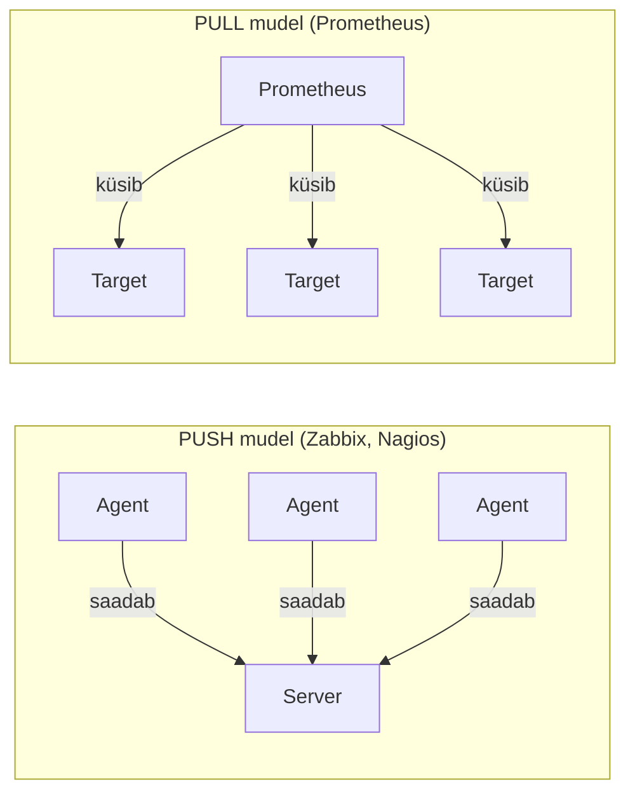
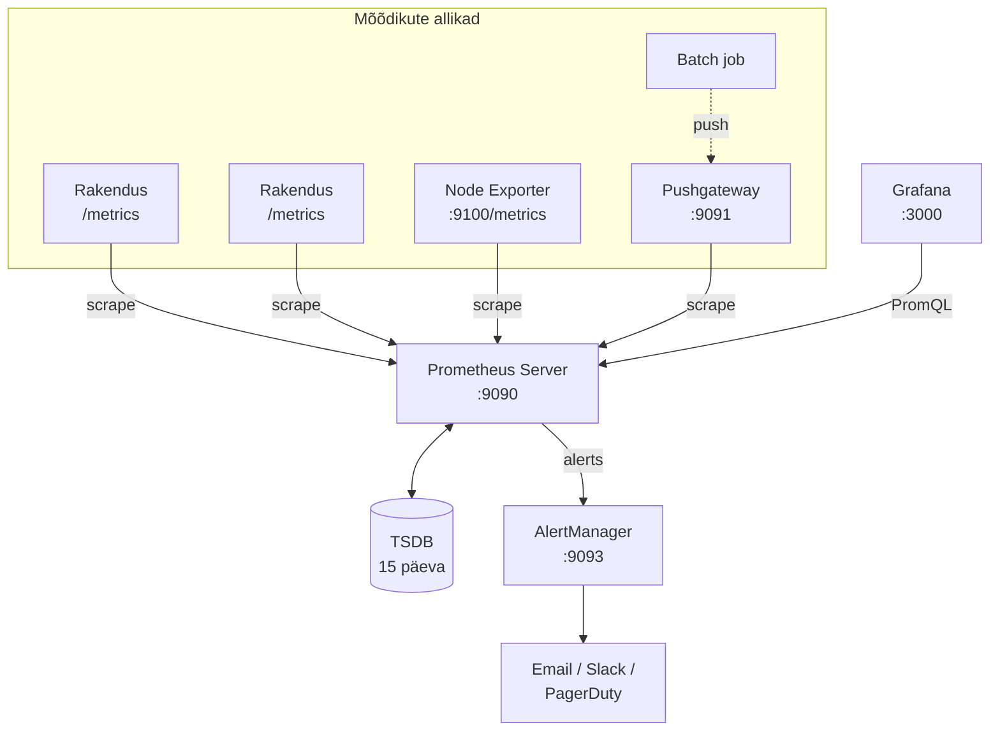
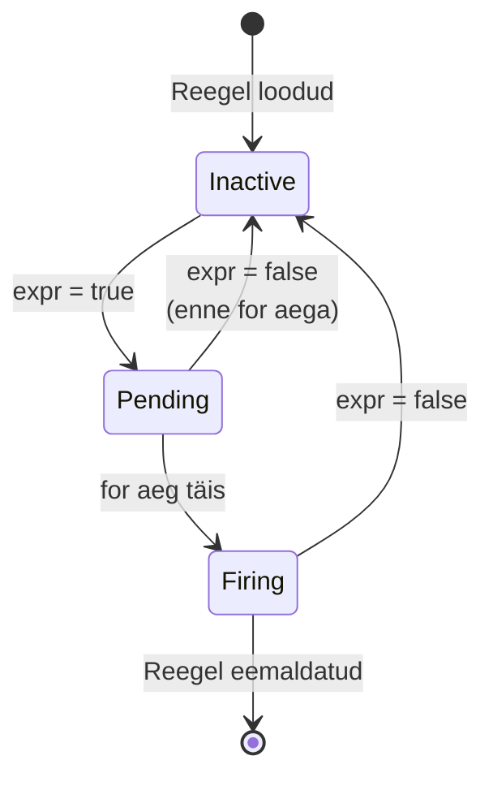
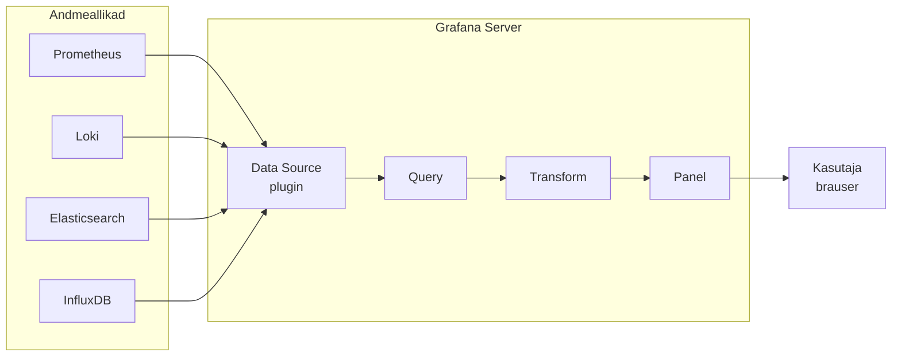

# Päev 1: Prometheus ja Grafana

*Iseseisev lugemine enne labi*

**Eeldused:** [Observability loeng](paev1-observability.md) loetud
**Dokumentatsioon:** [prometheus.io](https://prometheus.io) · [grafana.com/docs](https://grafana.com/docs/) · [PromLabs Training](https://training.promlabs.com/)
**Versioon:** Prometheus 3.x (meie laboris), Grafana 11.x

---

## Õpiväljundid

Pärast seda loengut:

- Mõistad, miks Prometheus loodi ja milliseid probleeme see lahendab
- Oskad selgitada, kuidas Prometheus erineb traditsioonilistest seiretööriistadest
- Tead, millal Prometheus sobib ja millal mitte
- Mõistad aegrea andmemudelit ja label'ite tähtsust
- Oskad lugeda lihtsamaid PromQL päringuid
- Tead, kuidas hoiatused töötavad
- Mõistad Grafana rolli ja põhimõisteid (data source, dashboard, panel, variables)

---

## Sissejuhatus: Miks Me Seda Vajame?

Alustame küsimusega: miks me üldse vajame Prometheust? Kas pole Nagios, Zabbix ja teised tööriistad juba olemas?

### Mikroteenuste probleem

2010. aastatel hakkas toimuma suur muutus: monoliitrakendustest mikroteenustesse. Äkki pole teil enam 10 serverit, vaid 100 konteinerit. Need konteinerid tulevad ja lähevad automaatselt. Kubernetes skaleerib neid vastavalt koormusele.

Vana seire ei sobinud enam:
- Nagios: käsitsi konfigureerid iga serveri
- Zabbix: agendid peavad olema eelnevalt seadistatud
- Mõlemad: ei tea konteinerite dünaamilisest elust midagi

SoundCloud seisis 2012. aastal sama probleemi ees. Neil oli sadu mikroteenuseid, mis muutusid pidevalt. Julius Volz ja tema meeskond otsustasid luua midagi uut — Prometheus sündis. 2016. aastal liitus Prometheus CNCF-iga teise projektina pärast Kubernetes-t, ja 2018. aastal sai sellest teine CNCF-ist graduate'inud projekt. Täna kasutavad Prometheust Bolt, Wise, Pipedrive, Uber ja tuhanded teised.

Kursuse jaoks oluline: **kasutame Prometheus 3.x**, mis tuli välja novembris 2024 — esimene suur versioon 7 aasta jooksul. Mitmed võrgus leiduvad juhendid viitavad veel v2.x süntaksile; erinevused on olemas, aga põhikontseptsioonid (pull-mudel, label'id, PromQL) pole muutunud.

---

## 1. Mis on Prometheus põhimõtteliselt?

Prometheus on avatud lähtekoodiga süsteemide seire ja hoiatuste tööriistakomplekt. Kolm asja teevad selle eriliseks.

### Prometheus KÜSIB ise — pull mudel

Traditsiooniline seire saadab andmeid serverile. Prometheus teeb vastupidi — küsib ise regulaarselt igast sihtmärgist.



**Miks pull on parem dünaamilises keskkonnas?** Kui agent vaikib push-mudelis, ei tea sa miks — kas agent on katki, võrk on maas, või pole lihtsalt midagi saata? Pull-mudelis küsib Prometheus ise iga 15 sekundi järel. Kui sihtmärk ei vasta — Prometheus näeb seda kohe, sisemine `up` mõõdik läheb nulli ja alert käivitub. Lisaks saad sihtmärgi `/metrics` lehe brauseris avada ja näed täpselt seda, mida Prometheus näeks — debug on triviaalne.

### Kõik on aegread

Iga mõõdik on aegrida — väärtuste jada ajas. Mitte lihtsalt "CPU on 45%", vaid "CPU oli 43%, siis 45%, siis 47%..." See võimaldab näha trende, ennustada probleeme, mõista mustreid.

### Võimas päringukeel PromQL

Sa ei küsi "mis on CPU kasutus?". Sa küsid "kui palju on CPU kasutus kasvanud viimase 5 minuti jooksul, grupeerituna serveri järgi?" — ja saad vastuse sekunditega.

---

## 2. Mis Prometheus EI OLE

Enne sügavamale minekut — ootuste haldamine hoiab ära hilisemad pettumused.

**Prometheus ei ole pikaajaline salvestus.** Ta hoiab mõõdikuid vaikimisi 15 päeva (seadistatav `--storage.tsdb.retention.time` parameetriga). Aastate trendide jaoks vajad Thanos-t, Mimir-it või Cortex-i.

**Prometheus ei ole logihaldussüsteem.** Ta on ainult mõõdikute jaoks. Logide analüüsiks kasuta Loki-t või ELK Stack-i — mõlemad tulevad järgmistel nädalatel.

**Prometheus ei ole distributed tracing.** Jaeger ja Tempo näitavad päringu teekonda läbi mikroteenuste. Prometheus näitab kui kiiresti need teenused töötavad — aga mitte päringute teed. Tracing tuleb kursuse lõpus.

**Prometheus ei sobi 100% täpsust nõudvale arveldusele.** Pull-mudelis võib üksikud mõõtmised vahele jääda, kui target on hetkeliselt maas. Arveldusele kasuta eraldi süsteemi.

---

## 3. Arhitektuur — kuidas see töötab

Prometheus ei ole üks programm — see on tööriistakomplekt mitmest komponendist.



### Komponendid

**Prometheus Server** on süda. Ta kogub mõõdikuid HTTP GET päringuga `/metrics` endpoint'ilt, salvestab need aegrea andmebaasi (TSDB) ja hindab hoiatuste reegleid.

**Exporterid** on tõlkijad. Linux server ei tea mis on Prometheus. Nginx ei tea. MySQL ei tea. Exporter on väike programm, mis loeb süsteemi statistikat (näiteks Linuxi `/proc` ja `/sys` kataloogidest) ja pakub seda Prometheus-e formaadis `/metrics` endpoint'il. Node Exporter teeb seda Linuxi serveri jaoks — CPU, mälu, ketas, võrk.

**Pushgateway** on erijuht — **ainult** lühiajaliste batch job'ide jaoks. Cronjob, mis töötab 30 sekundit ja lõpeb, ei jõua Prometheus-e scrape'imist oodata. Ta saadab mõõdikud Pushgateway'le, Prometheus loeb sealt.

> ⚠️ **Levinud viga:** Pushgateway ei ole lahendus firewall-probleemidele ega üldine "ma tahan push-i" tööriist. Ametlik dok ([When to use the Pushgateway](https://prometheus.io/docs/practices/pushing/)) ütleb otse — enamikus juhtumites on Pushgateway anti-pattern. Kasuta seda ainult service-level batch job'ide jaoks.

**AlertManager** on intelligentne teavitaja. Prometheus tuvastab probleemi, AlertManager otsustab mida teha: grupeerib sarnased hoiatused üheks emailiks, suunab andmebaasi alertid DBA meeskonnale, summutab hoiatused plaanilise hoolduse ajal.

**Grafana** on visualiseerimisplatvorm (eraldi projekt Grafana Labs-ilt). Prometheus-el on oma minimaalne UI, aga reaalses töös kasutatakse alati Grafana-t.

### Ametlik arhitektuuri diagramm

Allpool on Prometheus-e ametlikust dokumentatsioonist pärit arhitektuuri joonis, mis näitab kogu ökosüsteemi:


*Allikas: [prometheus.io/docs/introduction/overview](https://prometheus.io/docs/introduction/overview/) — CC-BY-4.0*

---

## 4. Aegrea andmemudel

Kuidas Prometheus andmeid salvestab? See on kogu süsteemi võtmekontseptsioon.

Tavalises andmebaasis on read: kasutaja nimi, email, vanus. Prometheus-es on aegread — sama väärtus erinevatel aegadel:

```
cpu_usage 10:00 → 45%
cpu_usage 10:01 → 47%
cpu_usage 10:02 → 43%
cpu_usage 10:03 → 50%
```

Meid huvitab muutus ajas — kas CPU tõuseb? Kui kiiresti? Mis hetkel täpselt hakkas tõusma?

### Andmemudeli struktuur

Iga aegrida koosneb kolmest osast — mõõdiku nimest, label'itest ja väärtusest koos ajatempliga:

```
http_requests_total{method="GET", path="/api/users", status="200"} 1234 @14:23:45
│                   │                                               │     │
└── mõõdiku nimi    └── label'id                                     │     └── ajatempel
                                                                     └── väärtus
```

### Label'id — miks need on võimsad

Ilma label'iteta vajaksid eraldi mõõdiku iga kombinatsiooni jaoks: `server1_api_users_get_requests`, `server1_api_users_post_requests`... 3 serverit × 2 endpoint'i × 2 meetodit = 12 erinevat mõõdikut.

Label'itega on üks mõõdik `http_requests_total` ja iga unikaalne kombinatsioon label'e moodustab omaette aegrea:

```
http_requests_total
         │
         ├── {method="GET",  status="200"}  ─── aegrida #1:  100 → 110 → 125 → 140 ...
         ├── {method="GET",  status="500"}  ─── aegrida #2:    2 →   3 →   5 →   4 ...
         ├── {method="POST", status="201"}  ─── aegrida #3:   50 →  55 →  60 →  58 ...
         └── {method="POST", status="500"}  ─── aegrida #4:    1 →   1 →   2 →   1 ...
```

Filtreerid PromQL-is täpselt vajalikku kombinatsiooni:

```promql
http_requests_total{method="GET", status="500"}   # Ainult GET vead
http_requests_total{status=~"5.."}                # Kõik 5xx vead (regex)
```

### Kardinaalsuse ohumärk

**Ära kasuta label'ina midagi, millel on tuhandeid unikaalseid väärtusi** — `user_id`, `email`, `session_id`, täielik URL path parameetritega. 3 serverit × 10 000 kasutajat = 30 000 aegrida. Kui iga aegrida võtab ~3 KB RAM-i, on see 90 MB ainult ühest mõõdikust. Suured label-plahvatused on Prometheus-e tapjaks #1.

Label'id peavad olema madala kardinaalsusega:
- ✅ `method` (GET, POST, PUT, DELETE, PATCH) — 5 väärtust
- ✅ `status` (2xx, 3xx, 4xx, 5xx kombinatsioonid) — ~10-20 väärtust
- ✅ `service` (nimi) — kümneid
- ❌ `user_id` — tuhandeid või miljoneid
- ❌ `timestamp` — lõpmatu

### Neli mõõdikutüüpi

**Counter** ainult kasvab — päringute arv, vigade arv, töödeldud baidid. Nullistub ainult teenuse taaskäivitusel. Kasuta alati koos `rate()` funktsiooniga.

```
COUNTER (ainult kasvab)           GAUGE (tõuseb ja langeb)

  │                                 │
  │         ▁▂▅█                    │   ▅▇█▇▅▃▂▃▅▇█▇▅
  │      ▁▂▄                        │
  │   ▁▂▃                           │
  └─────────────▶ aeg                └─────────────▶ aeg
  päringute arv kokku                CPU kasutus (%)
```

**Gauge** tõuseb ja langeb vabalt — CPU kasutus, mälu hulk, aktiivsete ühenduste arv, temperatuur. Kasuta otse, ilma `rate()`-ta.

**Histogram** mõõdab jaotust bucket'ites — vastuse ajad, päringu suurused. Kasuta `histogram_quantile()` funktsiooniga p95, p99 arvutamiseks:

```promql
histogram_quantile(0.95,
  sum by(le) (rate(http_request_duration_seconds_bucket[5m]))
)
```

`le` label on eriline — see tähendab "less than or equal", bucket'i ülemine piir. `sum by(le)` agregeerib bucket'eid üle serverite.

**Summary** arvutab protsentiilid kliendi poolel — täpsem aga **ei ole agregeeritav** üle instantside. Kui sul on 5 serverit, ei saa Summary-ga globaalset p95-t arvutada. Histogram saab. **Reegel:** eelista Histogram-i.

> 💡 **Tulevikumärk:** Prometheus 3.8 (november 2025) tegi stabiilseks **native histograms** — efektiivsem alternatiiv klassikalistele histogrammidele ilma eelnevalt määratud bucket-piirideta. Klassikaline histogram on praegu veel standard, aga 3-5 aasta perspektiivis native histograms võtab üle. Vaata [ametlikku spetsifikatsiooni](https://prometheus.io/docs/specs/native_histograms/).

---

## 5. Mõõdikute formaat `/metrics` endpoint'il

Prometheus kasutab lihtsat tekstiformaati — inimloetav, lihtne parsida:

```
# HELP http_requests_total The total number of HTTP requests.
# TYPE http_requests_total counter
http_requests_total{method="GET",path="/api/users",status="200"} 1234
http_requests_total{method="POST",path="/api/users",status="201"} 567

# HELP node_memory_MemAvailable_bytes Memory information field MemAvailable.
# TYPE node_memory_MemAvailable_bytes gauge
node_memory_MemAvailable_bytes 2147483648
```

`# HELP` rida on inimestele — kirjeldab mida mõõdik tähendab. `# TYPE` rida on Prometheus-ele — ütleb kas tegemist on counter, gauge, histogram või summary-ga.

Sa saad seda ise kontrollida:
```bash
curl http://localhost:9100/metrics | head -20
```

See on täpselt see, mida Prometheus iga 15 sekundi järel sihtmärkidelt saab.

---

## 6. PromQL — päringukeel lühidalt

PromQL on spetsiaalselt aegrea andmete jaoks loodud keel. Erineb SQL-ist fundamentaalselt.

### Filtreerimine label'ite järgi

```promql
# Kõik HTTP päringud
http_requests_total

# Ainult GET päringud
http_requests_total{method="GET"}

# Kõik peale GET
http_requests_total{method!="GET"}

# Regex — kõik 5xx vastused
http_requests_total{status=~"5.."}
```

### `rate()` — kõige olulisem funktsioon

Counter väärtus ise ei ütle midagi kasulikku — 1 234 567 päringut alates käivitusest. `rate()` arvutab **keskmise kasvu sekundis** antud ajaakna jooksul:

```promql
# VALE — absoluutarv, kasvab pidevalt
http_requests_total

# ÕIGE — keskmine päringute arv sekundis viimase 5 minuti jooksul
rate(http_requests_total[5m])
```

### Aken ja scrape interval — kriitiline reegel

`[5m]` on ajavahemik, mida Prometheus vaatab. Aga aken peab olema **vähemalt 4× scrape interval**, muidu saad tühja tulemuse:

```
scrape iga 15s:    │──│──│──│──│──│──│──│──│──│──│──│──│──│──│──│──│
                   ▲  ▲  ▲  ▲  ▲  ▲  ▲  ▲  ▲  ▲  ▲  ▲  ▲  ▲  ▲  ▲  ▲

rate(x[1m]):       └──────┘     ← 4 scrape'i ✓ minimaalne
rate(x[5m]):       └──────────────────────────────────┘  ← 20 scrape'i ✓ silutud
rate(x[15s]):      └──┘                        ← 1 scrape ✗ TÜHI TULEMUS!
```

Mida laiem aken, seda silutum graafik — aga ka aeglasem reaktsioon. Tavaline valik: `[5m]` dashboardidele, `[1m]` alert'idele.

### Agregeerimine

```promql
# Kõigi serverite päringud kokku
sum(rate(http_requests_total[5m]))

# Grupeeritud meetodi järgi
sum by(method) (rate(http_requests_total[5m]))

# CPU kasutus % per server
100 - (avg by(instance) (rate(node_cpu_seconds_total{mode="idle"}[5m])) * 100)
```

---

## 7. Hoiatused — automaatne reaktsioon

Prometheus hindab reegleid regulaarselt. Kui tingimus kehtib, käivitub hoiatus:

```yaml
- alert: HighCPUUsage
  expr: 100 - (avg by(instance) (rate(node_cpu_seconds_total{mode="idle"}[5m])) * 100) > 80
  for: 2m
  labels:
    severity: warning
  annotations:
    summary: "Kõrge CPU: {{ $labels.instance }}"
```

`for: 2m` on kriitiline — tingimus peab kehtima katkematult 2 minutit enne hoiatuse saatmist. See väldib valehoiatusi mööduvate spike'ide peale.

### Alert'i elutsükkel



AlertManager võtab firing hoiatused vastu ja otsustab mida teha:
- **Grupeerib** — 10 serverit on maas → 1 teade, mitte 10
- **Suunab** — andmebaasi alertid DBA meeskonnale, kriitilised kõigile
- **Summutab** — planeeritud hooldus, 2 tundi vaikust
- **Inhibeerib** — kui terve data center on maas, ära saada iga üksiku teenuse alertit eraldi

---

## 8. Grafana — visualiseerimise platvorm

Prometheus-el on oma lihtne UI päringute tegemiseks. Aga see on arendaja tööriist — ei sobi tootmis-dashboardideks ega juhtkonnale näitamiseks.

Grafana on visualiseerimisplatvorm, mis ühendab erinevaid andmeallikaid. Oluline: **Grafana ise ei kogu andmeid** — ta küsib neid Prometheus-elt (või Loki-lt, Elasticsearch-ist, InfluxDB-st jne) ja kuvab graafikutena.

See tähendab, et ühel Grafana dashboardil saad näidata mõõdikuid Prometheus-est, logisid Loki-st ja trace-e Tempo-st — kõik koos, täielik observability pilt.

### Grafana andmevoog



### Põhimõisted

**Data Source** on ühendus välise andmebaasiga. Igal andmeallika tüübil on oma plugin, mis teab kuidas suhelda selle teenusega ja millist päringukeelt kasutada (PromQL Prometheuse jaoks, LogQL Loki jaoks, SQL MySQL-i jaoks).

**Dashboard** on konteiner paneelide jaoks. Sisaldab:
- Paneele (graafikud, tabelid, näitud)
- Variables (dünaamilised filtrid)
- Time range (globaalne ajavahemik kõigile paneelidele)
- Annotations (sündmuste märkimine — deploy, incident)

**Panel** on üks visualiseering dashboardil. Kolm osa, mida Grafana ametlik [dashboards-overview](https://grafana.com/docs/grafana/latest/fundamentals/dashboards-overview/) nimetab "kolmeks väravaks":

```
Andmeallikas → [Query] → [Transform] → [Panel/Visualization]
                  │           │                │
                  ▼           ▼                ▼
              Päring      Kombineeri       Graafik,
              (PromQL)    andmed enne      tabel, gauge
                          renderdust        (valik 25+ tüübist)
```

**Variables** teevad dashboardi dünaamiliseks. Näiteks `$server` variable täitub automaatselt PromQL päringust:

```promql
label_values(node_cpu_seconds_total, instance)
```

Kasutaja valib dropdown-ist serveri ja **kõik paneelid uuenevad automaatselt**, sest iga paneeli päringus on `{instance="$server"}`.

### Visualiseerimistüübid

Grafana pakub 25+ visualiseeringut. Tavakasutuses:

| Tüüp | Millal kasutada |
|------|----------------|
| **Time series** | Trendid ajas — CPU, mälu, võrguliiklus, latentsus |
| **Stat** | Üks hetkenumber — aktiivsete kasutajate arv |
| **Gauge** | Protsent poolringina — ketta täituvus, SLA |
| **Bar gauge** | Võrdlus kategooriate vahel — top 5 aeglasem endpoint |
| **Table** | Detailne pilt paljude dimensioonidega |
| **Heatmap** | Jaotus ajas — latentsuse histogramm |
| **Logs** | Logide otsing (Loki data source) |
| **Trace** | Distributed tracing (Tempo/Jaeger data source) |

### Thresholds ja alert'id Grafanas

**Thresholds** värvivad väärtused automaatselt: alla 70% roheline, 70-90% kollane, üle 90% punane. Visuaalne abiline, ei saada hoiatusi.

**Grafana unified alerting** (v8+) võimaldab dashboard-ist otse alerte teha — erinevalt Prometheus-e AlertManager-ist, mis töötab tekstipõhiste reeglitega. Kumba kasutada?

- **Prometheus alert rules + AlertManager** — kui su alert'id on versioneeritud Git-is koos Prometheus konfiga, soovid infrastructure-as-code lähenemist
- **Grafana alerting** — kui meeskond töötab peamiselt Grafana UI-s, soovib kiiret iteratsiooni

Tootmises kasutatakse sageli mõlemat — Prometheus kriitilised süsteemialertid, Grafana ärianalüütika ja dashboard-põhised.

### Dashboard kui kood

Dashboardid on JSON-failid. Saad need eksportida, commit-ida Git-i ja **provisioning** mehhanismi kaudu automaatselt laadida. See tähendab:
- Versioneerimine (kes muutis mida, millal)
- Code review dashboard-muudatustele
- Sama dashboard dev/staging/prod keskkondades
- Grafana.com on tuhandeid valmis dashboarde — [Node Exporter Full (ID 1860)](https://grafana.com/grafana/dashboards/1860/) on klassika

---

## Kokkuvõte

Prometheus lahendab dünaamiliste keskkondade monitooringu probleemi pull-mudeliga, aegrea andmebaasiga ja võimsa PromQL päringkeelega. Grafana lisab visualiseerimiskihi ja ühendab mõõdikud teiste andmeallikatega. AlertManager tegeleb intelligentse teavitamisega.

**Meeles pidada:**
- Counter vajab `rate()` — ilma selleta on arv kasutu
- Label'id on võimsad aga hoia kardinaalsus madalal
- `rate()` aken peab olema vähemalt 4× scrape interval
- `for:` alertireeglites väldib valehoiatusi
- Pushgateway ainult lühiajaliste batch job'ide jaoks
- Grafana ei kogu andmeid — ta ainult küsib neid
- Eelista Histogram-it Summary asemel (agregeeritav)

Laboris ehitad Prometheus 3.x + Grafana 11.x + AlertManager stacki ja näed kõiki neid kontseptsioone praktikas.

---

## Allikad

### Ametlik dokumentatsioon

| Allikas | Miks lugeda |
|---------|-------------|
| [Prometheus Overview](https://prometheus.io/docs/introduction/overview/) | Ametlik sissejuhatus — arhitektuuri diagramm, komponendid |
| [Prometheus Data model](https://prometheus.io/docs/concepts/data_model/) | Kuidas aegrea andmed struktureeritud on |
| [Metric types](https://prometheus.io/docs/concepts/metric_types/) | Counter, Gauge, Histogram, Summary — ametlik seletus |
| [PromQL basics](https://prometheus.io/docs/prometheus/latest/querying/basics/) | Päringukeele ametlik õpetus |
| [Best practices — Histograms and summaries](https://prometheus.io/docs/practices/histograms/) | Miks Histogram > Summary enamikus juhtudes |
| [When to use the Pushgateway](https://prometheus.io/docs/practices/pushing/) | Pushgateway anti-pattern'i hoiatused |
| [AlertManager](https://prometheus.io/docs/alerting/latest/alertmanager/) | Routing, grouping, silencing, inhibition |
| [Prometheus 3.0 release notes](https://prometheus.io/blog/2024/11/14/prometheus-3-0/) | Mis on uut v3-s võrreldes v2-ga |
| [Native Histograms spec](https://prometheus.io/docs/specs/native_histograms/) | Tuleviku histogrammi mudel |

### Grafana ametlik

| Allikas | Miks lugeda |
|---------|-------------|
| [Grafana dashboards overview](https://grafana.com/docs/grafana/latest/fundamentals/dashboards-overview/) | "Kolm väravat" — plugin, query, transform |
| [Panels and visualizations](https://grafana.com/docs/grafana/latest/panels-visualizations/) | Kõik visualiseerimistüübid ühes kohas |
| [Build your first dashboard](https://grafana.com/docs/grafana/latest/fundamentals/getting-started/first-dashboards/) | Ametlik samm-sammult juhend |
| [Variables](https://grafana.com/docs/grafana/latest/dashboards/variables/) | Dünaamilised dashboardid |
| [Grafana alerting](https://grafana.com/docs/grafana/latest/alerting/) | Unified alerting dokumentatsioon |

### Kogukond ja õppematerjalid

| Allikas | Miks lugeda |
|---------|-------------|
| [PromLabs Training](https://training.promlabs.com/) | Julius Volz (Prometheus looja) tasuta kursused |
| [PromQL Cheat Sheet](https://promlabs.com/promql-cheat-sheet/) | Prindi välja, hoia laua peal |
| [Awesome Prometheus alerts](https://samber.github.io/awesome-prometheus-alerts/) | Valmis alertireeglid tootmiseks |
| [Node Exporter Full (ID 1860)](https://grafana.com/grafana/dashboards/1860) | Professionaalne dashboard näide — kasutatakse laboris |
| [Google SRE raamat — peatükk 6](https://sre.google/sre-book/monitoring-distributed-systems/) | Four Golden Signals, tööstusstandard |
| [Grafana Labs blog](https://grafana.com/blog/) | Uued funktsioonid ja parimad praktikad |

### Prometheus + OpenTelemetry

Tänase päeva arengusuund — Prometheus 3.x toetab natiivselt OpenTelemetry mõõdikute vastuvõtmist. Kui labis töötame klassikalise pull-mudeli ja exporterite-ga, siis tööturul kohtad järjest enam OTLP (OpenTelemetry Protocol) sissetulevaid mõõdikuid.

- [OpenTelemetry + Prometheus guide](https://prometheus.io/docs/guides/opentelemetry/) — ametlik integratsioonijuhend
