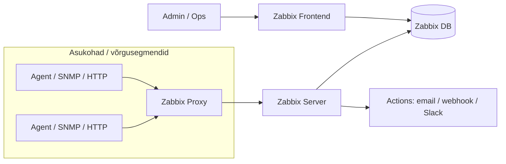

# Päev 2: Zabbix — kõik-ühes seiresüsteem

**Kestus:** ~2,5 tundi iseseisvat lugemist  
**Eeldused:** [Päev 1: Prometheus + Grafana](paev1-loeng.md) loetud, Linux CLI põhitõed, võrgunduse alused  
**Versioonid laboris:** Zabbix 7.0.6 LTS, MySQL 8.0, Zabbix agent 2 (7.0+)  
**Kiirlingid:** [Zabbix docs](https://www.zabbix.com/documentation/current/en/manual) · [Roadmap](https://www.zabbix.com/roadmap) · [Performance tuning](https://www.zabbix.com/documentation/current/en/manual/appendix/performance_tuning)

!!! abstract "TL;DR (kui sul on 5 min)"
    - **Zabbix = “kõik ühes”**: agentid, SNMP, HTTP, templated, dashboardid, alerting — eriti hea traditsioonilises infrastruktuuris.
    - **Andmemudel**: Host → Item → Trigger → Action (Template on “korrutaja”, mis teeb halduse võimalikuks).
    - **Kõige ohtlikum viga**: `History=0` → **triggerid ei tööta** (sa kogud andmeid, aga süsteem ei hoiata).
    - **Jõudlus = DB**: SSD + RAM + (suures mahus) partitsioneerimine.
    - **Skaleerimine**: proksid jagavad koormust, HA annab rikkekindluse; proxy groupid (7.0+) on mugavad, aga piirangutega.

---

## Õpiväljundid

Pärast selle materjali läbitöötamist osaleja:

1. **Selgitab** Zabbixi arhitektuuri — server, agent, frontend, DB, proksi — ja iga komponendi vastutusala
2. **Eristab** Host, Item, Trigger ja Action mõisteid ning näeb kuidas need matrjoškana üksteist ehitavad
3. **Valib** aktiivse ja passiivse agendi vahel ning põhjendab valikut itemi tüübi ja tulemüüri kontekstist
4. **Selgitab** History ja Trends vahet ning mõistab miks History=0 tähendab triggerite kadumist
5. **Teostab** NVPS-põhiseid mahuarvutusi ja hindab andmebaasi suurust ette
6. **Kirjeldab** housekeeperi töö, selle piiranguid ja partitsioneerimise rolli suurtes süsteemides
7. **Analüüsib** proksi rolli, Zabbix 7.0+ proxy gruppe ning HA klastri toimimist ja piiranguid
8. **Seostab** Zabbix 8 põhimuudatusi (OTel, log-observability, ClickHouse) laiema vaatluse (observability) liikumisega

---

## 1. Miks Zabbix?

Eile vaatasime Prometheust — cloud-native maailma meetrikakogujat: pull-mudel, deklaratiivne konfig, Kubernetes-esimene mõtteviis. Täna oleme teisel pool spektrit.

Zabbix sündis 1998. aastal Läti Ülikoolis (Alexei Vladišev’i diplomitöö) ja esimene avalik versioon ilmus 2001. See on 25+ aastat “tootmiskarastust” — mitte aegumine, vaid kogemus.

Zabbix on klassikaline *kõikehõlmav* seireplatvorm:
- agendid
- SNMP / IPMI / JMX / VMware
- SQL / ICMP / SSH / Telnet / HTTP
- templated + dashboardid + alertimine

Mõte: **ühest kohast** konfigureerid suure osa ettevõtte infra “vaatluse baasist”.

Eestis on Zabbix laialt kasutuses. Telia, Swedbank, maksu- ja tolliamet, enamus riigiasutusi, ülikoolid — kus tahes vaatad, seal ta on. Kuna Zabbix on open-source koos enterprise-tasemel kvaliteediga ja Läti päritolu (seega lokaalne tugi), on ta Baltikumis kodus nagu kala vees.

**Zabbix vs Prometheus** — mõlemad on head tööriistad, aga erinevate ülesannete jaoks:

| Aspekt | Zabbix | Prometheus |
|--------|--------|------------|
| Paradigma | Push ja pull (mõlemad) | Pull |
| Konfig | Frontend/DB (klik-klõps) | YAML failid (koodina) |
| Andmemudel | Klassikaline relatsioonne DB | Aegridade TSDB |
| Tugev külg | Infrastruktuur, mitut protokolli | Mikroteenused, service discovery |
| Päringukeel | Triggeri funktsioonid | PromQL |
| HA | Alates 6.0 natiivne | Föderatsioon + Thanos/Mimir |
| Agendid | Kõik-ühes paketid | Per-teenus exporterid |

Reaalses maailmas kasutatakse sageli **mõlemaid**:
- **Zabbix**: traditsiooniline IT-infra (võrk, virtualisatsioon, fileserverid, UPS-id, printerid, “legacy”)
- **Prometheus**: konteinerplatvormid ja dünaamiline keskkond

Mõlemad võivad voolata Grafanasse — ja keegi ei pea “üht ainsat” valima.

---

## 2. Arhitektuur — neli komponenti

Zabbixi süda koosneb neljast osast. Igaüks vastab ühe lihtsa küsimuse eest.

**Zabbix Server** (aju)  
Võtab vastu andmeid, hindab triggereid, tekitab probleeme, saadab hoiatusi. C-s kirjutatud, Linuxi teenus. Üks protsess, palju tööprotsesse (pollerid, trapperid, housekeeper, alerter).

**Zabbix Database** (mälu)  
Tavaliselt MySQL/MariaDB või PostgreSQL. Siin on **kõik**: nii konfiguratsioon (hostid, template’id, triggerid) kui ka ajalooandmed. Ja see on peamine pudelikael.

!!! tip "Reegel"
    **Zabbixi jõudlusprobleemid lahenevad ~90% ulatuses andmebaasi tasemel.**

**Zabbix Frontend** (nägu)  
PHP-põhine veebiliides (Apache/Nginx taga). Räägib **sama DB-ga**, mis server. Kasutaja “klikib” frontendis — seda ei tohi segi ajada serveriga.

**Zabbix Agent** (käed-jalad)  
Jookseb jälgitaval masinal, kogub lokaalsed mõõdikud ja edastab serverile. Kaks peamist haru:
- **Agent 1** (C) — stabiilne klassika
- **Agent 2** (Go) — uuem, moodulitega

Viies komponent — **Zabbix Proxy** — tuleb mängu, kui on vaja jälgida asju kaugvõrgus, piiratud internetiühendusega harukontorites või serverit koormuse alt välja võtta. Proksi kogub andmeid kohapeal, puhverdab neid vajadusel ja saadab serverile edasi. Proksist rohkem peatselt.

Kriitiline punkt: **Zabbix Server ja DB on tihedalt seotud**. Kui DB jääb hätta, kukub server. Kui server kogub 1000 väärtust sekundis ja DB suudab kirjutada 500 — mahajäämus kasvab, järjekorrad täituvad, andmeid läheb kaduma. Suurem osa Zabbixi häälestamisest ongi tegelikult *andmebaasi* häälestamine.

### Topoloogia pilt (mida sa täna praktikas ehitad)



??? note "Kus mida jooksutatakse (kiire mental model)"
    - **Frontend** võib olla eraldi konteiner/VM (UI).
    - **Server + DB** võivad alguses olla ühes masinas, aga tootmises on DB sageli eraldi (ja HA puhul ka klastris).
    - **Proxy** on “piirkondlik kogujasõlm”: kogub lokaalselt, puhverdab, saadab serverile.

---

## 3. Andmemudel: Host → Item → Trigger → Action

Zabbixi kogu maailm tugineb neljale kontseptsioonile. Need on nagu matrjoškad — üks on teise sees.

**Host** = “asi mida jälgitakse”  
Linuxi server, switch, ruuter, ESXi host, DB, VM, jne. Hostil on IP/DNS, interface’id ja 1+ template’i.

**Item** = üks konkreetne mõõtmine hostil  
Nt `system.cpu.load[all,avg1]` või `net.if.in[eth0]`. Ühel hostil on tihti kümneid kuni sadu item’eid.

**Trigger** = tingimus item’i väärtuste peal  
Nt “kui CPU load > 5, tee häire”. Kui tingimus täitub, tekib **Problem**. Prioriteedid: `Not classified`, `Information`, `Warning`, `Average`, `High`, `Disaster`.

**Action** = “mis juhtub probleemi korral”  
Email, SMS, Slack, webhook, skript. Reeglid võivad olla nüansirikkad (kestus, severity, acknowledge, eskalatsioon).

!!! warning "Klassikaline komistuskivi (Zabbix 7.0 UI)"
    Triggeri loomine: **Data collection → Hosts → hosti real “Triggers” link → Create trigger**  
    Kui klikid hosti *nimel*, jõuad hosti seadistusse, mitte triggerite vaatesse.

**Template** on juurkontseptsioon, ilma milleta on Zabbix kasutu. Selle asemel, et 500 serveril kõik itemid ükshaaval luua, teed ühe template'i ("Linux by Zabbix agent") ja rakendad 500-le hostile. Muudad template'it — muutused levivad kõigile. Hiiglastes ettevõtetes on template hierarhia mitmekihiline: baas-template + keskkonna-kiht + rolli-kiht + rakenduse-kiht.

---

## 4. Agentid: tüübid, pluginad, active vs passive

Zabbixis on “agent” lai mõiste: osa mõõdikuid tuleb Zabbix Agent’ist, osa tuleb *ilma agendita* (SNMP, HTTP, IPMI, JMX, VMware, …).

### 4.1 Zabbix Agent vs Agent 2

- **Zabbix Agent (Agent 1)**: klassikaline, väga levinud, stabiilne.
- **Zabbix Agent 2**: uuem agent, mille tugevus on **pluginad** (laiendatavus). Tootmises kohtad mõlemaid.

Praktiline rusikareegel:
- kui sul on “standard Linux host” ja tahad kiiresti üles saada → mõlemad sobivad
- kui vajad lisa-integratsioone/pluginasid või tahad tulevikukindlust → Agent 2 on tihti mõistlik valik

### 4.2 Kuidas “agentita” monitooring Zabbixis välja näeb

Zabbix ei nõua alati hosti peal agenti:
- **SNMP** (võrguseadmed, UPS-id, printerid, kaamerad)
- **HTTP Agent** (REST API-d, endpointid, stub_status)
- **ICMP** (ping, latency)
- **IPMI** (serveri riistvara)
- **JMX** (Java)
- **VMware** (vCenter/ESXi)

See on põhjus, miks Zabbix on traditsioonilises inframaailmas nii tugev.

Eile vaatasime pull-mudelit Prometheuse juures. Zabbix agent toetab mõlemat stiili — ja tootmises kasutatakse sageli korraga mõlemat.

### Passiivne agent (server küsib)
Server küsib, agent vastab — Prometheuse mõttes *pull*.  
**Pluss**: tulemüüris lihtne (server → agent).  
**Miinus**: skaleerimisel koormus serverile.

### Aktiivne agent (agent saadab)
Agent küsib serverilt “mida jälgida” (active checks) ja saadab tulemused ise — *push*.  
**Pluss**: skaleerub paremini suurtes keskkondades.  
**Miinus**: agent peab serverini (või proksini) jõudma; NAT/proksid/tulemüürid võivad keeruliseks teha.

Reaalne valik sõltub itemi tüübist. Madala sagedusega itemid (kettaruum kord tunnis) on tihti passiivsed. Kõrge sagedusega itemid (CPU iga 30 sekundit) on sageli aktiivsed. **Log-failide monitoorimine on alati aktiivne** — passiivne režiim ei toeta log-tail'i üldse.

Oluline piirang edasiseks: Zabbix 7.0+ proksi gruppide kasutamisel on **aktiivne režiim ainus valik**.

!!! tip "Kiirvalik"
    - **Agent “passive”**: kui server pääseb agentini (intranet, lihtne tulemüür).
    - **Agent “active”**: kui hoste on palju / võrgu suunad on keerulised / kasutad proksisid või proxy group’e.

---

## 5. History vs Trends — andmete elutsükkel

See on *üks olulisemaid* tootmiskeskkonna mõisteid. Kui see läheb valesti, läheb “kõik valesti”.

### Kaks mälu tüüpi

Zabbixil on kaks eraldiseisvat salvestustasandit, mis töötavad eri loogikaga.

**History** on lühiajaline mälu. Iga kogutud väärtus salvestatakse toorkujul. Kui agent saadab CPU load iga 60 sekundi järel, siis history-tabelis on iga 60 sekundi kohta üks rida. See on peen graanulsus — CPU spike kell 14:23:15 on täpselt näha, koos ajatempli ja väärtusega.

**Trends** on pikaajaline mälu. Summeeritud statistika. Iga tunni, iga itemi kohta on *neli* arvu: `min`, `max`, `avg` ja `count`. Üks rida tunnis. See on jäme graanulsus — CPU spike kell 14:23:15 kaob, näed vaid et kella 14:00 ja 15:00 vahel oli maksimum 95%.

### Miks see vahe kriitiline on

Kui organisatsioon hoiab kõike History-na ja pikalt, siis ketta I/O kasvab plahvatuslikult (iga väärtus on DB kirjutamisoperatsioon), DB maht ulatub miljardiastmetesse (varukoopiad muutuvad praktiliselt võimatuks), ja päringud aeglustuvad nii, et graafikud võtavad mitu minutit laadida.

!!! danger "Kõige ohtlikum viga: History=0"
    Kui paned `History=0`, siis **triggerid lõpetavad töötamise**.  
    Põhjus: triggeri funktsioonid (`last`, `avg`, `max`, …) töötavad History pealt. Kui History puudub, pole “mille pealt” hinnata.

Tootmises tüüpilised väärtused:
- **History**: 7-14 päeva (operatiivseks vaatluseks ja triggerite jaoks)
- **Trends**: 1-5 aastat (mahtude planeerimiseks, SLA-raportiteks, aastaaruanneteks)

### Üks konkreetne nüanss — ümardamine

Trendide keskmise arvutamisel *täisarvuliste* (unsigned) itemite puhul **ümardatakse tulemus alati allapoole**. Kui tunni jooksul on CPU väärtused 0 ja 1, siis trends-is on keskmine 0, mitte 0,5. Ühelt poolt loogiline (täisarv on täisarv). Teiselt poolt halb üllatus, kui sa seda ei tea ja imestad miks aastaraport näitab, et midagi "ei olnudki". Float-tüüpi itemite puhul seda probleemi pole.

### NVPS ja andmemahu planeerimine

Tark administraator arvutab DB suuruse ette, mitte ei avasta pärast, et ketas on täis. Näide:

- 3000 itemi
- Iga item uueneb iga 60 sekundi järel
- **NVPS = 3000 / 60 = 50 väärtust sekundis**

Numbrilise andmetüübi maht on ligikaudu 90 baiti punkti kohta. History 30 päeva jaoks:

```
50 × 3600 × 24 × 30 × 90 ≈ 10,9 GB
```

Trendide maht 5 aasta jaoks (iga tund × iga item × üks rida):

```
3000 × 24 × 365 × 5 × 90 ≈ 11,8 GB
```

**Tekst ja logid maksavad ~500 baiti punkti kohta** — umbes 5-6 korda rohkem kui numbrid. Ja logidele trendi *ei arvutata* — seega logide säilitamiseks on ainus hoob History säilitusperiood. Rusikareegel: pane numbreid igasse nurka, logisid ainult seal kus hädapärast vajalikud.

??? tip "NVPS kontroll tootmises"
    Kui sul on juba Zabbix püsti, võrdle planeeringut reaalsusega:
    - vaata sisemisi item’eid, mis näitavad tegelikku kirjutusmahtu ja järjekordi
    - kui NVPS on 2× suurem kui arvasid, on tihti põhjus “liiga tihe intervall” või “liiga palju item’eid template’is”

### Housekeeper ja selle piirid

Zabbix server püüab regulaarselt vanu ridu kustutada — seda teeb sisseehitatud **housekeeper**. See jookseb DB-s rida-realt, kustutades ükshaaval.

Housekeeper töötab hästi väikestes süsteemides (kuni ~500 NVPS). Üle selle muutub ta sageli pudelikaelaks.

Põhjus: rida-realt kustutamine on DB jaoks kallis (indeksid, redo/binlog, fragmentatsioon). Kui kustutada tuleb miljoneid ridu, võib DB suure osa ajast kulutada kustutamisele, samal ajal kui uued väärtused tulevad peale.

Lahendus on **tabelite partitsioneerimine**. Jagad history- ja trends-tabelid päevade või kuude põhisteks partitsioonideks. Vanade andmete kustutamine tähendab siis terve partitsiooni kukutamist — üks käsk, sekundijagu aega, ei puuduta ülejäänud andmeid. See on suurte süsteemide standard: partisjoneerimine sisse, housekeeper välja.

**TimescaleDB** on PostgreSQL-i laiendus, mis teeb partitsioneerimise automaatselt ja lisab kompressiooni. Zabbix 5.0+ toetab seda ametlikult. Kui alustad uut paigaldust ja tead, et see kasvab suureks — TimescaleDB on sageli parem valik kui klassikaline MySQL/MariaDB.

!!! warning "Housekeeperi sümptomid (mida päriselus näed)"
    - graafikud laevad aeglaselt (DB “busy”)
    - `zabbix[queue]` kasvab (server ei jõua)
    - DB CPU/I/O on pidevalt kõrge, eriti housekeeping akna ajal

---

## 6. Performance — andmebaas on kuningas

Zabbixi jõudlusprobleemid lahendatakse ülekaalukalt andmebaasi tasemel. Siin on asjad, mida peab teadma juba enne esimese Zabbixi püsti panekut.

### Riistvara: SSD on vältimatu

Üks arv tasub meeles pidada: **Enterprise SSD teeb 15 000+ IOPS juhuslikuks lugemiseks, SAS 15K RPM ketas umbes 250, SATA 7200 RPM ~100**. See tähendab, et sama päringu jaoks (näiteks 6-kuu graafiku genereerimine) vajab SSD umbes 1 sekundi, pöörlev ketas 60. Kui NVPS ületab 500-1000, siis SSD pole luksus — see on ainus, mis päästab süsteemi.

RAM-i osas: DB server vajab piisavalt mälu, et indeksid ja kuumandmed mahuks sisse. Liiga väike mälu sunnib DB-d kettale minema — isegi SSD puhul on see 100x aeglasem kui RAM. Tootmises tüüpiline rusikareegel: DB buffer pool ~75% süsteemi RAM-ist (eraldi DB serveri korral).

| Suurus | Seadmed | NVPS | CPU | RAM | DB soovitus |
|--------|---------|------|-----|-----|-------------|
| Väike | <100 | <50 | 2 | 2 GB | MySQL lokaalselt |
| Keskmine | 500 | 500 | 4 | 8 GB | MySQL InnoDB SSD |
| Suur | >1000 | >1000 | 8 | 16-32 GB | RAID10 SSD, eraldi DB server |
| Väga suur | >10000 | >10000 | 16+ | 64+ GB | NVMe RAID, klaster |

!!! tip "Kiire kontroll: kas DB on pudelikael?"
    Kui “Zabbix on aeglane”, alusta 3 küsimusest:
    - kas `zabbix[queue]` on 0 või kasvab?
    - kas mõni `zabbix[process,<tüüp>,avg,busy]` on püsivalt >75%?
    - kas DB masinal on I/O latency kõrge (ja kas ketas on SSD/NVMe)?

### Mida andmebaasi juures häälestada

Detailid kuuluvad paigalduse juhendisse, aga kontseptuaalselt on kolm-neli asja, mida iga tootmise Zabbixi DB juures peab vaatama:

- **Buffer pool** suurus (RAM-i osa, mis hoiab indekseid ja kuumandmeid) — liiga väike tähendab pidevalt kettale pöördumist
- **Kirjutamise sünkroniseerimine** — vaikimisi teeb DB iga tehingu kohta ketta-flushi, mis on aeglane. Zabbixi tööle on aktsepteeritav nõrgem garantii (1 sekundi andmekadu crashi puhul) ja 3-5x kiirem kirjutamine
- **I/O võimekuse parameeter** — ütleb DB-le, kui palju IOPS-i ta võib eeldada (SSD vs HDD puhul täiesti erinev)
- **Logifaili suurus** — peab mahutama vähemalt 1-2 tunni kirjutamisandmed

Kõik need parameetrid on konkreetsete arvudega laboris ja paigaldusjuhendis. Loengus piisab kontseptsiooni mõistmisest.

### Serveri häälestus

`zabbix_server.conf` sisaldab palju konfigureeritavaid protsesse (pollerid, trapperid, history syncerid, pingerid). Üldreegel: **ärge suurendage neid suvaliselt**. Iga lisaprotsess on DB ühendus ja overhead.

Õige lähenemine on diagnostikatsükkel: vaata järjekordade pikkust, vaata protsesside hõivatust. Kui järjekord kasvab pidevalt ja vastav protsess on üle 75% hõivatud — alles siis suurenda. Enne seda on probleem kas DB-s või itemide kogusel. Zabbixi sisemised itemid näitavad seda kohe — nendest räägime peatükis 8.

---

## 7. Skaleerimine: proksid ja HA

Kui üks Zabbix server ei jõua enam kõike kaasa teha, on kaks teed edasi: **proksid** (horisontaalne koormuse jagamine) või **HA klaster** (serveri rikkekindlus). Tootmises on sageli mõlemad korraga.

### Proksi klassikaliselt

Proksi on vahemehhanism — kogub andmeid oma piirkonnast, puhverdab neid kohalikus väikeses DB-s (SQLite või MySQL) ja edastab serverile. Kasulik kolmes tüüpilises olukorras.

Esimene: **geograafiline hajumine**. Tallinna server, proksi Tokyos. Ilma prokseta küsiks server iga 60 sekundi järel sadade Tokyos asuvate masinate käest andmeid üle ookeani. Prokseta: proksi küsib lokaalselt, saadab serverile tihendatud kogumeid.

Teine: **tulemüüriga segmendid**. DMZ-s on 50 seadet, üks proksi pääseb neile, server ei pea üldse DMZ-sse reeglit avama.

Kolmas: **serveri koormuse vähendamine**. 10 000 host ühe serveriga on piiripealne. Jagatud prokside vahel — lihtne.

Proksi ei tee triggerite hindamist — see jääb alati serveri töö. Proksi ainult kogub ja edastab.

### Proxy groups (Zabbix 7.0+)

Zabbix 7.0 tuli välja 2024 ja tõi revolutsiooni — **proksigrupid**. Mitu proksit grupina, koormus jaotub automaatselt, rike tähendab automaatset failoverit. Enne seda pidi proksi HA-d ehitama keerukate välistöövahenditega (Corosync/Pacemaker) — nüüd on see sisseehitatud.

**Koormuse jaotamise loogika** on kahetingimuslik. Zabbix server jaotab hoste ümber ainult siis, kui ühe proksi hostide arv erineb grupi keskmisest vähemalt 10 hosti võrra **JA** faktoriga vähemalt 2x. See topeltlävi on tahtlik — süsteem ei hakka iga väikese muudatuse peale hoste ümber asetama, mis tekitaks tarbetut overheadi.

Näide: grupi keskmine on 5 hosti proksi kohta, ühel proksil 15 — vahe 10 (täidab tingimuse), 15 on 3x suurem kui 5 (täidab faktori). Jaotatakse ümber. Kui aga keskmine on 50 ja ühel proksil 60 — vahe 10, aga faktor ainult 1,2x. Jätame rahule.

**Failover mehhanism.** Proksid saadavad serverile heartbeat-i regulaarse intervalliga (vaikimisi iga minut). Korrektne peatumine → teavitab serverit → hostid jaotatakse kohe ümber. Ootamatu rike → oodatakse failover-perioodi, seejärel kuulutatakse kättesaamatuks. Põhjalik ümberjagamine käivitub alles pärast 10-kordset failover-perioodi, et lühiajaline võrguhäire ei tekitaks massiivset rapsimist.

**Olulised piirangud proxy groupide kasutamisel:**

- **SNMP Trappe ei toetata.** Kui keskkond sõltub SNMP trapidest (näiteks võrguseadmete alarmid), jäta need seadmed tavalisele, grupi välisele proksile
- **Ainult Zabbix Agent 7.0+** töötab proxy groupidega aktiivses režiimis. Vanad agendid ei suuda dünaamiliselt liikuva proksiga suhelda
- **Tulemüür peab lubama agendi → kõik grupi proksid.** Failover-i ajal suunatakse agent teisele proksile. Kui tulemüür ainult ühte ust avab, jääb agent failover-i ajal ripakile
- **Välised skriptid** tuleb käsitsi kopeerida kõigile grupi proksidele identselt
- **VMware monitooringu juures ettevaatust.** Iga grupi proksi peab puhverdama KOGU vCenter'i andmestiku, mis võib vCenterit päringutega üle koormata

!!! warning "Proxy group praktikas (tüüpiline tootmiskomistus)"
    Failover töötab ainult siis, kui:
    - agent/proksi “näeb” alternatiivseid proksisid (võrk + tulemüür)
    - kasutad sobivaid agenti versioone
    Muidu läheb proksi rikke ajal “kõik vaikseks” ja sa avastad probleemi liiga hilja.

### Zabbix Server HA (alates 6.0)

Enne 6.0 pidi HA tegema välise tarkvaraga (Corosync/Pacemaker) — keeruline ja vigaderohke. Alates 6.0 on see sisseehitatud.

Põhimõte on lihtne: mitu Zabbix server protsessi jagavad sama andmebaasi ja saadavad DB-sse "heartbeat"-i iga 5 sekundi järel. Ainult üks on korraga **Active**, ülejäänud on **Standby**. Kui aktiivne lakkab heartbeat-i saatmast, võtab Standby üle.

Üks praktiline nüanss tuleb siin mainida, sest see tüütab paljusid esimesel HA seadistamisel: **frontend tuleb seadistada nii, et see tuvastab aktiivse sõlme dünaamiliselt DB kaudu**, mitte ei osuta fikseeritud IP-le. Kui jätad frontendis ühe serveri IP kõvasti sisse, siis failover-i ajal kaob ka frontend koos ripakile jääva sõlmega. Levinuim HA-seadistuse komistuskivi.

### Andmebaasi HA

Kui Zabbix serveri HA on olemas, aga DB on ühel masinal — pole HA-d. DB on SPOF. MariaDB Galera Cluster või PostgreSQL-i replikatsioon (patroni, repmgr) on standardvastused. Detaile ei lähe siin sügavamale — enamik osalejaid ei hakka DB-klastreid igapäevaselt püstitama. Peamine põhimõte: tõsiseltvõetava HA-paigalduse puhul peab DB kiht olema samuti kõrgkäideldav.

---

## 8. Sisemine diagnostika

Zabbixi oluline omadus: **ta monitoorib iseennast**. On terve hulk sisemisi iteme (internal items), mis näitavad serveri enda olekut reaalajas. Kui Zabbix töötab halvasti, on see esimene koht kust vaatama hakata.

Kolm kõige tähtsamat:

- **`zabbix[queue]`** näitab järjekorras ootavate kontrollide arvu. Peaks olema null. Kui see kasvab pidevalt, sul on andmete viivitus
- **`zabbix[process,<tüüp>,avg,busy]`** näitab konkreetse protsessi (poller, trapper, history syncer) hõivatust protsentides. Üle 75% pidevalt tähendab, et on aeg suurendada
- **`zabbix[wcache,values,all]`** näitab reaalselt saabuvat NVPS-i — kas see vastab sinu plaanile või on midagi oodatust rohkem/vähem

Tee neist eraldi dashboard — **monitori monitori**. Kui keegi küsib "Zabbix on aeglane", annab see dashboard vastuse 10 sekundiga.

??? note "Miks see õpetlik on (ka väljaspool Zabbixit)"
    Sisemine telemeetria (queue, busy%, cache) on sama muster igas observability süsteemis:  
    kui tööriist on aeglane, küsi kõigepealt “mis on tema enda tervis ja järjekorrad?”.

---

## 9. Zabbix 8 — kuhu minnakse

Täna kasutad tõenäoliselt Zabbix 7.0 LTS-i, mis ilmus 2024. aasta juunis. Aga tasub teada, mis tuleb, sest **Zabbix 8.0 LTS ilmub sel aastal** (alfa versioon oktoobris 2025, stabiilne 2026 jooksul) ja see ei ole tavaline versiooniuuendus.

Zabbix 8 filosoofia on üleminek "monitooringult" → "täielikule vaatlusele" (observability). Alexei Vladišev on ise öelnud: see on liikumine reaktiivselt seirelt proaktiivsele mõistmisele. See seob Zabbixi otseselt samasse maailma, kus on Prometheus + Grafana + Tempo + Loki, DataDog, Splunk — kogu kursuse teine pool. Seega mõned ideed, mida täna Zabbixi kontekstis puudutame, tulevad nädalate pärast uuesti teiste tööriistade juures tagasi.

### 3 suunda, mis sind 2026 päriselt mõjutavad

1. **OpenTelemetry (OTel) tugi**  
   Zabbix liigub sinna, kus “telemeetria standard” hakkab olema OTel — eriti mikroteenuste ja pilvega.

2. **Logipõhine korrelatsioon**  
   Logid + meetrikad samal ajateljel (sarnane mõte, mida me kursusel Loki/Tempo päevadel teeme).

3. **Uued backendid ja andmetüübid**  
   Suund analüütilisematele andmehoidlatele (nt ClickHouse) ja struktureeritud andmetele (JSON), et suurtes mahtudes päringud oleksid mõistlikumad.

??? note "Lisadetailid (kui tahad süvitsi)"
    Kui tahad “mis täpselt UI-s muutub” ja millised uued widgetid tulevad (scatter plot, geomap klasterdamine, inherited tags, CEP jne), siis vaata:
    - “What’s new in Zabbix 8.0” (docs)
    - roadmap
    Need detailid on huvitavad, aga kursuse eesmärgi jaoks on olulisem mõista **suunda**: Zabbix püüab tuua rohkem observability-mustreid enda maailma.

---

## 10. Kokkuvõte

Zabbix on suur süsteem — täna puudutasime pinda. Enne laborisse minekut jäta meelde viis asja:

1. **Host → Item → Trigger → Action** on alus. Template on “korrutaja”, mis teeb halduse võimalikuks.

2. **History = toorandmed, Trends = tunnipõhine statistika.** `History=0` → triggerid ei tööta.

3. **DB on pudelikael.** SSD + piisav RAM (buffer pool) + suuremas mahus partitsioneerimine.

4. **Proksi skaleerib, HA tagab rikkekindluse.** Proxy groupid on mugavad, aga piirangutega.

5. **Zabbix 8 liigutab fookuse “monitoring” → “observability”.** OTel, log-korrelatsioon, ClickHouse, scatter plot.

Zabbixit kritiseeritakse tihti tema "kitchen sink" lähenemise pärast — teeb kõike, aga eriti midagi. Tegelikult on see tema tugevus. Väga vähe tööriistu katab kogu infrastruktuuri spektrit ühest kohast, ühe konfiguratsiooniga, ühe skillsetiga. 8.0-ga astub ta ka vaatlemise territooriumile. Tulev kümmekond aastat on põnev.

**Järgmine samm:** [Labor: Zabbix](../../labs/02_zabbix_loki/zabbix_lab.md) — ehita Zabbix stack üles, lisa host'id ja template'id, jookse läbi trigger-fire/resolve tsükkel.

---

## 11. Zabbix Cloud (mida see on ja millal valida)

Zabbix on open-source ja saad seda ise majutada. **Zabbix Cloud** on “managed” variant: Zabbixi tiim hostib ja haldab serveri/DB platvormi osa sinu eest.

Tüüpiline väärtus:
- vähem “DB + upgrade + backup” tööd
- kiire stardikiirus (eriti väiksematel tiimidel)
- sobib kui tahad Zabbixi funktsionaalsust, aga mitte Zabbixi platvormi opereerimist

Piirangud/kaalutlused:
- võrguühendus ja andmete suunamine Cloudi (agendid/proksid peavad jõudma)
- andmete asukoha ja compliance nõuded (kus andmed paiknevad)
- kulumudel (subscription)

!!! info "Hinnad"
    Zabbixi hinnad sõltuvad paketist/mahu- ja retention-valikutest ning muutuvad ajas. Kasuta ametlikku hinnakirja: [Zabbix Cloud](https://www.zabbix.com/cloud)

---

## 12. Integratsioonid ja “feature map” (kiire orientiir)

Kui keegi ütleb “Zabbix oskab kõike”, siis tavaliselt mõeldakse neid kategooriaid:

- **Andmete kogumine**: Agent/Agent2, SNMP, HTTP, IPMI, JMX, VMware, ICMP
- **Modelleerimine**: hostid, host groups, template’id, discovery (LLD)
- **Korrigeerimine**: preprocessing (regex, JSONPath, JS), dependent items
- **Alerting**: triggerid, event correlation, actions, eskalatsioon, maintenance, silences
- **Visualiseerimine**: graafikud, dashboardid, mapid/geomap, (8.0+) scatter plot
- **Automatiseerimine**: API, import/export, integratsioonid webhookide kaudu

Praktiline mõte kursuse jaoks: laborites kasutame “klassikalist” Zabbixi (agent + template + trigger + action), aga tootmises on suur jõud **template’ides**, **discovery’s** ja **preprocessing’u** mustrites.

---

## Enesekontrolli küsimused

1. Mis vahe on Zabbixi push- ja pull-mudelil? Millal millist eelistada?
2. Miks on history=0 triggerite jaoks kriitiline viga? Mida süsteem kogub ja mida ei kogu?
3. Arvuta: 5000 itemi, iga uueneb 30 sekundi järel. Mis on NVPS? Kui palju ruumi vajab 30 päeva history numbriliste andmete jaoks?
4. Mis on housekeeperi põhiprobleem suurtes keskkondades? Kuidas partitsioneerimine selle lahendab?
5. Milles on Zabbix 7.0 proxy groupide piirangud? Nimeta vähemalt kaks.
6. Kui su rakendus logib JSON-formaadis ja tahad trace id'de põhjal otsida — miks Zabbix ei sobi ja mis sobib paremini?
7. Zabbix 8 toob OpenTelemetry natiivse toe. Mida see praktiliselt tähendab keskkonnas, kus on juba Prometheus?

---

## Allikad

### Peamised

- Zabbix docs: <https://www.zabbix.com/documentation/current/en/manual>
- Performance tuning: <https://www.zabbix.com/documentation/current/en/manual/appendix/performance_tuning>
- Proxy groups (7.0+): <https://www.zabbix.com/documentation/current/en/manual/distributed_monitoring/proxies/ha>
- History/Trends: <https://www.zabbix.com/documentation/current/en/manual/config/items/history_and_trends>

??? note "Lisalugemine"
    - Roadmap: <https://www.zabbix.com/roadmap>
    - “What’s new in Zabbix 8.0”: <https://www.zabbix.com/documentation/8.0/en/manual/whatsnew>
    - Zabbix blog: <https://blog.zabbix.com/>
    - TimescaleDB + Zabbix (tag): <https://www.timescale.com/blog/tag/zabbix/>
    - MySQL partitsioneerimise skript: <https://github.com/OpensourceICTSolutions/zabbix-mysql-partitioning-perl>
    - Zabbix GitHub: <https://github.com/zabbix/zabbix>

---

*Järgmine: [Labor: Zabbix](../../labs/02_zabbix_loki/zabbix_lab.md) — Zabbix stack üles, agent + templates + triggers + dashboards*
