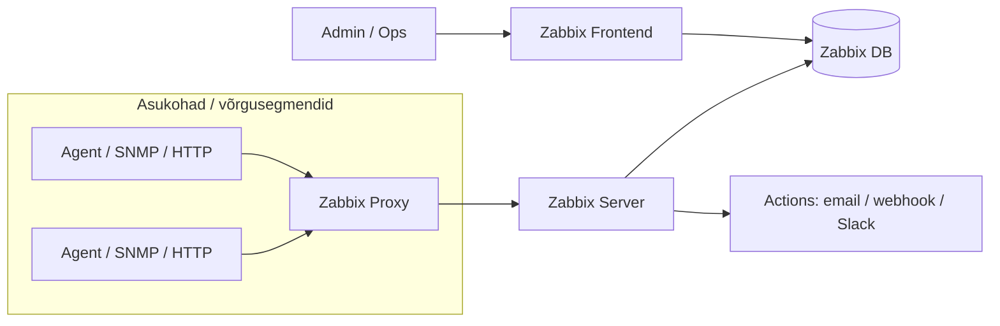

# Päev 2: Zabbix — kõik-ühes seiresüsteem

**Kestus:** ~2,5 tundi iseseisvat lugemist  
**Eeldused:** [Päev 1: Prometheus + Grafana](paev1-loeng.md) loetud, Linux CLI põhitõed, võrgunduse alused  
**Versioonid laboris:** Zabbix 7.0.25 LTS, MySQL 8.0, Zabbix agent 2 (7.0+)  
**Kiirlingid:** [Zabbix docs](https://www.zabbix.com/documentation/current/en/manual) · [Roadmap](https://www.zabbix.com/roadmap) · [Performance tuning](https://www.zabbix.com/documentation/current/en/manual/appendix/performance_tuning)

!!! abstract "TL;DR (kui sul on 5 min)"
    **4 asja, mis tasub päriselt meelde jätta:**

    - **Zabbix mõtleb nii:** Host → Item → Trigger → Action (ja **Template** teeb selle skaleeritavaks).
    - **Kui Zabbix on aeglane, vaata DB-d:** SSD + piisav RAM + (suures mahus) partitsioneerimine.
    - **Ära tee `History=0`:** muidu triggerid ei tööta ja saad "ilusad graafikud, null häiret".
    - **Kui võrk on keeruline, kasuta proksisid:** proxy/HA lahendavad päriselus 80% "kuidas ma üldse kogun andmeid?" probleemist.

---

## Õpiväljundid

Pärast selle materjali läbitöötamist osaleja:

1. **Selgitab** Zabbixi arhitektuuri — server, agent, frontend, DB, proksi — ja iga komponendi vastutusala
2. **Eristab** Host, Item, Trigger ja Action mõisteid ning näeb kuidas need matrjoškana üksteist ehitavad
3. **Valib** aktiivse ja passiivse agendi vahel ning põhjendab valikut itemi tüübi ja tulemüüri kontekstist
4. **Selgitab** History ja Trends vahet ning mõistab miks `History=0` tähendab triggerite kadumist
5. **Teostab** NVPS-põhiseid mahuarvutusi ja hindab andmebaasi suurust ette
6. **Kirjeldab** housekeeperi töö, selle piiranguid ja partitsioneerimise rolli suurtes süsteemides
7. **Analüüsib** proksi rolli, Zabbix 7.0+ proxy gruppe ning HA klastri toimimist ja piiranguid
8. **Seostab** Zabbix 8 põhimuudatusi (OTel, log-observability) laiema vaatluse liikumisega

---

## 1. Miks Zabbix?

Eile vaatasime Prometheust — cloud-native maailma meetrikakogujat: pull-mudel, deklaratiivne konfig, Kubernetes-esimene mõtteviis. Täna oleme teisel pool spektrit.

Zabbix sündis 1998. aastal Läti Ülikoolis (Alexei Vladišev'i diplomitöö) ja esimene avalik versioon ilmus 2001. See on **25+ aastat tootmiskarastust** — mitte aegumine, vaid kogemus.

Zabbix on klassikaline *kõikehõlmav* seireplatvorm — selle tugevus on **laius**. Ühes ja samas süsteemis saad jälgida nii servereid kui võrguseadmeid ning teha sellest kohe ka alertid ja dashboardid. Praktikas tähendab see, et Zabbix saab andmeid väga erinevatest kohtadest: agentidelt, SNMP-st, IPMI-st, HTTP endpointidest, JMX-ist, VMware-st. Sa ei pea "iga asja jaoks" eraldi tööriista võtma.

**Eestis on Zabbix laialt kasutuses** — Telia, Swedbank, maksu- ja tolliamet, enamus riigiasutusi, ülikoolid. Kuna Zabbix on open-source koos enterprise-tasemel kvaliteediga ja **Läti päritolu** (lokaalne tugi, eesti keele tugi olemas), on ta Baltikumis kodus nagu kala vees.

### Zabbix vs Prometheus

| Aspekt | Zabbix | Prometheus |
|--------|--------|------------|
| Paradigma | Push ja pull (mõlemad) | Pull |
| Konfig | Frontend/DB (klik-klõps) | YAML failid (koodina) |
| Andmemudel | Klassikaline relatsioonne DB | Aegridade TSDB |
| Tugev külg | Infrastruktuur, mitut protokolli | Mikroteenused, service discovery |
| Päringukeel | Triggeri funktsioonid | PromQL |
| HA | Alates 6.0 natiivne | Föderatsioon + Thanos/Mimir |
| Agendid | Kõik-ühes paketid | Per-teenus exporterid |

Reaalses maailmas kasutatakse sageli **mõlemaid**. Lihtsustatud jaotus: **Zabbix** katab hästi traditsioonilise IT-infra (võrk, virtualisatsioon, failiserverid, UPS-id, printerid, legacy). **Prometheus** sobib eriti hästi konteinerplatvormidele ja dünaamilisse keskkonda (service discovery, cloud-native mustrid). Mõlemad voolavad Grafanasse — keegi ei pea "üht ainsat" valima.

---

## 2. Arhitektuur — neli komponenti

Zabbixi süda koosneb neljast osast. Igaüks vastab ühele küsimusele.

**Zabbix Server** (aju)  
Võtab vastu andmeid, hindab triggereid, tekitab probleeme, saadab hoiatusi. C-s kirjutatud Linux-teenus. Üks protsess, palju tööprotsesse (pollerid, trapperid, housekeeper, alerter).

**Zabbix Database** (mälu)  
Tavaliselt MySQL/MariaDB või PostgreSQL. Siin on **kõik**: nii konfiguratsioon (hostid, templated, triggerid) kui ajalooandmed. Peamine pudelikael.

!!! tip "Reegel, mis kehtib kogu peatüki vältel"
    **Zabbixi jõudlusprobleemid lahenevad ~90% ulatuses andmebaasi tasemel.**

**Zabbix Frontend** (nägu)  
PHP-põhine veebiliides (Apache/Nginx taga). Räägib **sama DB-ga**, mis server. Kasutaja klõpsib frontendis — seda ei tohi segi ajada serveriga.

**Zabbix Agent** (käed-jalad)  
Jookseb jälgitaval masinal, kogub lokaalsed mõõdikud ja edastab serverile. Kaks haru: **Agent 1** (C, stabiilne klassika) ja **Agent 2** (Go, uuem ja pluginatega).

Viies komponent — **Zabbix Proxy** — tuleb mängu, kui on vaja jälgida kaugvõrgus, piiratud internetiühendusega harukontorites või serverit koormuse alt välja võtta. Proksi kogub andmeid kohapeal, puhverdab ja saadab serverile edasi. Sellest §7-s.

**Kriitiline punkt:** Zabbix Server ja DB on tihedalt seotud. Kui DB jääb hätta, kukub server. Kui server kogub 1000 väärtust sekundis ja DB suudab kirjutada 500 — mahajäämus kasvab, järjekorrad täituvad, andmeid läheb kaduma.

### Topoloogia (mida sa täna laboris ehitad)



??? note "Kus mida jooksutatakse (kiire mental model)"
    - **Frontend** võib olla eraldi konteiner/VM (UI).
    - **Server + DB** võivad alguses olla ühes masinas, aga tootmises on DB sageli eraldi (ja HA puhul ka klastris).
    - **Proxy** on "piirkondlik kogujasõlm": kogub lokaalselt, puhverdab, saadab serverile.

---

## 3. Andmemudel: Host → Item → Trigger → Action

Zabbixi kogu maailm tugineb neljale kontseptsioonile. Need on nagu matrjoškad — üks on teise sees.

**Host** = asi mida jälgitakse  
Linuxi server, switch, ruuter, ESXi host, DB, VM. Hostil on IP/DNS, interface'id ja 1+ template'i.

**Item** = üks konkreetne mõõtmine hostil  
Nt `system.cpu.load[all,avg1]` või `net.if.in[eth0]`. Ühel hostil on tihti kümneid kuni sadu item'eid.

**Trigger** = tingimus item'i väärtuste peal  
Nt "kui CPU load > 5, tee häire". Kui tingimus täitub, tekib **Problem**. Prioriteedid: `Not classified`, `Information`, `Warning`, `Average`, `High`, `Disaster`.

**Action** = mis juhtub probleemi korral  
Email, SMS, Slack, webhook, skript. Reeglid võivad olla nüansirikkad (kestus, severity, acknowledge, eskalatsioon).

!!! warning "Klassikaline komistuskivi (Zabbix 7.0 UI)"
    Triggeri loomine: **Data collection → Hosts → hosti real "Triggers" link → Create trigger.**  
    Kui klõpsid hosti *nimel*, jõuad hosti seadistusse, mitte triggerite vaatesse.

**Template** on juurkontseptsioon, ilma milleta on Zabbix kasutu. Selle asemel, et 500 serveril kõik itemid ükshaaval luua, teed ühe template'i ("Linux by Zabbix agent") ja rakendad 500-le hostile. Muudad template'it — muutused levivad kõigile. Hiiglastes ettevõtetes on template hierarhia mitmekihiline: baas-template + keskkonna-kiht + rolli-kiht + rakenduse-kiht.

---

## 4. Agentid: tüübid, pluginad, active vs passive

Zabbixis on "agent" lai mõiste: osa mõõdikuid tuleb Zabbix Agent'ist, osa tuleb *ilma agendita* (SNMP, HTTP, IPMI, JMX, VMware).

### 4.1 Agent 1 vs Agent 2

**Agent 1** on klassikaline ja väga levinud. **Agent 2** on uuem ning selle tugevus on **pluginad** (laiendatavus). Tootmises kohtad tihti mõlemat korraga.

Rusikareegel: standard Linux host puhul sobivad mõlemad. Kui vajad lisa-integratsioone või tulevikukindlamat valikut — **Agent 2**.

### 4.2 Agentita monitooring

Zabbix ei nõua alati hosti peal agenti. Väga palju asju tuleb otse:

- **SNMP** — võrguseadmed, UPS-id, printerid
- **HTTP Agent** — REST API-d, endpointid (laboris: Nginx stub_status)
- **ICMP** — ping, latency
- **IPMI** — riistvara (BMC)
- **JMX** — Java
- **VMware** — vCenter, ESXi

See on põhjus, miks Zabbix on traditsioonilises inframaailmas tugev.

### 4.3 Active vs passive agent

Eile vaatasime pull-mudelit Prometheuse juures. Zabbix agent toetab mõlemat stiili — ja tootmises kasutatakse sageli korraga mõlemat.

**Passiivne agent (server küsib)** — Prometheuse mõttes *pull*.
- ✅ Tulemüüris lihtne (server → agent)
- ❌ Skaleerimisel koormus serverile

**Aktiivne agent (agent saadab)** — agent küsib serverilt "mida jälgida" ja saadab tulemused ise. *Push.*
- ✅ Skaleerub paremini suurtes keskkondades
- ❌ Agent peab serverini (või proksini) jõudma; NAT/tulemüür võivad keeruliseks teha

**Reaalne valik sõltub item'i tüübist.** Madala sagedusega item'id (kettaruum kord tunnis) on tihti passiivsed. Kõrge sagedusega item'id (CPU iga 30 sek) on aktiivsed. **Log-failide monitoorimine on alati aktiivne** — passiivne režiim ei toeta log-tail'i üldse.

Oluline piirang edasiseks: **Zabbix 7.0+ proksi gruppide kasutamisel on aktiivne režiim ainus valik**.

!!! tip "Kiirvalik"
    - **Agent passive:** server pääseb agentini (intranet, lihtne tulemüür)
    - **Agent active:** hoste on palju / võrgu suunad on keerulised / kasutad proksisid või proxy group'e

---

## 5. History vs Trends — andmete elutsükkel

See on **üks olulisemaid** tootmiskeskkonna mõisteid. Kui see läheb valesti, läheb "kõik valesti".

### Kaks mälu tüüpi

Zabbixil on kaks eraldiseisvat salvestustasandit, mis töötavad erineva loogikaga.

**History** on lühiajaline mälu. Iga kogutud väärtus salvestatakse **toorkujul**. Kui agent saadab CPU loadi iga 60 sekundi tagant, siis history-tabelis on iga 60 sekundi kohta üks rida. Peen graanulsus — CPU spike kell 14:23:15 on täpselt näha, koos ajatempli ja väärtusega.

**Trends** on pikaajaline mälu. Summeeritud statistika. Iga tunni, iga item'i kohta **neli arvu**: `min`, `max`, `avg`, `count`. Üks rida tunnis. Jäme graanulsus — CPU spike kell 14:23:15 kaob, näed vaid et kella 14:00 ja 15:00 vahel oli maksimum 95%.

### Miks see vahe kriitiline on

Kui organisatsioon hoiab **kõike History-na ja pikalt**:
- ketta I/O kasvab plahvatuslikult (iga väärtus on DB kirjutamisoperatsioon)
- DB maht ulatub miljardiastmetesse (varukoopiad muutuvad võimatuks)
- päringud aeglustuvad (graafikud võtavad minuteid laadida)

!!! danger "Kõige ohtlikum viga: `History=0`"
    Kui paned `History=0`, **triggerid lõpetavad töötamise**.  
    Põhjus: triggeri funktsioonid (`last`, `avg`, `max`, …) töötavad History pealt. Kui History puudub, pole millele tugineda.

Tootmises tüüpilised väärtused:

| Kiht | Tüüpiline säilitus | Milleks |
|------|-------------------|---------|
| **History** | 7–14 päeva | operatiivne vaatlus + triggerid |
| **Trends** | 1–5 aastat | planeerimine + SLA + aruanded |

### Üks konkreetne nüanss — ümardamine

Trendide keskmise arvutamisel **täisarvuliste** (unsigned) itemite puhul **ümardatakse tulemus alati allapoole**. Kui tunni jooksul on CPU väärtused 0 ja 1, siis trends-is on keskmine 0, mitte 0,5. Ühelt poolt loogiline (täisarv on täisarv). Teiselt poolt halb üllatus, kui sa seda ei tea ja imestad miks aastaraport näitab, et midagi "ei olnudki". **Float-tüüpi item'ite puhul seda probleemi pole.**

### NVPS ja andmemahu planeerimine

Tark administraator arvutab DB suuruse **ette**, mitte ei avasta pärast, et ketas on täis.

Näide: 3000 itemit × uuenevad iga 60 sekundi järel:

```text
NVPS = 3000 / 60 = 50 väärtust sekundis
```

Numbrilise andmetüübi maht on ~90 baiti punkti kohta.

**History 30 päeva jaoks:**
```text
50 × 3600 × 24 × 30 × 90 ≈ 10,9 GB
```

**Trends 5 aasta jaoks:**
```text
3000 × 24 × 365 × 5 × 90 ≈ 11,8 GB
```

**Tekst ja logid maksavad ~500 baiti punkti kohta** — 5–6 korda rohkem kui numbrid. Ja logidele trendi **ei arvutata** — seega logide säilitamiseks on ainus hoob History säilitusperiood. **Rusikareegel:** pane numbreid igasse nurka, logisid ainult seal kus hädapärast vajalik.

??? tip "NVPS kontroll tootmises"
    Kui sul on Zabbix juba püsti, võrdle planeeringut reaalsusega: vaata sisemisi itemeid, mis näitavad tegelikku kirjutusmahtu (§8). Kui NVPS on 2× suurem kui arvasid, on tihti põhjus "liiga tihe intervall" või "liiga palju itemeid template'is".

### Housekeeper ja selle piirid

Zabbix server püüab regulaarselt vanu ridu kustutada — seda teeb sisseehitatud **housekeeper**. Jookseb DB-s rida-realt, kustutades ükshaaval.

Housekeeper töötab hästi väikestes süsteemides (**kuni ~500 NVPS**). Üle selle muutub ta sageli pudelikaelaks — rida-realt kustutamine on DB jaoks kallis (indeksid, redo/binlog, fragmentatsioon). Kui kustutada tuleb miljoneid ridu, võib DB suure osa ajast kulutada kustutamisele, samal ajal kui uued väärtused tulevad peale.

**Lahendus on tabelite partitsioneerimine.** Jagad history- ja trends-tabelid päevade või kuude partitsioonideks. Vanade andmete kustutamine tähendab terve partitsiooni **kukutamist** — üks käsk, sekundijagu aega, ei puuduta ülejäänud andmeid. See on suurte süsteemide standard: partitsioneerimine sisse, housekeeper välja.

**TimescaleDB** on PostgreSQL-i laiendus, mis teeb partitsioneerimise automaatselt ja lisab kompressiooni. Zabbix 5.0+ toetab seda ametlikult. Kui alustad uut paigaldust ja tead, et see kasvab suureks — TimescaleDB on sageli parem valik kui klassikaline MySQL/MariaDB.

!!! warning "Housekeeperi sümptomid (mida päriselus näed)"
    - graafikud laevad aeglaselt (DB "busy")
    - `zabbix[queue]` kasvab (server ei jõua)
    - DB CPU/I/O on pidevalt kõrge, eriti housekeeping akna ajal

---

## 6. Performance — andmebaas on kuningas

Zabbixi jõudlusprobleemid lahendatakse ülekaalukalt andmebaasi tasemel. Siin on asjad, mida peab teadma juba **enne** esimese Zabbixi püsti panekut.

### Riistvara: SSD on vältimatu

Üks arv tasub meeles pidada: **enterprise SSD teeb 15 000+ IOPS juhuslikuks lugemiseks, SAS 15K RPM ketas umbes 250, SATA 7200 RPM ~100**. See tähendab, et 6-kuu graafiku genereerimiseks vajab SSD ~1 sekundi, pöörlev ketas 60. Kui NVPS ületab 500, on SSD pole luksus — see on ainus, mis päästab süsteemi.

**RAM-i osas:** DB server vajab piisavalt mälu, et indeksid ja kuumandmed mahuks sisse. Liiga väike mälu sunnib DB-d kettale minema — isegi SSD puhul on see 100× aeglasem kui RAM. Tootmises: DB buffer pool ~75% süsteemi RAM-ist (eraldi DB serveri korral).

| Suurus | Seadmed | NVPS | CPU | RAM | DB soovitus |
|--------|---------|------|-----|-----|-------------|
| Väike | <100 | <50 | 2 | 2 GB | MySQL lokaalselt |
| Keskmine | 500 | 500 | 4 | 8 GB | MySQL InnoDB SSD |
| Suur | >1000 | >1000 | 8 | 16–32 GB | RAID10 SSD, eraldi DB server |
| Väga suur | >10000 | >10000 | 16+ | 64+ GB | NVMe RAID, klaster |

!!! tip "Kiire kontroll: kas DB on pudelikael?"
    Kui "Zabbix on aeglane", alusta 3 küsimusest:

    - kas `zabbix[queue]` on 0 või kasvab?
    - kas mõni `zabbix[process,<tüüp>,avg,busy]` on püsivalt >75%?
    - kas DB masinal on I/O latency kõrge (ja kas ketas on SSD/NVMe)?

### DB häälestus — kontseptsioon, mitte arvud

Detailid on paigaldusjuhendis. Kontseptuaalselt on **neli asja**, mida iga tootmise Zabbixi DB juures peab vaatama:

| Teema | Miks see loeb |
|-------|---------------|
| **Buffer pool** | Liiga väike → DB käib pidevalt kettal |
| **Kirjutamise sünkroniseerimine** | Konservatiivne flush on aeglane; Zabbix talub "natuke leebemat" garantiid (kiirem kirjutus) |
| **I/O võimekuse eeldus** | DB peab teadma, kas all on SSD/NVMe või HDD |
| **Logifaili suurus** | Peab mahutama vähemalt 1–2 tunni kirjutamisandmed |

### Serveri häälestus

`zabbix_server.conf` sisaldab palju konfigureeritavaid protsesse (pollerid, trapperid, history syncerid, pingerid). **Üldreegel: ära suurenda neid suvaliselt.** Iga lisaprotsess on DB ühendus ja overhead.

Õige lähenemine on **diagnostikatsükkel**: vaata järjekordade pikkust, vaata protsesside hõivatust. Kui järjekord kasvab pidevalt ja vastav protsess on üle 75% hõivatud — alles siis suurenda. Enne seda on probleem kas DB-s või itemide kogusel. Zabbixi sisemised itemid näitavad seda kohe — nendest räägime §8.

---

## 7. Skaleerimine: proksid ja HA

Kui üks Zabbix server ei jõua enam kõike kaasa teha, on kaks teed: **proksid** (horisontaalne koormuse jagamine) ja **HA klaster** (serveri rikkekindlus). Tootmises on sageli **mõlemad korraga**.

### 7.1 Proksi — klassikaliselt

Proksi on vahemehhanism — kogub andmeid oma piirkonnast, puhverdab kohalikus väikeses DB-s (SQLite või MySQL) ja edastab serverile. **Kolm tüüpilist kasutusjuhtu:**

1. **Geograafiline hajumine.** Tallinna server, proksi Tokyos. Ilma prokseta küsiks server iga 60 sekundi tagant sadade Tokyos asuvate masinate käest andmeid üle ookeani. Prokseta: proksi küsib lokaalselt, saadab serverile tihendatud kogumeid.

2. **Tulemüüriga segmendid.** DMZ-s on 50 seadet, üks proksi pääseb neile, server ei pea üldse DMZ-sse reeglit avama.

3. **Serveri koormuse vähendamine.** 10 000 hosti ühe serveriga on piiripealne. Jagatud prokside vahel — lihtne.

**Proksi ei tee triggerite hindamist** — see jääb alati serveri töö. Proksi ainult kogub ja edastab.

### 7.2 Proxy groups (Zabbix 7.0+)

Zabbix 7.0 tuli välja 2024 ja tõi revolutsiooni — **proksigrupid**. Mitu proksit grupina, koormus jaotub automaatselt, rike tähendab automaatset failoverit. Enne 7.0-d pidi proksi HA-d ehitama keerukate välistööriistadega (Corosync/Pacemaker) — nüüd on see sisseehitatud.

**Koormuse jaotamise loogika** on kahetingimuslik. Server jaotab hoste ümber ainult siis, kui ühe proksi hostide arv erineb grupi keskmisest:
- vähemalt **10 hosti** võrra, **JA**
- faktoriga vähemalt **2×**

See topeltlävi on tahtlik — süsteem ei hakka iga väikese muudatuse peale hoste ümber asetama. Näide: keskmine 5, ühel proksil 15 — vahe 10 (täidab), faktor 3× (täidab) → jaotatakse ümber. Keskmine 50, ühel 60 — vahe 10 aga faktor 1,2× → rahule.

**Failover mehhanism:**
- Proksid saadavad serverile heartbeat-i (vaikimisi iga minut)
- Korrektne peatumine → teavitab serverit → hostid jaotatakse kohe ümber
- Ootamatu rike → oodatakse failover-perioodi, siis kuulutatakse kättesaamatuks
- Põhjalik ümberjagamine käivitub alles pärast 10-kordset failover-perioodi (lühiajaline võrguhäire ei tekita rapsimist)

**Olulised piirangud proxy groupide kasutamisel:**
- **SNMP trapid** — ei toeta
- **Agentiversioonid** — aktiivses režiimis eeldab 7.0+
- **Tulemüür** — agent peab jõudma *kõigi* grupi proksideni
- **Välised skriptid** — tuleb hoida prokside vahel sünkroonis
- **VMware** — vCenter'i päringukoormus võib suureneda

!!! warning "Proxy group praktikas (tüüpiline komistus)"
    Failover töötab ainult siis, kui:

    - agent/proksi "näeb" alternatiivseid proksisid (võrk + tulemüür)
    - kasutad sobivaid agent'i versioone
    
    Muidu läheb proksi rikke ajal "kõik vaikseks" ja sa avastad probleemi liiga hilja.

### 7.3 Zabbix Server HA (alates 6.0)

Enne 6.0 pidi HA tegema välise tarkvaraga (Corosync/Pacemaker) — keeruline ja vigaderohke. Alates 6.0 on see **sisseehitatud**.

Põhimõte on lihtne: mitu Zabbix server protsessi jagavad sama andmebaasi ja saadavad DB-sse heartbeat-i iga 5 sekundi järel. **Ainult üks on korraga Active**, ülejäänud on **Standby**. Kui aktiivne lakkab heartbeat-i saatmast, võtab Standby üle.

**Üks praktiline nüanss**, mis tüütab paljusid esimesel HA seadistamisel: **frontend tuleb seadistada nii, et see tuvastab aktiivse sõlme dünaamiliselt DB kaudu**, mitte ei osuta fikseeritud IP-le. Kui jätad frontendis ühe serveri IP kõvasti sisse, siis failover-i ajal kaob ka frontend koos ripakile jääva sõlmega. **Levinuim HA-seadistuse komistuskivi.**

### 7.4 Andmebaasi HA

Kui Zabbix serveri HA on olemas, aga DB on ühel masinal — **pole HA-d**. DB on SPOF (single point of failure). **MariaDB Galera Cluster** või **PostgreSQL-i replikatsioon** (patroni, repmgr) on standardvastused. Enamik osalejaid ei hakka DB-klastreid igapäevaselt püstitama — peamine põhimõte: **tõsiseltvõetava HA-paigalduse puhul peab DB kiht olema samuti kõrgkäideldav**.

---

## 8. Sisemine diagnostika

Zabbixi oluline omadus: **ta monitoorib iseennast**. On terve hulk sisemisi iteme (internal items), mis näitavad serveri enda olekut reaalajas. Kui Zabbix töötab halvasti, on see **esimene koht kust vaatama hakata**.

Kolm kõige tähtsamat:

| Sisemine item | Mida see ütleb |
|---------------|----------------|
| `zabbix[queue]` | Kas kontrollid jäävad järjekorda (peaks olema 0) |
| `zabbix[process,<tüüp>,avg,busy]` | Kas mõni protsess on püsivalt üle koormatud (>75%) |
| `zabbix[wcache,values,all]` | Milline NVPS tegelikult sisse tuleb |

Tee neist **eraldi dashboard** — monitor monitori. Kui keegi küsib "Zabbix on aeglane", annab see dashboard vastuse **10 sekundiga**.

??? note "Miks see õpetlik on (ka väljaspool Zabbixit)"
    Sisemine telemeetria (queue, busy%, cache) on sama muster igas observability süsteemis: kui tööriist on aeglane, küsi kõigepealt "mis on tema enda tervis ja järjekorrad?".

---

## 9. Zabbix 8 — kuhu minnakse

Täna kasutad Zabbix 7.0 LTS-i, mis ilmus juunis 2024. Aga tasub teada, mis tuleb: **Zabbix 8.0 LTS ilmub sel aastal** (alfa oktoobris 2025, stabiilne 2026 jooksul) ja see ei ole tavaline versiooniuuendus.

**Zabbix 8 filosoofia** on üleminek monitooringult → täielikule vaatlusele (observability). Alexei Vladišev: *liikumine reaktiivselt seirelt proaktiivsele mõistmisele*. See seob Zabbixi otseselt samasse maailma, kus on Prometheus + Grafana + Tempo + Loki — kogu kursuse teine pool.

**Kolm suunda, mis 2026 sind päriselt mõjutavad:**

1. **OpenTelemetry (OTel) tugi** — telemeetria standardiks liigub OTel, eriti mikroteenuste ja pilvega. Zabbix lisab natiivse toe.

2. **Logipõhine korrelatsioon** — logid + meetrikad samal ajateljel (sarnane mõte, mida teeme täna pärastlõunal Loki peatükis).

3. **Uued backendid ja andmetüübid** — analüütilisemad andmehoidlad (ClickHouse) ja struktureeritud JSON, et suurtes mahtudes päringud oleks mõistlikud.

Detailid ("mis täpselt UI-s muutub", uued widgetid) leiad [What's new in Zabbix 8.0](https://www.zabbix.com/documentation/8.0/en/manual/whatsnew) ja roadmap'ist. **Kursuse mõttes on olulisem mõista suunda:** Zabbix püüab tuua observability-mustreid enda maailma. Zabbix 8 ei tähenda, et Zabbix 7.0 LTS täna valesti valida — vastupidi, 7.0 on toetatud kuni 2029 juunini.

---

## 10. Kokkuvõte

Zabbix on suur süsteem — täna puudutasime pinda. Enne laborisse minekut jäta meelde **viis asja**:

1. **Host → Item → Trigger → Action** on alus. **Template** on "korrutaja", mis teeb halduse võimalikuks.

2. **History = toorandmed, Trends = tunnipõhine statistika.** `History=0` → triggerid ei tööta.

3. **DB on pudelikael.** SSD + piisav RAM (buffer pool) + suuremas mahus partitsioneerimine.

4. **Proksi skaleerib, HA tagab rikkekindluse.** Proxy group'id on mugavad, aga piirangutega (SNMP trapid, tulemüür, skriptide sünk).

5. **Zabbix 8 liigutab fookuse "monitoring → observability".** OTel, log-korrelatsioon, ClickHouse.

Zabbixit kritiseeritakse tihti "kitchen sink" lähenemise pärast — teeb kõike, aga eriti midagi. See on tegelikult tema tugevus. Väga vähe tööriistu katab kogu infrastruktuuri spektrit ühest kohast, ühe konfiguratsiooniga, ühe skillsetiga. 8.0-ga astub ta ka vaatlemise territooriumile. Tulev kümmekond aastat on põnev.

**Järgmine samm:** [Labor: Zabbix](../../labs/02_zabbix_loki/zabbix_lab.md) — ehita Zabbix stack üles, lisa host'id ja template'id, jookse läbi trigger fire/resolve tsükkel.

---

## Enesekontrolli küsimused

<details>
<summary><strong>Küsimused + vastused (peida/ava)</strong></summary>

1. Mis vahe on Zabbixi push- ja pull-mudelil? Millal millist eelistada?
2. Miks on `History=0` triggerite jaoks kriitiline viga? Mida süsteem kogub ja mida ei kogu?
3. Arvuta: 5000 itemit, iga uueneb 30 sekundi järel. Mis on NVPS? Kui palju ruumi vajab 30 päeva history numbriliste andmete jaoks?
4. Mis on housekeeperi põhiprobleem suurtes keskkondades? Kuidas partitsioneerimine selle lahendab?
5. Milles on Zabbix 7.0 proxy groupide piirangud? Nimeta vähemalt kaks.
6. Kui su rakendus logib JSON-formaadis ja tahad trace_id'de järgi otsida — miks Zabbix ei sobi ja mis sobib paremini?
7. Zabbix 8 toob OpenTelemetry natiivse toe. Mida see praktiliselt tähendab keskkonnas, kus on juba Prometheus?

??? note "Vastused (peida/ava)"
    1) **Push vs pull:** Zabbixis on mõlemad mustrid olemas — passiivne agent (server küsib) ja aktiivne agent (agent saadab). Valik sõltub võrgu/tulemüüri reaalsusest ja skaleerimisest (palju hoste → aktiivne/proksid).

    2) **`History=0`:** triggeri funktsioonid (`last`, `avg`, `max`) töötavad History peal. Kui History puudub, võib süsteem küll "koguda" (trends tekib), aga triggerid ei tööta — `last()` ei leia midagi.

    3) **NVPS:** 5000/30 ≈ **166,7**.  
       **Maht 30 päeva** (numbrid, ~90 baiti/punkt):  
       166,7 × 3600 × 24 × 30 × 90 ≈ **39 GB** (+ indeksid/overhead).

    4) **Housekeeper** kustutab rida-realt (DB jaoks kallis operatsioon — indeksid, binlog, fragmentatsioon). Partitsioneerimine laseb vanad andmed eemaldada **partitsiooni kaupa** (kiire, ei koorma teisi päringuid).

    5) **Proxy group piirangud:** SNMP trapid (ei toeta), agentiversioonid (aktiivses režiimis 7.0+), tulemüür (agent peab jõudma *kõigi* proksideni), skriptide sünkroon, VMware päringukoormus.

    6) **Trace-ID / logiotsing:** Zabbix pole logi-otsingu tööriist (ta ei indekseeri logisisu). Sobivamad: **Loki** (logid) + **Tempo/Jaeger** (traces) + OTel instrumentatsioon.

    7) **OTel tugi:** lihtsustab standardset instrumentatsiooni ja korrelatsiooni modernses stackis. Prometheus jääb metrics-kihis tugevaks, Zabbix püüab osa observability mustreid enda maailma tuua — saad samast Zabbixist näha nii klassikalist monitooringut kui ka OTel-põhiseid andmeid.

</details>

---

## Allikad

??? note "Allikad (peida/ava)"
    **Peamised:**

    - Zabbix docs: <https://www.zabbix.com/documentation/current/en/manual>
    - Performance tuning: <https://www.zabbix.com/documentation/current/en/manual/appendix/performance_tuning>
    - Proxy groups (7.0+): <https://www.zabbix.com/documentation/current/en/manual/distributed_monitoring/proxies/ha>
    - History/Trends: <https://www.zabbix.com/documentation/current/en/manual/config/items/history_and_trends>

    **Lisalugemine:**

    - Roadmap: <https://www.zabbix.com/roadmap>
    - "What's new in Zabbix 8.0": <https://www.zabbix.com/documentation/8.0/en/manual/whatsnew>
    - Zabbix blog: <https://blog.zabbix.com/>
    - TimescaleDB + Zabbix: <https://www.timescale.com/blog/tag/zabbix/>
    - MySQL partitsioneerimise skript: <https://github.com/OpensourceICTSolutions/zabbix-mysql-partitioning-perl>
    - Zabbix GitHub: <https://github.com/zabbix/zabbix>

---

*Järgmine: [Labor: Zabbix](../../labs/02_zabbix_loki/zabbix_lab.md) — Zabbix stack üles, agent + templates + triggers + dashboards*

--8<-- "_snippets/abbr.md"
