---
tags:
  - Elasticsearch
  - OpenSearch
  - VectorSearch
  - AI
  - Day3

# Päev 3: Elastic Stack & OpenSearch — kust tuli, kus on, kuhu läheb

**Kursus:** Kaasaegne IT-süsteemide monitooring ja jälgitavus  
**Kestus:** ~130 min klassiloengut (6 plokki) + kodutöö lab (~3 h) — vt [Päev 3 kava](../paev3-kava.md)  
**Tase:** Kesktase → kesk-edasijõudnud  
**Eeldused:** Päev 1 (observability kolm sammast, Prometheus pull-mudel) · Päev 2 (Zabbix host-tsentriline, Loki + Alloy, label vs sisu indekseerimine)

!!! abstract "TL;DR"
    ELK / OpenSearch on **andme-tsentriline** logi- ja otsingukiht Zabbixi kõrvale — JSON-dokumendid, time-based indeksid, horisontaalne skaleerumine. Täna on Elastic ja OpenSearch **kaks paralleelset** avatud lähtekoodi haru (2021 litsentsi-drama). Päeva lõpus oskad valida ingestion-tööriista, dimensioneerida 3-master klastrit ja otsustada BM25 vs vector otsingu vahel. AI/RAG detailid on **eraldi lisalugemistes**, mitte siin.

---

## Sisu (klassi plokid)

| Plokk | Kell (kava) | Peatükk siin | Teema |
|-------|-------------|--------------|-------|
| **1** | 10:05–10:35 | [§1](#1-zabbixilt-andmehaldusele-paradigm-shift) · [§2](#2-maastik-2026) · [§3](#3-ajalugu-kust-me-siia-joudsime) | Paradigm shift · maastik 2026 · ajalugu |
| **2** | 11:05–11:35 | [§4](#4-dokumendi-mudel-json-indeksid-mappings-data-streams) · [§5](#5-stack-ingestion-kuidas-logid-jouavad-klasterisse) | JSON, indeksid, ingestion |
| **3** | 11:55–12:10 | [§6](#6-elasticsearch-vs-opensearch-tana) | ES vs OS, hinnad, valik |
| **4** | 12:40–13:05 | [§7](#7-arhitektuur-solmed-shardid-quorum-999) | Klaster, shardid, ILM, Kafka |
| **5** | 13:20–13:35 | [§8](#8-apm-ja-traces-kolmas-observability-sammas) · [§9](#9-kibana-monitooringule-discover-dashboards-alerting-ml) | APM · Kibana |
| **6** | 14:00–14:15 | [§10](#10-otsing-lexical-bm25-vs-vector-ja-kuidas-need-tootavad) | BM25 vs vector (ülevaade) |
| — | Kodutöö | [§11](#11-cheat-sheet--vota-too-juurde-kaasa) · [Lab](../../labs/03_elk_stack/lab.md) | Otsustustabelid · praktika |


**Lisalugemine** (mitte klassis kohustuslik): [Vector search ja RAG](paev3-vector-rag-lisalugemine.md) · [RAG retrieval — BM25, vector, hübriid](paev3-rag-hybrid-monitooring.md)

---

## Õpiväljundid

Pärast seda loengut oskad:

- **Selgitada**, kuidas tööstus liikus klassikalisest host-tsentrilisest seirest (Zabbix) andme-tsentrilisele observability'le ja milline jõud seda muutust ajas
- **Eristada** Elasticsearchi ja OpenSearchi: kust ühine tüvi, miks lahkuminek 2021, kuidas seis 2026
- **Selgitada**, miks logide salvestus JSON-dokumentidena teeb võimalikuks structured search ja mille poolest see erineb tekstifaili `grep`-ist
- **Eristada** Beats, Logstash, Elastic Agent ja OpenSearch ingestion-tööriistu (Data Prepper, Fluent Bit) ning otsustada, milline neist kuhu sobib
- **Kirjeldada** Elasticsearchi sõlmerolle (master, data, ingest, coordinating) ja kuidas shardid + replica'd päringut teenindavad
- **Põhjendada**, miks tõsiselt mõeldud klastris on vähemalt 3 dedicated master sõlme ja mis on quorum
- **Kirjeldada** APM-i rolli Elastic Stack'is (kolmas observability sammas — traces) ja kuidas see erineb logide-klastrist
- **Loetleda** Kibana monitooringu-funktsioone (Discover, Dashboards, Stack Monitoring, Alerting, ML Anomaly Detection) ja nende OpenSearch-vasted
- **Eristada** lexical otsingut (BM25 inverted index'iga) ja vector otsingut (HNSW lähimnaaber-graafiga)
- **Selgitada**, mis on ELSER, `semantic_text`, OpenSearch neural search, FAISS ja RAG muster
- **Otsustada**, millal valida Elastic Cloud, Elasticsearch on-prem, Amazon OpenSearch Service, OpenSearch Serverless või OpenSearch on-prem

---

## 1. Zabbixilt andmehaldusele: paradigm shift

> **Plokk 1** (osa 0). ~5 min, enne §2 maastiku osa.
>
> **Miks see sulle oluline:** annab sulle argumendi managementile — miks Zabbixist (mis on klassikaline ja stabiilne) üksi enam ei piisa ja milleks teie organisatsioonis ELK / OpenSearch / Loki kihiks vaja läheb.

Ennem tutvusid Zabbixiga. Sa nägid neli mõistet ahelas — **Host → Item → Trigger → Action**. See on arhitektuur, mis on töötanud 25 aastat: sa tead, **mis hostid** sul on, **mida nendelt mõõdad** ja **mis tingimustel hoiatust saadetakse**. Iga element on eeldefineeritud, schema on jäik.

Siis lisasid sinna Loki. Sa ei pea enam SSH-ga 50 serverisse logima, et `grep ERROR` teha. Mugavusena tundub vähe, aga selle taga on suurem nihe: tööstus liigub viimase 10 aasta jooksul host-tsentriliselt seirelt andme-tsentrilisele.

### Kaks paradigmat kõrvuti


|                  | Klassikaline (Zabbix)                      | Andme-tsentriline (ELK / OS / TICK / Loki)     |
| ---------------- | ------------------------------------------ | ---------------------------------------------- |
| **Põhi-küsimus** | "Mu host on X, mida ma sellelt mõõdan?"    | "Mul on andmed, mida ma neilt küsida saan?"    |
| **Andmemudel**   | Schemaful (Item = nimi + tüüp + intervall) | Schema-less (dünaamiline mapping, JSON-id)     |
| **Päringud**     | **Eeldefineeritud** (Trigger avaldis)      | **Ad-hoc** (jooksvalt loodud KQL, ESQL, LogQL) |
| **Skaala suund** | Rohkem hoste, rohkem agente                | Rohkem andmesõlmi, rohkem shardide             |
| **Sa tead**      | **ette**, mida sa otsid                    | **avastad** mustreid andmetest                 |


Neli jõudu seda nihet ajavad.

### 1. Cloud-native — host pole enam stabiilne entity

Zabbix eeldab, et `**host` on stabiilne objekt** — sa lood selle UI-s, seod template'iga ja jälgid kuid või aastaid. Kubernetes maailmas ei toimi see. Pod tuleb ja kaob iga 4 minuti tagant, IP-aadress muutub, replica arv skaleerub 3-st 30-le ja tagasi. Kui sa lood Zabbixi host'i iga pod'i kohta, oled hommikul 5000 surnud host'iga.

K8s-mõtteviis on hoopis: **"andmed on entity"**. Pod kirjutab logisid ja metricsid stdout'ile, agent kogub kõik, paneb sildid külge (`namespace=prod, app=api, pod=api-7d4f`), saadab tsentraalsesse storage'sse. Pärast saab päringuga küsida `{app="api", namespace="prod"}` — pole tähtis, mis IP, mis pod, mis hetkest mis hetkeni. Andmed räägivad ise.

### 2. Andmemahud on kasvanud 100x

10 aastat tagasi: tüüpiline keskmise suurusega ettevõte genereeris ~10 GB logisid päevas. Täna: sama suurusega ettevõte mikroteenuste arhitektuuriga genereerib **1–10 TB logisid päevas**. Suuremad SaaS-ettevõtted ja telekomid liiguvad **50–500 TB/päev** suunas. Datadogi 2024 "State of Cloud Costs" raport [^datadog2024] näitab, et **observability andmemahud kasvavad keskmiselt 20–30% aastas** ettevõtetel, mis migreeruvad pilve ja mikroteenustele.

Zabbixi MySQL/PostgreSQL andmebaas saab koormatud — Zabbix on hostide ja itemite jaoks loodud, mitte miljardite sündmuste salvestamiseks.

ELK, OpenSearch, Loki, Splunk on **algusest peale** ehitatud horisontaalselt skaleeruva andmehoidlana. Shardid, replica'd, object storage. Andmetagavara kasv lahendatakse rohkem sõlmede lisamisega.

### 3. Otsingu ja korrelatsiooni vajadus

Zabbix vastab küsimusele: **"kas miski on katki?"** — kena, aga see ei ole alati piisav. Kui kasutaja kaebab "API on aeglane esmaspäeval pärast kella 14:00", tahad sa küsida:

- Mis päringud olid sel ajal aeglased? (logid)
- Mis SQL-päringud sel ajal andmebaasi koormasid? (logid)
- Mis hosti pealt päringud tulid? (logid + trace'id)
- Kas mingi deploy juhtus äsja enne? (audit-logid)
- Kas seda mustrit on varem nähtud? (ajalooline agregeerimine)

Need on **ad-hoc päringud**, mis avastavad mustreid. Zabbix Trigger ei oska seda — ta vastab ainult sellele, mille jaoks ta on eelnevalt seadistatud. ELK / OS Kibana Discover, OpenSearch Dashboards, Loki Explore — kõik on disainitud just selliseid avastamise-päringuid teha.

### 4. AI ja ML nõue

Anomaalia-tuvastus, root cause analysis, klastri-mustri leidmine, ennustav alerting — kõik need vajavad **andmebaasi**, mille peal saab agregeerida, statistikat teha, ML-mudeleid sõita. Threshold-trigger ("kui CPU > 80%, hoiata") on lihtne reegel; "ennusta järgmise 2 tunni põhjal, kas süsteem kukub" on hoopis teine asi.

Lisaks 2024–26 lisandus uus mõõde: **semantic search ja RAG** (vt §10 hiljem). LLM-id vajavad relevante dokumente ette anda — ja need dokumendid tulevad ELK / OS-st kui vector storage'st. Zabbix Item ei sobi RAG-ile.

### Pilt 2026 — mitte "üks asendab teist", vaid "koos töötavad"

Pärast seda pööret ei kao Zabbix kuhugi. **Ta elab edasi seal, kus klassikaline seire on õige tööriist:**

- Infrastruktuur (host CPU, mälu, ketas, võrk)
- Võrguseadmed (Cisco / MikroTik / HP SNMP-ga)
- Hardware-monitooring (IPMI, ventilaatorid, temperatuur, UPS)
- Stabiilsed pikaajalised teenused (PostgreSQL master, Nginx LB)

**ELK / OpenSearch / Loki / TICK on lisaks** — andmehalduse kihid, mis tegelevad:

- Logidega (struktureeritud ja mitte)
- Forensikaga (mis konkreetselt juhtus tunni X jooksul)
- Full-text otsinguga (kasutaja kogemus)
- Semantic search'iga ja RAG-iga (uus 2024+)
- Multi-source korrelatsiooniga (metrics + logs + traces ühes vaates)

Tüüpiline modernne monitooringu-stack aastal 2026 koosneb mitmest kihist, mis teevad eri tööd:

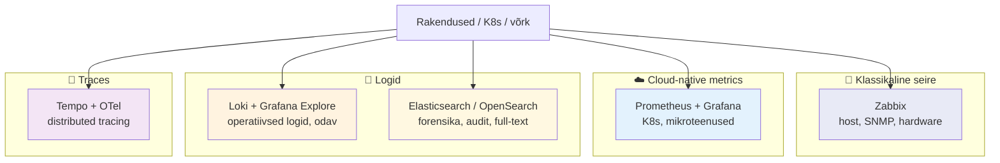


- **Zabbix** — võrguseadmed, hardware, klassikaline host-monitooring
- **Prometheus + Grafana** — Kubernetes ja mikroteenuste mõõdikud
- **Loki** — operatiivsed logid Grafana Explore'is (kerge, odav)
- **Elasticsearch või OpenSearch** — forensika, audit-logid, full-text otsing, semantic search
- **Tempo + OpenTelemetry** — traces (Päev 5)

Täna sa ei õpi Zabbixi asendust. Õpid täiendavat kihti, mis lahendab probleeme, mida Zabbix lahendada ei suuda.

!!! tip "💭 Mõtle hetk — enne edasilugemist"
    Sinu praeguse töökeskkonna logide ja sündmuste haldamine — kumb paradigma on sees? Klassikaline (host → item → trigger Zabbix-stiilis) või andme-tsentriline (logid kogutakse ühte storage'sse, päringud jooksvalt)? Või mõlemad korraga?

```
Kui mõlemad — milline rahvas üle sinu meeskonna teeb kumba? Kas need on samad inimesed või eraldatud rollid?
```

---

## 2. Maastik 2026

> **Plokk 1** (osa 1). ~10 min, jätkub kohe §1 järel.
>
> **Miks see sulle oluline:** aitab sul aru saada, millisesse ökosüsteemi tasub praegu panustada — Elastic-i suunda, OpenSearchi suunda, või Grafana LGTM suunda. Iga otsus lukustab sind aastateks.

Eelnev tabel ütleb mis paradigma muutus on. Aga miks just **praegu** on selle paradigma esindajad — Elastic Stack ja OpenSearch — sellised nagu nad on? Sest 2024–26 on observability-turul olnud rohkesti mängumuutuseid.

### Konsolideerimise laine

Viimase paari aasta jooksul on suured tegijad ostnud teisi suuri tegijaid:

- **Palo Alto Networks ostis Splunki** (sept 2024, ~$28 miljardit) [^palo-splunk] — Splunk muutub osaks security platvormist
- **Cisco** üritas Splunki osta, tehing ütleti 2024 alguses üles, Palo Alto astus sisse
- **IBM ostis HashiCorpi** (2024) — Terraform, Vault, Consul tulevad IBM-i pärandi alla
- **Datadog** kasvab agressiivselt, ostab väiksemaid (Codiac, Eppo, Voltron)
- **Grafana Labs** kasvab orgaaniliselt, hoiab open source'i ja paneb suure panuse LGTM stackile

Mida see sysadminile tähendab? **Vendor lock-in** on tagasi tulekul, isegi observability-ruumis, kus open source on olnud tugev. Iga kord, kui sa valid vendori, vaata litsentsi ja edasine ostumuster.

### Open source vastureaktsioon

Iga litsentsi-muutus tekitas forki:

- HashiCorpi Terraform → **OpenTofu** (Linux Foundation, 2023)
- HashiCorpi Vault → **OpenBao** (Linux Foundation, 2024)
- Elasticsearch → **OpenSearch** (AWS taga, **Linux Foundation septembris 2024** — OpenSearch Software Foundation moodustati neutraalse koduriigiga)
- MongoDB → ei ole tugevat forki (litsents jäi)

OpenSearch on 2026-l küpsuses: OpenSearch Foundationi raportite põhjal **sajad miljonid allalaadimised**, kümned tuhanded pull request'id ja kümned partnerid — see on üks suurimaid avatud otsingumootori projekte maailmas [^os-foundation]. AWS panustab sellesse jätkuvalt suuresti, aga ka Aiven, Logz.io, Oracle ja teised kontribueerivad.

2024 lõpus muutis Elastic litsentsi tagasi — lisas AGPL-i olemasolevatele SSPL + Elastic License valikutele. Shay Banon (Elastic-i looja) kirjutas blogiposti pealkirjaga "Elasticsearch is Open Source, Again". Hea PR, aga reaalsus on, et OpenSearch eksisteerib edasi ja kasvab.

### OpenTelemetry on võitnud instrumenteerimise

Üks asi, mis 2024–25 on selgelt välja kujunenud: **OpenTelemetry on muutunud de facto standardiks** rakenduste instrumenteerimisel. Datadog, Splunk, Elastic, Grafana, New Relic ja Dynatrace pakuvad kõigil OTel-põhist sisendit. See tähendab, et **rakenduse instrumenteerimine ei lukusta sind enam vendorile** — kui kirjutad oma rakenduse OTel SDK-ga, saad ükskõik kuhu eksportida.

Praktikas: OTel rakenduses → OTel Collector → ükskõik mis backend (Datadog, Tempo, Jaeger, Elastic APM, OpenSearch). Vendori vahetad ilma rakenduse koodi puutumata.

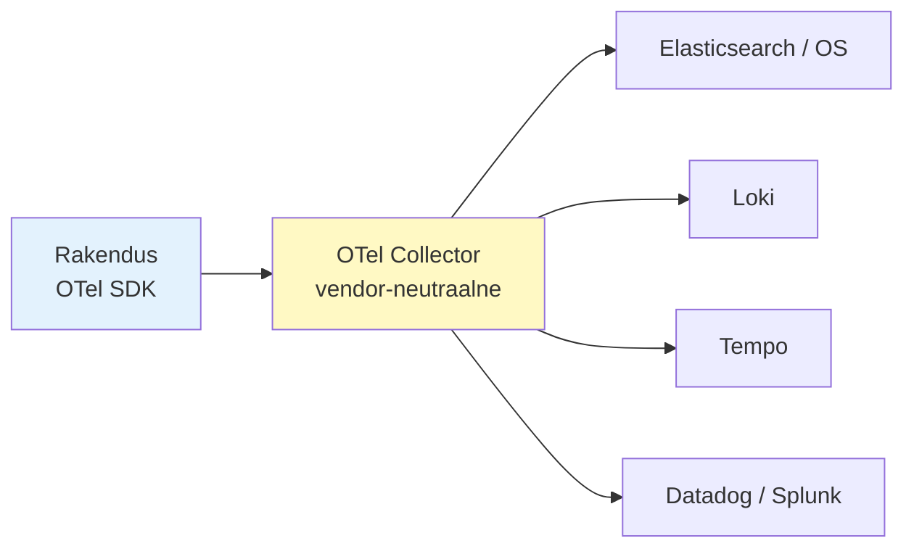

### Andmesalvestuse standard tulemas

Vähem tuntud, aga sysadminile oluline: **Apache Iceberg** on kiiresti kujunemas üheks standardseks tabeliformaadiks logi- ja turbeandmete andmejärvedes. Splunk Federated Search/Analytics, Snowflake, Databricks ja teised platvormid lisavad tuge Iceberg-tabelitele, mis lubab hoida logisid ühises objektisalvestuses (S3) ja teha päringuid mitme tööriistaga. Praegu on see veel uuem suund, aga tasub teada.

### AI-pööre — vector search ja Bedrock

Ja siis on **AI-pööre**. Ei "agentic AI päästab kõik" turundus, vaid praktilised muutused:

- **Vector search** on saanud nõudeks. Elasticsearch 8.x lisas `dense_vector` field 2022, ELSER 2023, `semantic_text` 2024.
- **OpenSearch 2.x** sisaldab **neural search** ja **ML Commons** plugin'it, integreerib **FAISS**'i (Facebook AI Similarity Search) ja toetab Amazon SageMakeri ja Bedrocki mudeleid.
- **Amazon OpenSearch Serverless** on Bedrock Knowledge Bases'i peamine ja tihedalt integreeritud vector-backend; AWS-i referentsarhitektuur RAG-lahendustele kasutab seda vaikimisi.
- **RAG** (Retrieval-Augmented Generation) — muster, kus LLM enne vastamist küsib relevante dokumente vector storage'st. ELK ja OS on selleks andmebaasiks.

Klientidele ei piisa enam "leia logist sõna error" — nad tahavad semantic similarity, AI-powered alerting, hybrid search. Day 3 lõpuks vaatame `semantic_text` ja neural search praktikas. Aga enne — kust me siia jõudsime?

---

## 3. Ajalugu, kust me siia jõudsime

> **Plokk 1** (osa 2). ~8 min, jätkub samas plokis.
>
> **Miks see sulle oluline:** aitab sul mõista, miks täna ELK ja OpenSearch ON kaks paralleelset projekti, kumb nendest on sinu olukorraga lähemal, ja miks järgmine sarnane litsentsi-drama tuleb tagasi (kui seda ei oska näha).

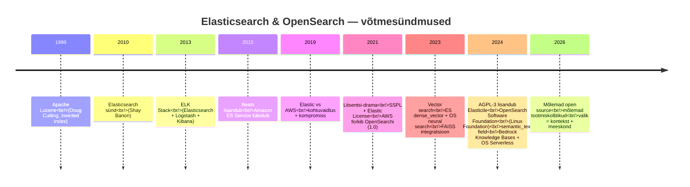


### 1999 — Apache Lucene sünd

Doug Cutting (sama mees, kes hiljem Hadoopi kirjutas) avaldab Java otsingulibrary nimega Lucene. Põhi-algoritm: **inverted index**. Sõna → dokumentide nimekiri, kus see sõna esineb. Sama põhi-idee, mis Elasticsearch'is tänapäeval kasutusel.

Lucene oli library, mitte server — programmeerija pidi selle oma rakendusse põimima.

### 2010 — Shay Banon ja Elasticsearch

Shay Banon, Iisraeli arendaja, kirjutas oma naise toidu-retseptide otsingusüsteemi jaoks Lucene peale REST API ja distribuiable klastri. Tegi sellest open source'i — Elasticsearch sünnib.

Asi võttis hoogu kiiresti — 2012 asutati Elastic NV (firma) Hollandis. Esimene major release 1.0 — 2014.

### 2013 — ELK Stack sünd

Logstash (2009) ja Kibana (2011) liideti samasse ökosüsteemi. Sünnib ELK Stack: Elasticsearch + Logstash + Kibana. Enne seda olid kaks valikut — Splunk (kallis) või syslog + grep (valus). ELK pakkus kolmandat: tasuta, tsentraalne, otsitav.

### 2015 — Beats lisandub, AWS astub sisse

Logstash oli raske (JVM, suur RAM). Lisandusid kerged agendid Go-s: **Filebeat** (failidest logid), **Metricbeat** (süsteemi mõõdikud), **Auditbeat** (audit-logid), **Packetbeat** (võrgupaketid). ELK saab "Elastic Stack"-iks.

Samal aastal käivitas Amazon **Amazon Elasticsearch Service**'i — managed Elasticsearch AWS-is. See oli kaubanduslik edu, aga ka tüli algus.

### 2019 — kohtuvaidlus

Elastic NV süüdistas Amazonit kaubamärgi-rikkumises ja eksitavas turunduses, esitas hagi. [Kohtuvaidlus lõppes 2019 kompromissiga](https://www.elastic.co/blog/elastic-and-amazon-reach-agreement-on-trademark-infringement-lawsuit), aga **tehnoloogiline ja ärilise pinge jäi**.

### 2021 — litsentsi-drama

Elastic NV ei näinud AWS-i Amazon ES teenusest tulu. Argument: AWS müüb meie tööd, meie ei saa midagi tagasi.

**Jaanuaris 2021** Elastic muudab versioonis **7.11** litsentsi: **Apache 2.0 → SSPL (Server Side Public License) + Elastic License**. SSPL nõuab, et kui sa pakud SSPL-tarkvara teenusena, peab kogu sinu teenuse stack ka avatud lähtekoodiga olema. **Open Source Initiative (OSI) ei tunnista SSPL-i open source litsentsina.**

Praktikas: AWS ei saa enam Apache 2.0 tingimustel Elasticsearchi managed teenusena pakkuda.

Vastus tuli kiiresti. AWS fork-is **viimase Apache 2.0 versiooni — Elasticsearch 7.10.2** — aprillis 2021. Koos Logz.io, Aiveni jt-ga moodustub **OpenSearch projekt** — Apache 2.0 all, AWS-i taga. Mai 2021 — esimene OpenSearch 1.0 release.

Kaks järgnevat aastat oli ökosüsteem segane. Millisel litsentsil mis versioon. Kas Logstash on ELK või OpenSearchi osa (mõlema — Logstash jäi Apache 2.0-le). Kas Kibana saab kasutada OpenSearchiga (algselt jah, hiljem ei).

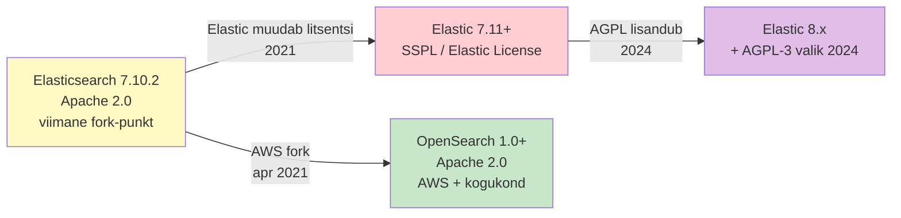


### 2023 — vector search

Elasticsearch 8.x lisab `dense_vector` field type, kNN otsingu, transformer-mudelite integratsiooni (Hugging Face). OpenSearch 2.x lisab neural search plugin'i ja FAISS integratsiooni.

### 2024 — kaks paralleelset uudist

Augustis 2024 kirjutab Shay Banon blogiposti **"Elasticsearch is Open Source, Again"**. Lisatakse **AGPL-3** kui kolmas litsents-valik (senise SSPL + Elastic License kõrvale). AGPL on OSI heaks kiidetud — niisiis Elasticsearch on tehniliselt jälle open source.

Septembris 2024 — **Linux Foundation kuulutab välja OpenSearch Software Foundation'i**. AWS andis OpenSearch projekti üle neutraalsele koduriigile. Kontribuendid: AWS, Aiven, Logz.io, Oracle ja teised. **OpenSearch ei kao** — eksisteerib edasi paralleelse projekti kujul.

### 2026 — kus me oleme

Mõlemad on open source. Mõlemad lisavad AI-võimekust agressiivselt. Mõlemad on tootmiskõlblikud. Valik on **kontekst- ja meeskonna-põhine**, mitte tehniline. Aga sa pead teadma, **mis nendega täna teha saab**. Selle juurde läheme nüüd.

---

## 4. Dokumendi-mudel: JSON, indeksid, mappings, data streams

> **Plokk 2** (osa 1). ~15 min, jätkub §3 järel.
>
> **Miks see sulle oluline:** see on **alus**, millele kogu Elastic Stacki monitooring on ehitatud. Kui sa ei mõista, mis on dokument ja kuidas indeks töötab, lähevad kõik järgnevad otsused (shard'id, mappings, ILM) sinust mööda.

### Logist saab dokument

Klassikaline Linux logi: tekstirida failis.

```
May 22 19:03:14 web-prod-01 nginx: 10.0.42.7 - - [22/May/2026:19:03:14 +0000] "GET /api/orders HTTP/1.1" 500 142 "-" "Mozilla/5.0"
```

Mida saab sellelt küsida? **Ainult `grep`-iga otsida**: "leia kõik read kus on `500`". Aga sa ei saa küsida: "leia kõik 5xx vastused, kus latentsus oli > 200ms, kasutaja oli sisselõginud ja see toimus tunni jooksul". Tekstirida ei tea, **mis on mis**.

Elasticsearch teisendab sama logi **JSON-dokumendiks**:

```json
{
  "@timestamp": "2026-05-22T19:03:14.000Z",
  "host.name": "web-prod-01",
  "service.name": "nginx",
  "client.ip": "10.0.42.7",
  "http.request.method": "GET",
  "url.path": "/api/orders",
  "http.response.status_code": 500,
  "http.response.body.bytes": 142,
  "user_agent.original": "Mozilla/5.0",
  "event.duration": 234000000,
  "user.id": "alice@example.com"
}
```

Nüüd sa saad küsida täiesti teistsuguseid päringuid:

- `http.response.status_code: [500 TO 599] AND event.duration > 200000000`
- `host.name: web-prod-* AND user.id: *@example.com`
- Aggregeerida: "top 10 client.ip, kes said 5xx vastuseid viimase tunni jooksul"

See on **structured logging**. Iga väli on **eraldi otsitav**, **filterdataav**, **agregeeritav**. See on põhjus, miks tootmissysteemid lasevad logid **JSON-ina** välja, mitte vabas tekstis.

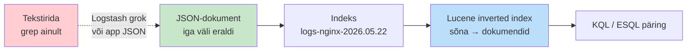


!!! tip "💡 ECS — Elastic Common Schema"
    Logidel on **standardiseeritud väljanimed** — `host.name`, `service.name`, `http.response.status_code` jne. See on **Elastic Common Schema**, mille Elastic avaldas 2019 ja mis on muutunud de facto standardiks. OpenSearch töötab samade väljanimedega. Kui sa kasutad ECS-i, on sinu dashboardid ülekantavad teise süsteemi.

### Indeks ≠ SQL-i indeks

Kui sul on SQL-taust, **unusta** see sõna hetkeks. SQL-is on "index" optimiseerimis-struktuur (B-tree või sarnane). Elasticsearchis on **indeks** loogiline **dokumentide kollektsioon** — nagu SQL-i **tabel** või MongoDB **collection**.

Nimetus tuli sellest, et iga sellise kollektsiooni all istub **Lucene'i inverted index** (mis on optimiseerimis-struktuur). Aga **ES-i indeks** on andmete-kollektsioon, mitte struktuur.

Monitooringus on indeksid **enamasti time-based**:

```
logs-nginx-2026.05.20
logs-nginx-2026.05.21
logs-nginx-2026.05.22  ← täna siia kirjutatakse

metrics-host-2026.05.20
metrics-host-2026.05.21
metrics-host-2026.05.22
```

**Miks päeva-kaupa?** Sest:

- Vana päev (eile) on **immutable** — sinna ei lisandu enam. Saab teha optimisat (force merge, snapshot).
- Vana päev saab **kolida odavamale storage'le** ilma täna-indeksit puudutamata (Hot → Warm → Cold).
- Vana päeva saab **kustutada** (delete index) ilma keerulise SQL `DELETE WHERE timestamp < ...` päringuta.

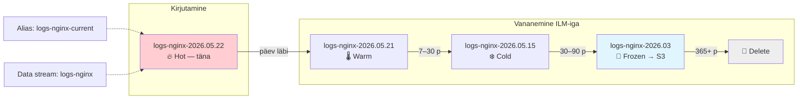


### Mapping — väljade sõnastik

**Mapping** on indeksi schema — mis väljad indeksis on ja mis tüüpi. ES saab mappingu **automaatselt** ära arvata (dynamic mapping), aga production'is mõistlikult **määrad ise**.

**Olulisemad välja-tüübid monitooringus:**


| Tüüp              | Kasutus                                               | Miks oluline                                         |
| ----------------- | ----------------------------------------------------- | ---------------------------------------------------- |
| `text`            | Full-text otsing ("error message" → tokeniseeritakse) | KQL `message: error` leiab; aga ei saa täpset matchi |
| `keyword`         | Exact match ("host.name": "web-prod-01")              | Filter, aggregation, sort                            |
| `date`            | Ajaline väli                                          | `@timestamp` päringuteks, range filter               |
| `long`, `double`  | Numbrid                                               | Latentsus, baidid, count'id                          |
| `boolean`         | true/false                                            | Filter                                               |
| `ip`              | IP-aadress                                            | CIDR päringud: `client.ip: 10.0.0.0/8`               |
| `geo_point`       | Latitude/longitude                                    | Kaardi-visualisatsioonid                             |
| `keyword` (multi) | Tagid, kategooriad                                    | terms aggregation                                    |


**Lugu, mille pärast see oluline on:** sa indekseerid logi `"host.name": "web-prod-01"`. Dynamic mapping otsustab et see on `text` (mitte `keyword`). Nüüd:

- KQL `host.name: "web-prod-01"` — **ei tööta** korralikult (text väli tokeniseeritakse, `web-prod-01` jaguneb)
- Aggregation **terms** `host.name` peale — ei luba seda (text väljade peal terms agg vaikimisi keelatud)
- Kibana Visualize ütleb "this field is not aggregatable"

Lahendus: määra `host.name: { "type": "keyword" }` enne esimest dokumenti. Selleks on **index template**.

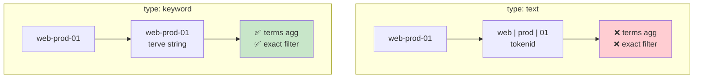


### Index template — schema, mis töötab tulevikku

Kui sa kirjutad iga päeva uue indeksi (`logs-nginx-2026.05.22`, `logs-nginx-2026.05.23`...), sa ei taha määrata mapping'ut iga indeksi jaoks eraldi. **Index template** ütleb: "kui keegi loob indeksi, mis vastab mustrile `logs-nginx-`*, rakenda neid seadeid ja mapping'ut".

```json
PUT _index_template/logs-nginx-template
{
  "index_patterns": ["logs-nginx-*"],
  "template": {
    "settings": {
      "number_of_shards": 1,
      "number_of_replicas": 1
    },
    "mappings": {
      "properties": {
        "@timestamp":              { "type": "date" },
        "host.name":               { "type": "keyword" },
        "client.ip":               { "type": "ip" },
        "http.response.status_code": { "type": "short" },
        "event.duration":          { "type": "long" }
      }
    }
  }
}
```

No igapäevane uus indeks saab automaatselt õiged seaded ja schema.

### Index alias — üks nimi, mitu indeksit

Kui rakendus tahab öelda "kirjuta uus logi siia", see ei taha teada, mis on tänane kuupäev. **Alias** on loogiline pseudõnim:

```
logs-nginx-current  →  logs-nginx-2026.05.22
```

Homme öösel toimub alias-rotation — `logs-nginx-current` osutab nuud `logs-nginx-2026.05.23` peale, atomic-operatsioon, rakendus ei märka muutust.

### Data stream — modernne abstraktsioon

Elasticsearch 7.9+ (ja OpenSearch) toetab **data stream'i** — see varjab alias'eid ja templates'eid ühe nime taha. Sa kirjutad `logs-nginx`, ES haldab rotatsiooni, hot/warm üleminekut, ILM-i — kõik on data stream'i sees.

```
logs-nginx  (data stream)
└─ .ds-logs-nginx-2026.05.20-000001  (Hot, kirjutamiseks)
└─ .ds-logs-nginx-2026.05.20-000002  (Warm)
└─ .ds-logs-nginx-2026.05.20-000003  (Cold)
```

Kaasaegne soovitus: **kasuta data streams logide jaoks**, klassikaline alias + template-lähenemine on backward-compatible.

!!! info "OpenSearch-i vasted"
    OpenSearch toetab samu kontseptsioone teiste nimedega ja üksikute erinevustega:

```
- **Index** = sama
- **Mapping** = sama
- **Index template** = sama
- **Index alias** = sama
- **Data stream** = OpenSearch 1.2+ toetab data streams analoogiliselt
- **ECS** = OpenSearch kasutab oma **OpenSearch Observability Schema (OOS)** või samu ECS välju (sageli kasutatakse ECS-i)
```

### Kokkuvõte

Elasticsearch ja OpenSearch on **dokumendi-baasidatel** — logi on JSON-dokument, mille iga väli on otsitav. Mapping määrab välja-tüübi (`text` vs `keyword` on monitooringu jaoks kriitilise tähtsusega). Indeks on dokumentide kollektsioon, mitte SQL-i indeks. Time-based indeksid (`logs-nginx-2026.05.22`) võimaldavad rotatsiooni, ILM-i ja kustutamist ilma SQL-stiilis DELETE-deta. Template + alias + data stream on operatiivsed tööriistad, mida sa **igapäevases monitooring-stackis kasutad**.

---

## 5. Stack ingestion: kuidas logid jõuavad klasterisse

> **Plokk 2** (osa 2). ~15 min, jätkub §4 järel.
>
> **Miks see sulle oluline:** Elasticsearch ise ei lae logisid — ta hoiab neid ja teeb päringuid. Vahel rakenduse ja klastri vahel istub **ingestion-kiht**, mis loeb logifaile, parsib neid, lisab kontekstit ja saadab klastrisse. See valik (Beats vs Logstash vs Elastic Agent vs OTel) **mõjutab sinu igapäevast tööd** rohkem kui klastri-konfiguratsioon ise.

### Beats — kerged shippers

**Beats** on **Go-s kirjutatud kerged data shippers**, igaks andmetüübiks oma. Installeeritakse igale hostile (server, konteiner, VM), nad loevad oma andmeid ja saadavad otse ES-i või Logstash'i / Kafka kaudu.


| Beat             | Mida shippib                         | Näide kasutuses                                  |
| ---------------- | ------------------------------------ | ------------------------------------------------ |
| **Filebeat**     | Logifailid (`/var/log/`*, app logid) | Iga nginx, sshd, app server                      |
| **Metricbeat**   | Süsteemi + app meetrikud             | CPU, mälu, ketas, MySQL päringud, Redis-i memory |
| **Auditbeat**    | Linux audit logid                    | Failimuutuste jälgimine, kasutaja-tegevused      |
| **Heartbeat**    | Uptime checks (HTTP/TCP/ICMP)        | Kas API on üleval? Kas SSL-sert kehtib?          |
| **Packetbeat**   | Võrgu-pakettide analyys              | DNS, HTTP, Cassandra protokolli-tasemel          |
| **Winlogbeat**   | Windows Events                       | AD logimine, security events                     |
| **Functionbeat** | Cloud function logid                 | AWS Lambda, GCP Functions                        |


**Plus:** kerge (10–20 MB RAM per beat), kiire, lihtne konfigureerida.

**Miinus:** iga andmetüübi jaoks eraldi beat = **mitu serviceit**. Suuremas keskkonnas (1000+ hosti) on **konfiguratsiooni-haldus** valus.

### Logstash — raskekõige transform-mootor

**Logstash** on **JRuby-l põhinev pipeline** (`input → filter → output`), mis suudab teha keerulisi transformatsioone. Klassikaline kasutus: **unstructured logi parsing**.

```
input {
  beats { port => 5044 }
}
filter {
  grok {
    match => { "message" => "%{IPORHOST:client.ip} %{HTTPDATE:[@timestamp]} \"%{WORD:http.request.method} %{URIPATH:url.path}" }
  }
  geoip { source => "client.ip" }
  date { match => [ "[@timestamp]", "dd/MMM/yyyy:HH:mm:ss Z" ] }
}
output {
  elasticsearch {
    hosts => ["https://es01:9200"]
    index => "logs-nginx-%{+YYYY.MM.dd}"
  }
}
```

**Tugev kus:**

- **Grok** — regex-põhine parsing unstructured logidele (kus rakendus ei suuda JSON-i väljastada)
- **Enrichment**: GeoIP (IP → riik/linn), DNS lookup, user_agent parse
- **Mitu sisendit / väljundit korraga**: ES + Kafka + S3
- **Conditional logic**: "kui status_code >= 500, saada ka Slack'i"

**Nõrk kus:**

- **Raske** — JVM, 1–2 GB RAM, installüss + haldus
- **Sundjada toimkonda** — vahel pole tegelik vajadus

**Tavaline disain**: Beats hostidel → Logstash (kesksena, 1–3 instantsi) → ES. Logstash teeb "raskem" töö (parsing, enrichment), Beats teevad "kõva" töö (lugemine + saatmine).

### Elastic Agent + Fleet — moderne tee (2022+)

Elastic võttis 2022 vastu valikuotsuse: **mitme erineva Beat'i asemel üks Agent**.

**Elastic Agent** on **üks binary**, mis suudab teha kõike, mida Beats teevad eraldi:

- Loeb logifaile (nagu Filebeat)
- Kogub metrikuid (nagu Metricbeat)
- Audit logid (nagu Auditbeat)
- Uptime checks (nagu Heartbeat)

Konfiguratsioon ei toimu hostis (YAML failina), vaid **Fleet'is** — Kibana sisene UI, kust haldad kõiki agente keskselt.

**Integration'id** — valmis-konfiguratsioonid spetsiifilistele teenustele: nginx, Apache, MySQL, PostgreSQL, Redis, Kafka, Kubernetes, AWS, Azure, GCP, Docker, Fortinet, Cisco jne. Kõik koos dashboardide, alertide, ECS-mappingutega.

**Soovitus:** **uutele deployment'idele kasuta Elastic Agent + Fleet'i**. Olemasolev Beats setup töötab edasi, aga migreerumine on mõtlik.

### Andmevoog (üldine pilt)

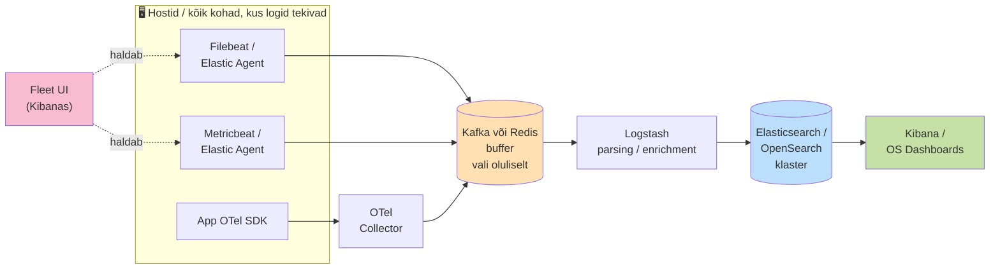


**Kafka või Redis vahel** on tihti vajalik, kui logide-maht on > ~100 GB/päev või klaster maintenance'i ajal ei tohi logisid kaotada.

### OpenSearch ingestion

OpenSearchil ei ole Elastic-i Beats'idega ühilduvat ökosüsteemi (alates 2021 fork'i ajast Beats jäi Elastic'iga). OpenSearch'i tavaline ingestion-stack:


| Komponent                      | Kirjeldus                                                   | Vaste Elastic'is                  |
| ------------------------------ | ----------------------------------------------------------- | --------------------------------- |
| **Data Prepper**               | OpenSearchi natiivne pipeline (Java, sarnane Logstashile)   | Logstash                          |
| **Fluent Bit**                 | Kerge log shipper, vendor-neutral, kõige populaarsem OS-iga | Filebeat                          |
| **Fluentd**                    | Raskem variant Fluent Bit'ist, Ruby-põhine                  | Logstash (osaliselt)              |
| **Vector**                     | Datadog'i avatud-kood log shipper, Rust, kiire              | Filebeat / Logstash kombineeritud |
| **OpenSearch Ingestion** (AWS) | AWS-i hallatud Data Prepper teenus                          | Elastic Cloud ingestion           |


### OpenTelemetry Collector — tulevik

**OpenTelemetry Collector** (OTel Collector) on **vendor-neutraalne** ingestion-lüli. Aktsepteerib **metrikuid, traceid ja logisid** (logid newer-feature), väljastab kuhu tahad: ES, OS, Tempo, Prometheus, Loki, Splunk, Datadog — kõik korraga või valikuliselt.

**Miks oluline:** kui sa instrumenteerid oma rakenduse OTel SDK-ga, sinu vendor-valik jääb **avatuks**. Saad migreeruda ES → OS, või välja-lülitada Splunk'i ühes regioonis, ilma rakenduse-koodi muutmata.

### Otsustamise raam: mis ingestion-tööriist?


| Olukord                                             | Vali                                                        |
| --------------------------------------------------- | ----------------------------------------------------------- |
| Uus Elastic Stack deployment                        | **Elastic Agent + Fleet**                                   |
| Olemasolev Beats setup, ei taha migreerida          | Beats edasi, lisa Logstash kui vaja parsing'ut              |
| Vajab kompleks-parsing'ut unstructured logide jaoks | Filebeat → **Logstash** → ES                                |
| OpenSearch deployment                               | **Fluent Bit + Data Prepper** või **OTel Collector**        |
| Vendor-neutral, multi-backend (ES + Splunk + Tempo) | **OTel Collector**                                          |
| Logide-maht > 100 GB/päev, klaster on "värske"      | Lisa **Kafka** vahele puhvriks (sama §7 Kafka osa)        |
| Cloud-native (Kubernetes-natiivne)                  | **Fluent Bit** (sidecar / DaemonSet) või **OTel Collector** |


!!! tip "💡 Mõtle hetk"
    Mis sinu organisatsioonis on praegu ingestion-kihiks? Kui see on "app kirjutab faili, syslog-ng saadab kuhugi", siis migreerumine **Filebeat'ile või Elastic Agent'ile** võtab järjepideva nadalavahetuse, aga vahetab teie monitooring-võimekuse täiesti ümber.

### Kokkuvõte

Ingestion-kiht otsustab, mis kvaliteediga logid klastrisse jõuavad ja kui palju vaeva võtab nende haldamine. **Beats** on klassikaline (üks-andmetüüp-üks-beat), **Logstash** on raskem transform-mootor, **Elastic Agent + Fleet** on modern unified lähenemine. **OpenTelemetry Collector** on vendor-neutraalne tulevik. OpenSearchi vasted: Data Prepper, Fluent Bit, Vector. **Sinu valik mõjutab igapäevast tööd rohkem kui klastri-konfiguratsioon.**

---

## 6. Elasticsearch vs OpenSearch täna

> **Plokk 3.** ~12 min, enne lõunat.
>
> **Miks see sulle oluline:** otsustamise raam, mille järgi valida Elastic Cloud, Elasticsearch on-prem, Amazon OpenSearch Service, OpenSearch Serverless või OpenSearch on-prem — koos hinnamudelite ja TCO komponentidega, mida CFO sinult küsib.

### Komponendid — peaaegu identsed

Sama tüvi 2021-st tähendab, et komponendid kannavad sageli sama nime ja teevad sama asja. Esmalt vaatame **Elastic Stack** terviklikult, siis kõrval OpenSearchi vasted.

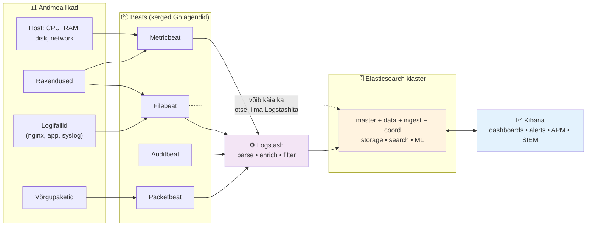


**Õkosüsteemide vaste — sama rollid, eri nimed:**


| Roll                                             | Elastic Stack                              | OpenSearch ökosüsteem                                           |
| ------------------------------------------------ | ------------------------------------------ | --------------------------------------------------------------- |
| Distribuiable otsingumootor + dokumendisalvestus | Elasticsearch                              | OpenSearch                                                      |
| UI ja dashboardid                                | Kibana                                     | OpenSearch Dashboards                                           |
| Andmevoog (pipeline'id, parse, transform)        | Logstash                                   | Logstash *(sama, Apache 2.0)* + Data Prepper (OS-spetsiifiline) |
| Kerged agendid                                   | Beats (Filebeat, Metricbeat, Auditbeat...) | Beats + Data Prepper                                            |
| APM / tracing                                    | Elastic APM                                | OpenSearch trace analytics                                      |


Kibana ja OpenSearch Dashboards näevad **80% identsed** välja — sama tüvi 2021-st. Sa avad ühe ja vaatad teist, vahel on raske ütelda, kummaga töötad. Erinevused tekivad seal, kus toode on 2021+ arenenud.

**Mida diagramm süsadminile ütleb:**

- **Beats** on kerged Go-agendid host'idel — kogu raske töö (parse, enrich) toimub mujal
- **Logstash** on **valikuline** — lihtsate kasutusjuhtude jaoks Beats saadab otse ES-i. Logstash tuleb juurde kui vaja keerukamaid pipeline'e (grok parsing, geoIP, lookup tabelid)
- **Elasticsearch klaster** on südamik — sealsamas elavad nii **logid**, **mol metrics**, **APM traçeid** kui **vector embeddings**
- **Kibana** ei ole "ainult dashboardid" — ta on **kogu Elastic Stack'i UI**, sh APM, SIEM (security), Observability, Machine Learning kasutajaliidesed

### Security

**Elastic xpack** (osa Elastic License) on Elastici enda security stack. RBAC, doc-level security, field masking, audit-log, SSO, krüpteerimine. Põhilised asjad on tasuta (Basic license), edasijõudnud (SAML SSO, audit) kommerts (Platinum+).

**OpenSearch Security plugin** (Apache 2.0) on **vaba**. Teeb sama asju: RBAC, doc-level, field masking, audit. Konfiguratsioon erineb (YAML failid vs API), aga võimekus on sageli **rikastam vabas versioonis** kui Elastic xpack basic.

### AWS integratsioon — OS-i tugevaim eelis

**Amazon OpenSearch Service** on disainitud AWS-i ökosüsteemis natiivselt töötama:

- **IAM, Cognito, SAML, KMS** — autentimine ja krüpteerimine läbi AWS-i identity-süsteemi
- **CloudWatch, CloudTrail** — sisseehitatud monitooring ja audit
- **Zero-ETL integratsioonid** — CloudWatch Logs, DynamoDB, DocumentDB, S3, Security Lake andmed otseselt OS-i ilma eraldi pipeline'ita
- **Bedrock + SageMaker + OpenAI / Cohere / DeepSeek** — vector mudelite integratsioon klikiga
- **Cross-AZ data transfer included** — kuluvõit Multi-AZ klastritele
- **Graviton ja OR1 instances** — cost-effective AWS-i enda hardware

Kui sul on AWS-i keskkond, OpenSearch on pärisilmas tihti **lihtsam ja odavam** kui Elasticsearch Cloud Marketplace'i kaudu.

### Machine learning ja vector search

**Elastic** pakub kahte asja, mis on praktikas väga lihtsalt kasutatavad:

- **ELSER** (Elastic Learned Sparse EncodeR) — Elastic-i enda treenitud sparse retrieval mudel. Pre-trained, töötab inglise keeles. Lisaks toetab Elastic teisi embedding-mudeleid (nt e5-põhised multilingual mudelid), mida saab `semantic_text` väljaga siduda.
- `semantic_text` field (8.13+, 2024): lisad indeksisse semantic_text-tüüpi välja, Elastic indekseerib selle automaatselt nii BM25-ga (sõnaline) kui ELSER-iga (semantiline). Päring annab hübriid-skoori.

**OpenSearch** pakub kahte komplementaarset võimalust:

- **ML Commons plugin** — sa registreerid oma mudeli (HuggingFace, ONNX, custom). Rohkem konfigureerimist, aga rohkem paindlikkust.
- **Neural search plugin** — high-level abstraktsioon, mis kasutab ML Commons'i sees.
- **FAISS integratsioon** — Facebook AI Similarity Search Library, optimeeritud vector indekseerimine.
- **OpenSearch Serverless vector database** — alates 2024 on see **default vector DB Amazon Bedrock Knowledge Bases'i jaoks**. AWS-i ametlik RAG-infrastruktuur.

Praktikas — Elastic on **välja-kastist** lihtsam (`semantic_text` on üks rida), OpenSearch on **paindlikum ja AWS-iga sügavalt integreeritud** (oma mudel, oma fine-tuning).

### Cloud ja managed teenused


| Pakkuja            | Toode                            | Tähelepanekud                                            |
| ------------------ | -------------------------------- | -------------------------------------------------------- |
| Elastic NV         | Elastic Cloud (AWS, GCP, Azure)  | täisteenus, 14-päevane trial krediitkaardiga             |
| AWS                | Amazon OpenSearch Service        | kõige populaarsem managed OS, AWS-natiivne               |
| AWS                | **Amazon OpenSearch Serverless** | auto-scaled, vector DB Bedrock Knowledge Bases'i default |
| Aiven              | OpenSearch managed               | multi-cloud, ei lukusta AWS-i                            |
| Logz.io            | OpenSearch-põhine SaaS           | spetsialiseerunud logidele                               |
| Bonsai, Elastic.co | Väiksemad managed pakkujad       | startup'idele                                            |


### Skaala arvud (2026)

Amazon OpenSearch Service'i raamid annavad arusaama, mida need süsteemid praktikas tähendavad [^aws-os-quotas]:

- **25 PB** hot data ühes klastris
- **15 PB** warm data lisaks
- **1000 data node'i** maksimum
- **200 coordinator node'i** lisaks
- **99.99% availability** Multi-AZ + standby arhitektuuri korral
- **Trillions of requests per month** — agregeeritud kõik AWS-i kliendid

Need ei ole tüüpilised numbrid, mida sa oma keskkonnas kohtad — aga need näitavad, et tehnoloogia ei ole **see** piirang. Piirang on tüüpiliselt eelarve ja arendaja-aeg.

### Hinnad ja TCO — millest tegelikult koosneb arve

Kui CFO küsib "miks Splunk on nii kallis ja kas saaks ELK-le üle minna?", siis vajad sa raami, kuidas neid võrrelda. Pole ühte "oige" hinda — on **kolm fundamentaalselt erinevat hinnamudel**:


| Hinnamudel                    | Kes kasutab                                                                           | Mis on kulu juur                                                                                                                |
| ----------------------------- | ------------------------------------------------------------------------------------- | ------------------------------------------------------------------------------------------------------------------------------- |
| **Per-GB-ingested**           | Splunk Cloud [^splunk-pricing], Datadog Logs [^datadog-pricing]                       | Iga GB sissetulev logi maksab. Lihtne arvutada, aga **karistab logi-mahtu** — sundib sind logimist vähendama.                   |
| **Instance-based (resource)** | Amazon OpenSearch Service [^aws-os-pricing], self-hosted ES/OS                        | Maksad **node'ide eest** (RAM × CPU × ketas), mitte logi-mahtude eest. Kasv on ennustatav, aga sa pead **ise dimensioneerima**. |
| **Tier'i-põhine**             | Elastic Cloud (Standard/Gold/Platinum/Enterprise) [^elastic-pricing], Confluent Cloud | Vali tier (RAM/CPU/storage komplekt) + add-ons. Tasakaal lihtsuse ja paindlikkuse vahel.                                        |


**Praktilised suurused** (avalike hinnakirjade põhjal, 2026 alguses):

- **AWS OpenSearch Service**, 3-node klaster `r6g.large.search` (2 vCPU, 16 GB RAM, 100 GB EBS gp3): umbes **$260–320/kuu** on-demand + storage + transfer. Reserved Instances annab 30–50% allahindlust 1–3 aasta lepingul.
- **Elastic Cloud**, Standard tier, väike production setup (4 GB RAM hot + 60 GB storage): umbes **$95–110/kuu**. Skaleerub lineaarselt tier'idega.
- **Splunk Cloud**, ajaloolised hinnad olid `$1500–2000/GB/päev` tier; 2024+ uus "Workload Pricing" mudel on paindlikum, aga **suurusjärk on sama** — 100 GB/päev = 5–6-kohaline aastane arve.
- **Loki + Grafana Cloud** (Day 2 katsetatud) on **3–10× odavam** per-GB ELK-st, sest indekseerib ainult silte, mitte täisteksti. Compromiss — vähem otsingu-paindlikkust.

**TCO komponendid, mis sageli unustatakse:**

1. **Cross-AZ data transfer** — AWS-is maksab data liikumine AZ'ide vahel ($0.01–0.02/GB). 1 TB/päev kolme AZ'i vahel = ~$30/päev. **Amazon OpenSearch Service includes seda** — see on suur nähtamatu eelis. Self-managed ES Multi-AZ EC2-l peab kasutaja seda maksma.
2. **RAM kui peamine kulutaja** — ES/OS armastab heap-mälu (vector search'iga eriti, HNSW graafid mälus). 32 GB RAM node maksab tihti rohkem kui 1 TB SSD.
3. **Operations overhead** — self-hosted on "tasuta tarkvara", aga DevOps-tunde on vaja. SaaS = 2–3× tarkvara-hind, aga DevOps-aega ei kulu.
4. **Search workload** — vector search on **CPU-intensiivne**. ELSER mudel + 1M dokumenti = märgatav CPU-löik klastri kogu-koormusele. Planeeri **eraldi node'id ML tööle**, kui plaanid AI-funktsioone.

**Mõistlik harjutus:** võta oma praeguse seire-eelarve, jaga see klassi `[tarkvara, hardware/cloud, personali-aeg, andmeedastus]` kategooriasse. Kui sa lihtsalt vahetad Splunki ELK vastu, **personali-aeg tõenaoliselt kasvab** ja seda tuleb arvestada otsuses.

!!! tip "💭 Mõtle hetk — enne edasilugemist"
    Sinu organisatsiooni praegune logimine — kumb hinnamudel on aluseks? Per-GB-ingested (Splunk, Datadog), instance-based (ES/OS on-prem või AWS) või SaaS-tier?

```
Kui sa ei tea — see ise on signaal: keegi sinu finants- või operatsiooni-rollis teab seda, aga see info ei jõua sinuni. Esmaspäeval tasub küsida.
```

### Litsents — lühidalt

- **Elasticsearch** = AGPL-3 **või** SSPL **või** Elastic License (kolmest valida)
- **OpenSearch** = Apache 2.0 (lihtne, vaba)

Kui sa pakud teenust kommertsiaalselt ja tahad vältida juriidilist debatti — OpenSearch on lihtsam. Kui sul on lihtsalt sisemine kasutus, Elasticsearchi kõik kolm litsentsi on okei.

### Kus kumb sobib — sysadmin perspektiivist

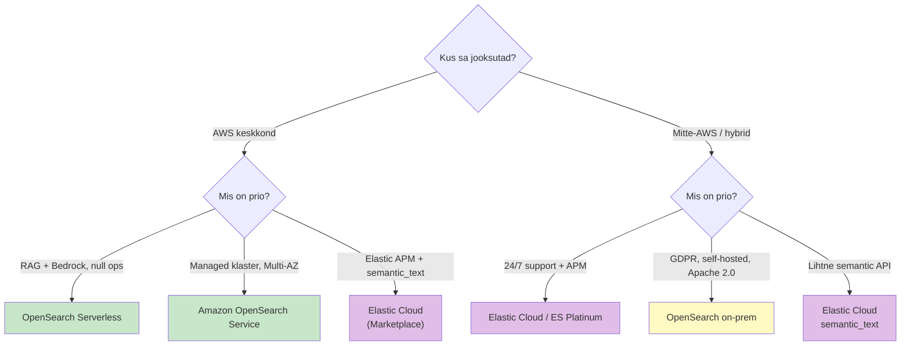


**Vali Elastic Cloud / Elasticsearch on-prem kui:**

- Sul on kommertsiaalne nõue (sertifitseerimine, 24/7 support)
- AI / semantic search on prio ja sa tahad lihtsat API-d (`semantic_text`)
- Sa kasutad Elastic APM-i (Elastic on siin tugevam kui OpenSearch)
- Sa pole AWS-is

**Vali Amazon OpenSearch Service kui:**

- Sa oled AWS-i keskkonnas
- Vendor lock-in vältimine on prio (Apache 2.0)
- Tahad Multi-AZ + standby out-of-the-box (99.99%)
- AWS-i Bedrock-integratsioon ja RAG on tee

**Vali OpenSearch Serverless kui:**

- Sa ehitad RAG-rakendust Bedrock Knowledge Bases'iga
- Vector DB peaks auto-skaleeruma (mitte fixed-size klaster)
- Operational overhead peab olema null

**Vali OpenSearch on-prem kui:**

- Suur self-hosted klaster, vaba security plugin on tähtis
- Andmed ei tohi AWS-i lahkuda (compliance, GDPR)
- Sa tahad oma ML mudelid laadida (ML Commons paindlikkus)

Sellega on **Plokk 3** läbi. Pärast lõunat (Plokk 4) vaatame, miks production-klaster näeb teistsugune välja kui single-node setup — ja miks kodutöös ([Lab Osa 1](../../labs/03_elk_stack/lab.md)) Kibana klastri olekut **kollasena** näitab.

---

## 7. Arhitektuur: sõlmed, shardid, quorum, 99.9%

> **Plokk 4.** ~25 min — enne labi [Osa 2](../../labs/03_elk_stack/lab.md) (3-node klastri laienemine).
>
> **Miks see sulle oluline:** aitab sul dimensioneerida klastrit, mis ei kuku ootamatult — mitu master node'i, kui palju RAM-i, kus on backup'id, kuidas Kafka puhverdab koormust, ja millal mis indeks tier'isse läheb.

Kodutöös ([Lab Osa 1](../../labs/03_elk_stack/lab.md)) paned Elasticsearchi ja Kibana single-node klastrina püsti. Seal võib esimese pilguga tunduda imelik: lõid indeksi, läksid Kibanasse, ja **klastri olek näitab kollasena**. Andmed on sees, otsing töötab, aga oleku-tuli on kollane. Miks?

Vastus on **replica shardides** ja sellega, et single-node klastris pole võimalik neid kuhugi paigutada. Selle teema raames vaatame, kuidas Elasticsearch (ja OpenSearch — identne arhitektuur) on **päriselt** ehitatud, et mõista, miks production-klaster näeb välja teistsugune kui Osa 1 setup.

### Sõlmerollid — neli rolli, sama binary

Elasticsearchi node ja OpenSearchi node on sama binary, aga konfiguratsioonis saab määrata, mis **rolli** see node täidab. Üks node võib täita mitut rolli korraga (väikeses klastris üks node täidab kõike). Aga tootmiskeskkondades **eraldatakse rollid**:


| Roll             | Mida teeb                                                                                                                                   | Resurssi-profiil                                         |
| ---------------- | ------------------------------------------------------------------------------------------------------------------------------------------- | -------------------------------------------------------- |
| **master**       | Hoiab klastri olekut (mis indeksid, mis shardid, mis node-id), võtab vastu cluster-tasemel päringuid (indeksi loomine, shard'i liigutamine) | Vähe CPU, vähe mälu, kiired diskid                       |
| **data**         | Hoiab tegelikke shardide andmeid, indeksib uusi dokumente, vastab otsingu-päringutele                                                       | Palju CPU, palju mälu (heap + page cache), kiired diskid |
| **ingest**       | Käivitab ingest pipeline'e (grok, geoIP, rename, script processor jne) enne dokumendi salvestamist                                          | Palju CPU                                                |
| **coordinating** | Võtab vastu klientide päringuid, jagab need data node'idele, koondab tulemused                                                              | Vähe diski, keskmine CPU/mälu                            |


Iga node on **vaikimisi kõik neli rolli** (default). Tootmises eraldad neid:

- 3 × dedicated master (väikesed, ainult master)
- N × data nodes (suured, palju mälu)
- 2+ × coordinating-only nodes load balancer rollis (suure päringukoormuse korral)
- ingest võib olla data node'il kaasas või eraldi

**Miks eraldada?** Sest master peab klastri olekut hoidma **stabiilselt**. Kui sama node teeb ka data tööd ja saab raske päringu — GC pause, OOM, ülekoormus — kogu klastri olekuhaldus läheb maha. Eraldatud master-only node on **väike ja vaikne**, ainult olekut hoiab.

Visuaalselt näeb production-klaster välja umbes nii:

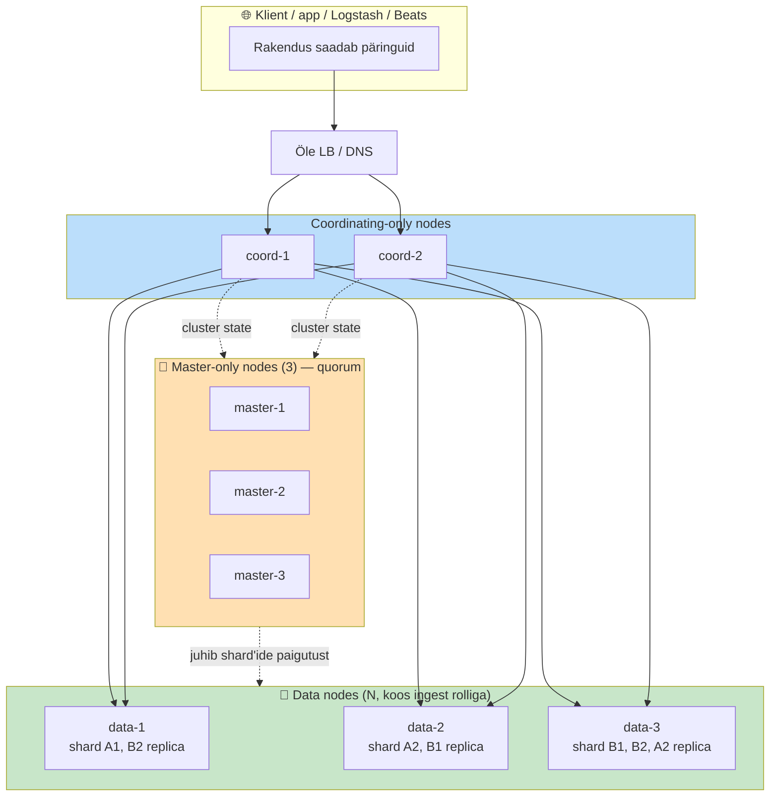


Klient ei pea teadma, kus mis shard on — coordinator teab seda master'i cluster state'ist ja teeb routing'u ära.

### Shardid — primary ja replica

Indeks Elasticsearchis on **loogiline konteiner**. Füüsiliselt jaotub ta **shardideks** — Lucene-indeksid, mis paiknevad data node'idel.

Indeksi loomisel määrad kaks numbrit:

- `**number_of_shards`** (primary) — mitmeks tükiks indeks jaotub. Vaikimisi 1. Hilisem muutmine on raske (reindex), niisiis vali ette.
- `**number_of_replicas**` — mitu koopiat igast primary shardist tehakse. Vaikimisi 1. Saab jooksvalt muuta.

Näide: indeks `logs-2026.05` `number_of_shards: 3` ja `number_of_replicas: 1` = **3 primary + 3 replica = 6 shardi kokku**. Kui sul on 3 data node'i, paigutab Elasticsearch shardid nii, et iga primary ja tema replica on **eri node'idel** — muidu node'i kadu kaotaks andmed.

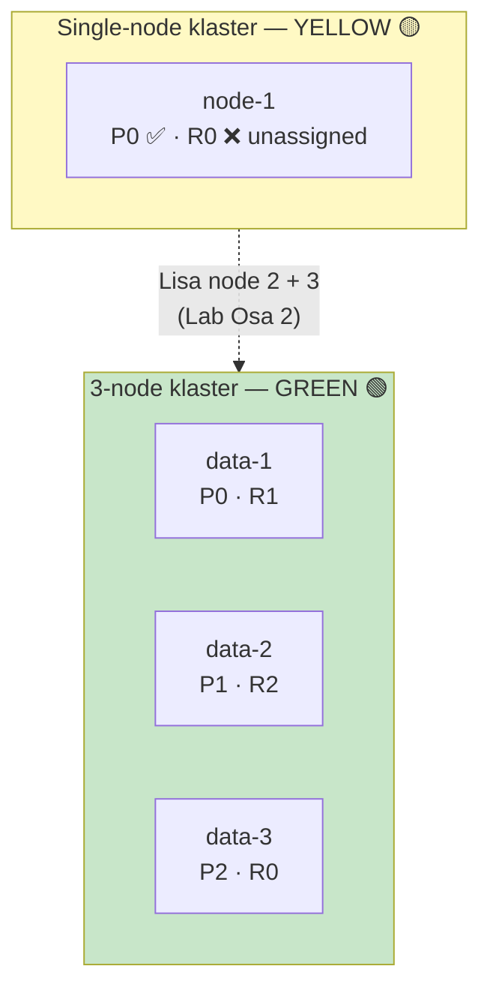

**Roll päringus:**

- Indekseerimine: dokument läheb **primary**'sse, sealt **replica**'sse (synchronous, mitte fire-and-forget). Kui replica ei kinnita, primary käsib master'il replica märkida `STALE`.
- Otsing: koordinaator vaatab, kus iga shardi koopia on, ja saadab päringu **ühele neist** (round-robin, mitte kõigile). Replica niisiis pole ainult HA, vaid ka **päringu-koormuse jagaja**.

**Tagasi labi kollase oleku juurde:** single-node klaster (Lab Osa 1). `number_of_replicas: 1` (default). Replica peab paiknema **erinevas node'is** kui primary. Erinevat node'i pole. Replica jääb **unassigned**. Klastri olek = **YELLOW** ("toimib, aga pole redundantne"). Lisa teine node (Lab Osa 2) → replica paigutub → GREEN.

### Cluster state ja quorum — miks **kolm** master node'i

Master node hoiab **cluster state**'i: tabelit, mis loetleb iga indeksi, shardi, node-i ja nende staatuse. See on üks autoriteetne allikas — ja see peab olema **järjepidev kõigil masteri-kandidaatidel**.

Probleem tekib siis, kui võrk lahkneb (network partition). Kujuta ette: 2 master node'i, võrk lahkneb pooleks.

- Node A arvab: "B kadus, mina olen ainus, ma olen master"
- Node B arvab: "A kadus, mina olen ainus, mina olen master"
- Klastri olek lahkneb kaheks. Ühel pool kirjutatakse indeksisse X, teisel pool kirjutatakse indeksisse Y. Võrk taastub — **konflikt**, andmed on ebajärjepidevad. See on **split-brain**.

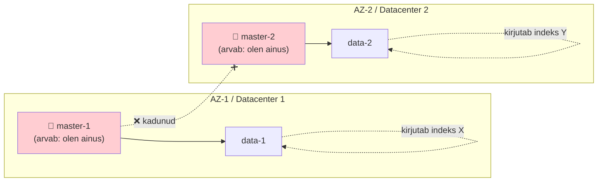


Kaks master'it korraga, mõlemad võtavad kirjutusi vastu — võrk taastub, **kumb on "õige" andmeseis?**

Lahendus: **quorum**. Master valitakse ainult siis, kui **enamus** master-kandidaatidest nõustub. Enamus tekib ainult ühel pool partitsiooni.

Matemaatika: kui sul on **N** master-kandidaati, quorum = **⌊N/2⌋ + 1**.

- N=2 → quorum=2 → kui üks kaob, klaster peatub. Halvem kui üks node!
- N=3 → quorum=2 → üks võib kaduda, klaster töötab edasi. ✅
- N=5 → quorum=3 → kaks võib kaduda. Suurematele klastritele.

**Niisiis tõsiselt mõeldud klaster algab 3 dedicated master node'iga.** Mitte sellepärast et "3 on hea arv", vaid sellepärast et quorum-matemaatika nõuab paaritut arvu ja vähem kui 3 ei talu ühtegi kadu.

### 99.9% (ja 99.99%) praktikas

**99.9% uptime** = ~8.7 tundi downtime aastas. **99.99%** = ~52 minutit aastas. **99.999%** ("viis üheksat") = ~5 minutit aastas. Igale lisanduvale üheksale kasvab kulu eksponentsiaalselt.

Mida need numbrid praktikas nõuavad:


| SLA                 | Mida nõuab                                                                                                                                               |
| ------------------- | -------------------------------------------------------------------------------------------------------------------------------------------------------- |
| 99.5% (best-effort) | 1 node võib jooksta, restart on okei.                                                                                                                    |
| 99.9%               | 3-node klaster, replica=1, automaatne shard recovery. Master + data eraldatud või kombineeritud. Plaaniline hooldus nädalavahetustel.                    |
| 99.99%              | **Multi-AZ** (3 erinevat data-keskust või AWS Availability Zone'i). 3 dedicated master üle AZ'ide. Replica üle AZ-ide. Snapshot-de regulaarne testimine. |
| 99.999%             | Multi-region + CCR (Cross-Cluster Replication). Reaalselt vähesed väljärakendused nõuavad seda.                                                          |


**Multi-AZ + standby** (AWS OpenSearch Service erijuhtum): 3 master + 3 data üle 3 AZ-i, lisaks **standby data nodes** ühes AZ-is, mis ei võta päringuid vastu, aga hoiavad replicaid. AZ kao korral standby võtab koormuse üle ilma rebalancing'uta. See on AWS-i ametlik **99.99% mudel**.

### Snapshots — ainus tegelik backup

Replica ei ole backup. Kui keegi kustutab `_delete_by_query` valega õla, replica sai sama käsu — andmed kadusid mõlemast. Backup tähendab **snapshot**'i, mis on sõltumatu point-in-time koopia välises storage'is.

Elasticsearch ja OpenSearch toetavad snapshot'e mitmesse repositooriumisse:

- **S3** (kõige levinum) või S3-ühilduvad (MinIO, Ceph)
- **Azure Blob, GCS**
- **Shared filesystem** (NFS) — testimiseks ok, tootmisse mitte
- **HDFS** — vanad keskkonnad

```http
PUT _snapshot/my_s3_repo
{
  "type": "s3",
  "settings": { "bucket": "my-elasticsearch-backups", "region": "eu-north-1" }
}

PUT _snapshot/my_s3_repo/snapshot_2026_05_17
{ "indices": "logs-*", "include_global_state": false }
```

**Snapshot Lifecycle Management (SLM)** automatiseerib: igapäevased snapshotid, 30 päeva säilitamine, vana kustutamine. **Aga —** ja see on oluline — **testi restore**'i regulaarselt. Snapshot, mida pole kunagi taastatud, ei ole backup.

### CCR — Cross-Cluster Replication

Kahe klastri vahel: üks **leader**, teine **follower**. Leader'i indeksid replikeeritakse follower'isse asynkroonselt. Kasutusjuhtumid:

- **Disaster recovery** — teine klaster teises piirkonnas, leader'i kao korral follower võtab üle
- **Geo-distribuited reads** — Euroopa, USA, APAC klastrid replikeerivad samad andmed, kliendid otsivad kõige lähemast
- **Andmete eristamine** — production indeksid replikeeritakse analytics-klastrisse, kus DBA-d teevad raskeid päringuid ilma tootmist mojutamata

Elasticsearchis on CCR **Platinum-licence** feature. OpenSearchis on **cross-cluster replication** plugin **vaba**. See on üks koht, kus OpenSearch licens-strateegia paistab välja sysadminile.

### Andmevoog ja Kafka kui ingest buffer

Reaalses tootmiskeskkonnas ei voola logid otse `Filebeat → Elasticsearch`. Vahel on **buffer**, mis lahendab kolm konkreetset probleemi:

1. **Peak hours** — logide maht ei ole ühtlane. Black Friday õhtu = 10× tavakoormus. Kui ES on selle jaoks dimensioneerimata, ingest queue üleujutub, dokumendid kaovad.
2. **ES downtime** — plaaniline uuendus või unplanned outage. Agendid (Filebeat, Vector, Fluent Bit) saadavad andmeid kuhugi, kuhu peavad. Kui ES ei vasta, agent peab kas pufferdama lokaalselt või kaotama.
3. **Multi-consumer** — sama logivoog läheb ES-i (operatiivne), S3 Iceberg'sse (analytics), Splunki (security), Loki-sse (Grafana). Iga konsument ei pea iseseisvalt agendiga rääkima.

**Apache Kafka** [^kafka] on de facto standard selle puhverdamise jaoks. Tüüpiline pipeline:

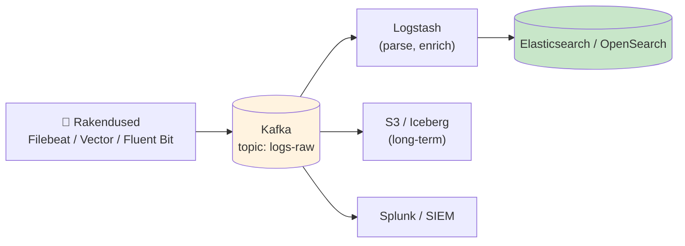


**Komponendid, mida tasub teada:**

- **Kafka Connect** — sisseehitatud konnektorid: source (Filebeat-laadne) ja sink (`elasticsearch-sink-connector`). Konfiguratsioonifail, mitte koodi-kirjutamine.
- **Schema Registry** (Confluent) — hoiab Avro/Protobuf schemasid, et tootja ja tarbija ei lahkneks. Oluline kui logid on struktureeritud.
- **Confluent Platform** — kommertspakkuja Apache Kafka peal (Confluent Cloud, Confluent Server). Apache Kafka ise on tasuta, Confluent-i lisand on enterprise-features (RBAC, audit, multi-region).
- **Amazon MSK** ja **Aiven for Apache Kafka** — managed Kafka pilves.

Suur küsimus mille peale komistab paljud setup'id: **mis on retention?** Kafka topic'us hoitakse sõnumeid määratud aeg (default 7 päeva) või määratud mõõtani (näiteks 100 GB topic'u kohta). Pikem retention = rohkem disk. Lyhem = kui ES on maas üle retention'i, kaotad andmeid.

Netflix, Uber ja Booking.com on avalikult kirjutanud oma `Kafka → Elasticsearch` pipeline'idest. Tüüpiline skaala: **kümned kuni sajad miljardid sõnumeid päevas**, mis lähevad puhvrist mitmesse konsumendisse. [^netflix-kafka]

### Indeksite elutsükkel — ILM ja Hot/Warm/Cold tiers

Log-indeksid on **time-series**: tehakse iga päev (`logs-2026.05.17`), kirjutatakse ainult üks päev, päringuid tehakse vähem aja jooksul. Kui sa hoiad neid kõik **kuum-tasemel** (kiired SSD-d, replicas, RAM-cache), satud kahel viisil:

- **Kulu** — kiired diskid on kallid. 6 kuu kõik indeksid kuumal SSD-l = nDC eelarve.
- **Klastri rõhk** — iga avatud indeks tarbib heap-mälu, file descriptoreid, segmente. Tuhandeid avatud indekseid ühes klastris lööb master node'i.

Lahendus: **Index Lifecycle Management (ILM)** Elasticsearchis [^ilm-es], ehk **Index State Management (ISM)** OpenSearchis [^ism-os]. Mõlemad teevad sama asja — indeksid läbivad **tier'eid** vananedes:

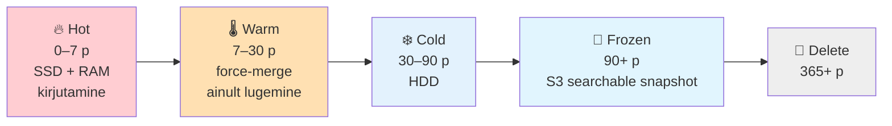

| Tier          | Tüüpiline vanus | Hardware                    | Replicas                | Operatsioon                                                   |
| ------------- | --------------- | --------------------------- | ----------------------- | ------------------------------------------------------------- |
| **🔥 Hot**    | 0–7 p           | Kiire SSD, palju RAM        | 1–2                     | Kirjutamine + päringud, hoitakse RAM-is                       |
| **🌡️ Warm**  | 7–30 p          | Aeglasem SSD või kiired HDD | 1                       | Ainult päringud, force-merge tehtud                           |
| **❄️ Cold**   | 30–90 p         | HDD, vähem RAM              | 0–1                     | Päringud aeglased aga toimivad                                |
| **🧊 Frozen** | 90+ p           | **S3 / object store**       | 0 (searchable_snapshot) | Päringud toimivad, aga eraldi cache-st, sekundid kuni minutid |
| **🚮 Delete** | 365+ p          | —                           | —                       | Indeks kustutatakse või jäetakse ainult snapshot S3-s         |


**Searchable snapshots** (mol Elastic ja OpenSearch) on võtmetehnoloogia frozen-tier'i jaoks: indeks elab **ainult S3-s**, mitte data node'i kettal. Klaster hoiab väiksed metadata-fragmendid, päring läheb S3-le. Kulu kukub **10–20×** (S3 on odav), aga päringu latentsus kasvab.

Tüüpiline ILM-policy näide (Elastic JSON):

```json
PUT _ilm/policy/logs-policy
{
  "policy": {
    "phases": {
      "hot":    { "actions": { "rollover": { "max_age": "7d", "max_size": "50gb" } } },
      "warm":   { "min_age": "7d",  "actions": { "forcemerge": { "max_num_segments": 1 }, "set_priority": { "priority": 50 } } },
      "cold":   { "min_age": "30d", "actions": { "freeze": {} } },
      "frozen": { "min_age": "90d", "actions": { "searchable_snapshot": { "snapshot_repository": "my_s3_repo" } } },
      "delete": { "min_age": "365d", "actions": { "delete": {} } }
    }
  }
}
```

**Rollover** — vahetatakse kirjutus-indeks (`logs-000001` → `logs-000002`) kui jooksev indeks jõuab 7 päeva või 50 GB. Vana indeks suletakse kirjutamisele, läheb warm-tier'isse väikselt ootama. **Data streams** (Elasticsearch 7.9+, OpenSearch 1.2+) automatiseerib selle — sa kirjutad data-stream'i `logs`, ES halduskeel määrab õige backing indeksi.

**Tier'ide praktiline jagamine** ei pea olema kõikiidne. Väike klaster (3 data node) võib hoida hot + warm samadel node'idel, ja cold + frozen on S3. Suur klaster (50+ data node) eraldab tier'id node-rollidega (`node.roles: [data_hot]`, `data_warm`, `data_cold`, `data_frozen`).

### Kokkuvõte

Production-klaster 2026 koosneb: **3 dedicated master + N data + 2+ coordinating-only**, kus N sõltub indeksite ja päringukoormuse mahust. Shardide arv valitakse ette indeksi loomisel. Replicad jagavad päringukoormust ja annavad HA. Quorum nõuab paaritu arvu master-kandidaate, miinimum 3. 99.9% on saavutatav 3-node klastris, 99.99% nõuab Multi-AZ + standby, 99.999% Multi-region + CCR. Snapshot S3-le on ainus tegelik backup — ja seda tuleb testida.

Osa 2 lab'is ([3-node klaster](../../labs/03_elk_stack/lab.md#osa-2--3-node-klaster)) laiendad single-node klastri 3-node klastriks ja vaatad, kuidas oleku-tuli muutub YELLOW → GREEN, ning katsetad, mis juhtub kui ühe node'i tapad.

---

## 8. APM ja traces: kolmas observability sammas

> **Plokk 5** (osa 1). ~10 min, jätkub §7 järel.
>
> **Miks see sulle oluline:** APM on **Elastic Stacki kõige sügavam diferentseerija** OpenSearchi kõrval ja peamine põhjus, miks paljud monitooring-tiimid valivad Elastic'u. APM-klastri sizing **ei võrdu** logide-klastri sizing'uga — kui sa segad need kokku, kukub klaster tasapisi alla.

### Kolmas sammas — traces

Päev 1 rääkis observability kolmest sambast: **logs**, **metrics**, **traces**. Päev 2 + Päev 3 esimene pool keskendub logidele. **APM = traces.**

Trace on **ühe päringu täielik teekond** läbi süsteemi: kasutaja klikib "osta" → frontend pärib API-d → API pärib auth-teenuse → auth pärib andmebaasi → API pärib makse-teenuse → makse-teenus pärib krediitkaardi-API-d. Kõik need on **spans** ühes trace'is. Sa näed waterfall vaates kus aeg kulus, kus error tekkis, milline service oli pudelikael.

Iga span = **mis teenus, mis operatsioon, kui kaua võttis, mis tulemus**. Kogu pilt (trace) annab response-time'i jaotuse mikroteenuste vahel.

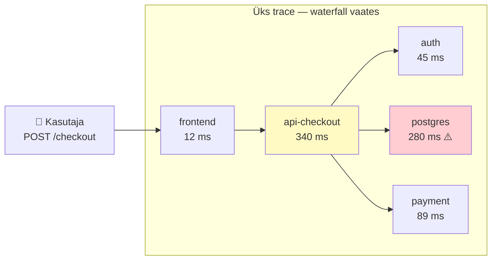

### Elastic APM — küps

Elastic ostis Opbeat'i 2017 ja töötas selle Elastic APM'iks. Tänu sellele on Elastic-i APM-pakk **küps**:

- **Auto-instrumentation agendid**: Java, .NET, Node.js, Python, Go, Ruby, PHP — paned agendi rakendusse, ta instrumenteerib automaatselt veebi-raamistiku, andmebaasi-driver'id, HTTP klientid, message queues
- **APM Server** — võtab agentidelt vastu, valideerib, kirjutab ES-i. **2022+ konsolideeritud Elastic Agent'i sisse**
- **Kibana APM UI** — Service map (kus mis teenus teisega räägib), Transactions (latentsus, p95/p99), Errors (mis exception'id), Traces (waterfall)

### APM-klaster vs logide-klaster

**APM tekitab väga palju andmeid**, palju rohkem kui logid:


| Aspekt         | Logide-klaster            | APM-klaster                                   |
| -------------- | ------------------------- | --------------------------------------------- |
| Dokumendi-maht | 1 logi-rida = 1 dokument  | 1 päring = **10–50 span'i** = 10–50 dokumenti |
| Tüüpiline maht | 100 GB/päev               | 1–10 TB/päev                                  |
| Retention      | 30–90 päeva (audit)       | 7–14 päeva (debugging)                        |
| Otsingu-muster | Tagasivaade incidentidele | Reaalajas dashboardid + alerting              |


Logide-klaster = 3 master + 4–6 data node. APM-klaster võib olla **eraldi**, optimeeritud lühema retention'i ja kõrgema ingest rate'i jaoks.

### OpenSearchi vaste — vähem küps

**OpenSearch Observability** + **Trace Analytics** + **Data Prepper**. Toimib, AGA:

- UI vähem viimistletud kui Kibana APM
- **Agentide perekond on väiksem** — OS soovitab OpenTelemetry SDK-d, oma natiivseid agente ei toodeta
- Data Prepper asendab APM Server'i — toimib, konfiguratsioon on rohkem käsitööd

See on suuremate observability tiimide jaoks Elastic'u poole arvestatav argument.

### OpenTelemetry kui sild

Nii Elastic kui OpenSearch võtavad vastu **OTel traceid** — sinu rakendus ei pea kasutama propriotaarset agendi. Kui instrumenteerid rakenduse OTel SDK-ga, saad eksportida OTel Collector'i kaudu kummale. Migration ES → OS ei nõua rakenduse koodi muutmist.

### Päev 5 ühendus

Päev 5 räägib **Grafana Tempo**'st — standalone trace-storage, Elastic APM-i alternatiiv. Tempo on **odav** (S3) ja **vendor-neutral**. Kui sul on Grafana-ettevõte (Prometheus + Loki + Tempo), jääd sinna. Kui Elastic-ettevõte, jääd sinna. **OTel SDK rakenduses hoiab ülemineku-uksed lahti.**

### Kokkuvõte

APM = traces. **Elastic APM** on küps, integreeritud, mitme keele agendid. **OpenSearch Trace Analytics** toimib, aga vähem viimistletud. **APM-klaster ≠ logide-klaster** — eraldi sizing, lühem retention. **OTel** on vendor-neutraalne sild.

---

## 9. Kibana monitooringule: Discover, Dashboards, Alerting, ML

> **Plokk 5** (osa 2). ~15 min, jätkub §8 järel.
>
> **Miks see sulle oluline:** Elasticsearch on backend, **Kibana on UI**. 90% sinu igapäevasest monitooring-ajast oled Kibanas, mitte ES API-l. Kui sa Kibana feature'isid ei tea, kaotad väärtuse, mille eest maksad.

### Kibana on rohkem kui dashboardid

Üldine eksiarvamus: "Kibana = Grafana ekvivalent." Tegelikult on Kibana **kogu Elastic Stack'i UI** — APM, SIEM, Observability, Machine Learning, Stack Monitoring, Alerting on kõik **Kibana sees**, eraldi rakendustena. Üks UI kõige jaoks.

OpenSearch Dashboards on Kibana fork 2021-st ja teeb sama, aga mõned UI-d on vähem viimistletud.

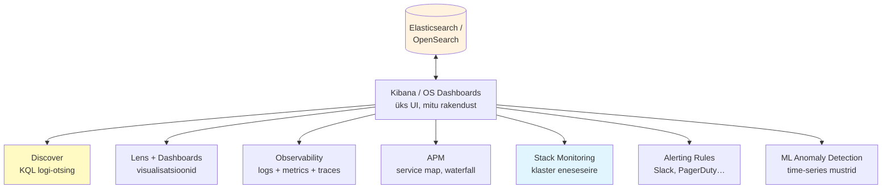

### Discover — sinu igapäevane töövahend

**KQL-iga logide-otsing.** 90% Kibana-ajast veedad siin. Võimalused mida tihti ei kasutata:

- **Saved searches** — kompleksne KQL nimega salvestatud, kõik tiimis kasutavad
- **Highlighted fields** — vali tabeli veerud (mitte vaikimisi `_source` JSON)
- **Surrounding documents** — leidsid kahtlase logi-rea? Kliki "View surrounding documents" → näed eelnenud ja järgnenud read kontekstist
- **Export to CSV** — tulemused alla edasiseks analüüsiks

### Lens — kaasaegne visualisatsiooni-ehitaja

Vana **Visualize** asendati **Lens**'iga 2020+. Drag-drop: tirid välja vasakult, valid graafiku-tüübi, Kibana arvab pakkumise. Õpikõver 5 min, mitte 50.

Näited monitooringus: aja-rida (`event.duration` per `service.name`), top-N (top 10 `client.ip` per 500-veaga), heat map (error rate per host per tund), sankey (kasutaja-teekonna jaotus).

### Dashboard — kombineeritud Lens-visualisatsioonid

Mitu Lens-visualisatsiooni ühele lehele. Toetab **drilldown** — kliki bar chart'i tükile, mine teisele dashboardile filtreeritud sellele väärtusele. Production'is on sul tihti 10–20 dashboardi (per-service, per-environment, per-incident-response).

### Stack Monitoring — klastri eneseseire

**Management → Stack Monitoring**. Näitab:

- Klastri olek (GREEN/YELLOW/RED)
- Iga node CPU/mälu/disk
- Iga indeksi shard count, dokumendi-maht, päringu-load
- Kibana enda performance
- Logstash pipeline'ide throughput

**See on "kes seerib seirejat?"** vastus. Kui sinu monitooring kukub, Stack Monitoring näitab miks.

### Observability UI — unified vaade (8.x+)

Kibana 8.x lisas **Observability** menus. Idee: üks vaade, kus näed **korraga** logid + metrikud + traces ühe service'i kohta. Discover on logide jaoks, Metrics on metrikute jaoks, APM on tracedide jaoks — **Observability liidab** kõik kolm.

Kui sa uurid incidenti "miks oli api-checkout aeglane":

1. Observability → Services → api-checkout
2. Näed transaction latency graafiku
3. Klikkid spike'le → näed selle hetke logid, metrics, traces ühes vaates

OpenSearch parallel: **OpenSearch Observability Plugin** (uuem, vähem viimistletud).

### Alerting — Rules (modern) vs Watcher (legacy)

Kibana 7.13+ tutvustas **Rules** — modern alerting framework. Asendab vana **Watcher**-i, mis oli JSON-DSL põhine ja väga keeruline.

**Rules tüübid:**

- **Index threshold** — "kui count > X 5 minuti jooksul"
- **Anomaly detection** — "kui ML anomaly score > 75"
- **Custom KQL** — "kui KQL päring annab > 0 tulemust"
- **APM** — "kui service latency p99 > 1s"
- **Logs threshold** — "kui ERROR logi-ridade arv > 100 per minute"

**Action types** (kuhu alert läheb):

- Slack, Microsoft Teams, PagerDuty, ServiceNow, Jira, Opsgenie
- E-mail, Webhook
- Kibana enda Connectors

**Soovitus:** kasuta Rules, mitte Watcher'it. Watcher on legacy ja süöötud Rules'i suunas. Olemasolev Watcher töötab edasi, aga uusi Watcher'eid ära kirjuta.

OpenSearch parallel: **Alerting plugin** (sarnane Rules-ile, Apache 2.0, vaba).

### ML Anomaly Detection

Elastic ML pakub **unsupervised anomaly detection** time-series andmetel. Sa annad mudelile aja-rida (näiteks päeva CPU per host), ta õpib mustri, märgib anomaaliad.

**Mida ML AD saab tuvastada:**

- Single-metric anomaaliad (CPU üksuse hostil ootamatult kõrge)
- Multi-metric (CPU + lätutus + error-rate korraga anomaalsed)
- Population analysis ("see host käitub erinevalt teistest sama-grupi hostidest")
- Rare events ("see error-kood ilmus, mida pole varem näinud")

**Hind:** Elastic ML on **Platinum-feature**. **OpenSearch Anomaly Detection plugin** on **Apache 2.0** — vaba. Algoritm on sama (Random Cut Forest), kasutuskoht erineb.

**Praktiline nõuanne:** ML AD on **võimas, aga ka petlik**. False positives võivad olla väsitavad, kui alerting on läbi ML score'i. Alusta ML-iga **visualisatsioonis** (näed graafikul anomaaliad punase joonega), mitte alerting'us. Hiljem, kui usaldad mudelit, lisa Rule.

### Canvas — NOC-seinad ja exec dashboard'id

Pixel-perfect dashboardid, mis ei sarnane standardse Kibana-paneeliga. Kasutus: NOC-seina-televisioonid, executive briefing'ud, klient-presentatsioonid. Vajab disainerit — ei ole klikkimise-tasemel.

OpenSearch ei oma Canvas'i ekvivalenti.

### Maps — geo-visualisatsioonid

Kui logidel on `geo_point` väli (client.ip + GeoIP enrichment), saad teha kaarte: "kust tulevad meie kasutajad", "kust tuli DDoS", "mis riikide servereid puudutab incident".

### Kokkuvõte

Kibana on **kogu Elastic Stack'i UI**, mitte ainult dashboardid. **Discover** = sinu igapäev. **Lens** = visualisatsioon drag-drop'iga. **Dashboard** = kombineeritud vaade. **Stack Monitoring** = seire enesest. **Observability UI** = unified logs+metrics+traces. **Alerting (Rules)** asendab Watcher'i. **ML Anomaly Detection** on võimas, aga alusta visualisatsiooniga. **OpenSearch Dashboards** teeb sama, aga mõned UI-d vähem viimistletud.

---

## 10. Otsing: lexical (BM25) vs vector, ja kuidas need töötavad

> **Plokk 6.** ~15 min klassis. Süvitsi vector/RAG → lisalugemine; labis [Osa 4](../../labs/03_elk_stack/lab.md) (kNN demo).
>
> **Miks see sulle oluline:** aitab sul otsustada, kas sinu kasutusjuhul (logide otsing, audit, klienditugi, dokumentatsioon) on vector search või RAG vajalik — või piisab klassikalisest BM25-st. Vector pole alati õige lahendus.

Logi-otsing on Elasticsearchi põhi-kasutusjuhtum, mida köik teavad. Aga 2024+ on otsing **kaheks haru ajunenud**: klassikaline **lexical** (sõnapotsing) ja moderne **vector / semantic** (tähendus-otsing). Mõlema all on **algoritmid** mida tasub tunda — mitte sellepärast et sa neid käsitsi implementeeriks, vaid sellepärast et sa pead mõistma, **miks** üks või teine sobib või mitte.

### Lexical otsing: inverted index + BM25

**Inverted index** on Lucene'i (ja seega ka Elasticsearch / OpenSearch) põhi-andmestruktuur. Idee on lihtne: tagurpidi tavalisest dokument-→-sõnade-suunast on **sõna-→-dokumentide** suund.

Dokumendid:

```
doc1: "the quick brown fox"
doc2: "the lazy dog"
doc3: "the quick blue ocean"
```

Inverted index:

```
the   → [doc1, doc2, doc3]
quick → [doc1, doc3]
brown → [doc1]
fox   → [doc1]
lazy  → [doc2]
dog   → [doc2]
blue  → [doc3]
ocean → [doc3]
```

Päring `quick brown` → vaatame mis dokumentides on `quick` (doc1, doc3), mis dokumentides on `brown` (doc1). Eeldades AND-loogikat: doc1. Eeldades OR-loogikat: doc1 ja doc3.

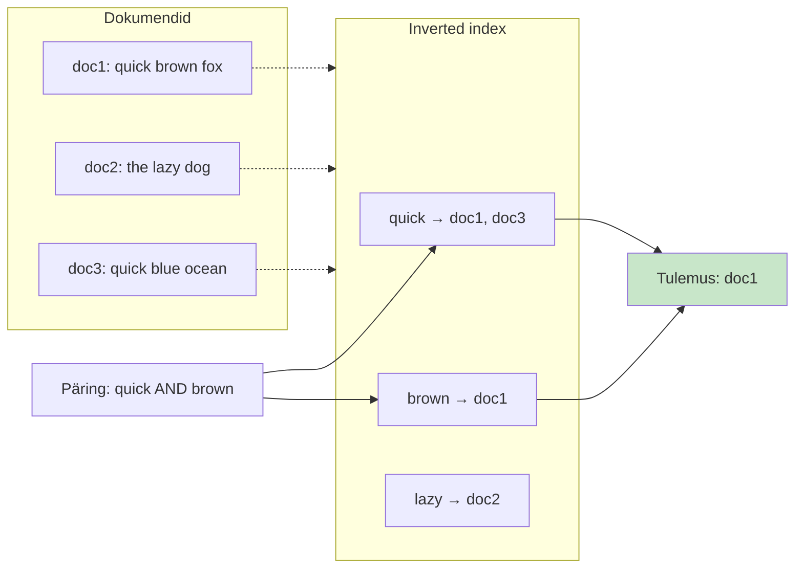

See on **kiire** (otsib sõna hash-tabelist, mitte kõigi dokumentide läbivaatamine) ja **täpne** (kui sõna on samas vormis, leitakse).

Aga "kiire ja täpne" pole **piisav**. Vaja on **järjestada** — milline dokument on **kõige relevantsem** päringule?

### BM25 — relevantsi algoritm

**BM25** (Best Matching 25, Okapi BM25 perekond) on Lucene'is vaikimisi kasutusel olev relevantsuse-algoritm — versioonist 5.0 alates Elasticsearchis (varem TF-IDF). Skoor sõltub kolmest jouust:

1. **Term frequency (TF)** — mitu korda otsisõna dokumendis esineb? Rohkem = parem, aga **küllastusega** (10 esinemist on parem kui 1, aga 100 ei ole oluliselt parem kui 10).
2. **Inverse document frequency (IDF)** — kui haruldane on otsisõna kogu korpuses? `the` on igas dokumendis, **madala IDF-iga** (ei aita eristada). `quorum` on harva, **kõrge IDF**.
3. **Field length normalization** — lyhike dokument, kus sõna esineb, on tihti relevantsem kui pikk dokument, kus sama sõna esineb.

Matemaatiliselt: `score(D, Q) = Σ IDF(qi) · (TF(qi, D) · (k₁ + 1)) / (TF(qi, D) + k₁ · (1 - b + b · |D|/avgdl))`

Sinu ülesanne ei ole seda valemi peäst teada. Sinu ülesanne on mõista, **mida BM25 mootor järjestab**: dokumendid, mis sisaldavad päringus olevaid sõnu **sageli, haruldastes kohtades ja lühikestes lõikudes**.

### Kus lexical otsing kukub läbi

Proovi monitooringu-perspektiivist võtta — oled hommikul kontoris, dashboard näitab et **API on aeglane**, ja sa otsid logist `database connection problems`. Mida BM25 tähistab? Dokumendid, kus on sõnad **"database"**, **"connection"** ja **"problems"**.

Aga mida sina **tegelikult otsid**? Läbi viimase 24 tunni logide on neid kirjeid sellistel kujudel:

- `ERROR: DB timeout after 30s`
- `Connection pool exhausted, waiting 5s`
- `Lost connection to database server, retrying`
- `SQLException: Cannot acquire connection`
- `psycopg2.OperationalError: server closed the connection`

**Ükski neist ei sisalda sõna "problems".** Tihti ei sisalda isegi "database". BM25 ei leia neid. See on **vocabulary mismatch problem** — sinu mentaalne sõnastik ("database connection problems") ja logi-rea sõnastik (`pool exhausted`, `OperationalError`) on erinevad.

Praktikas tähendab see, et incident response võtab kauem — sa pead läbi proovima 5–10 erinevat otsisõna, enne kui leiad selle, mis su logides kasutusel on.

Lahendus: **vector otsing**, mis ei võrdle sõnu, vaid **tähendusi**.

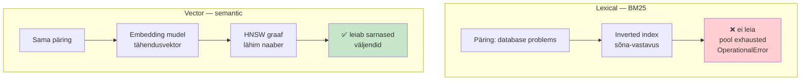

### Edasine areng — vector search ja RAG monitooringus

Alates 2024-st on Elasticsearch ja OpenSearch lisanud **vector search** ja **RAG (Retrieval-Augmented Generation)** võimekuse. Tänu sellele toimivad:

- **Elastic AI Assistant** ja **Splunk AI Assistant** — sa küsid `mis juhtus eile õhtul kell 19:00?`, AI leiab vector storage'st (sinu logid + traces + alerts) konteksti ja vastab.
- **Semantic log pattern matching** — `leia kõik database connectivity issues` leiab nii `pool exhausted`, `OperationalError`, `lost connection`.
- **Alert-korrelatsioon** — 1000 alerti grupeeritakse mustrite järgi ja antakse juur-põhjus.
- **Runbook-otsing** — `kuidas taaskäivitada Redis cluster?` leiab vastuse sinu organisatsiooni wiki-st.
- **Postmortem auto-draft** — AI kirjutab esmase mustandi incident'i kohta.

Tänase loengu põhi-fookus on **logide-otsing klassikaliselt** (BM25), sest see on igapäevatöö Kibana Discoveri ja OpenSearch Dashboards'i Discover'i lahtris. Vector search ja RAG-i tehniline pool — embedding mudelid, HNSW algoritm, FAISS, ELSER, `semantic_text`, ML Commons, hybrid search — on **eraldi lisalugemises**:

!!! abstract "📖 Lisalugemine"
    Vector search, HNSW, ELSER, RAG ja hybrid otsingu detailid on **eraldi peatükkides** (klassis piisab BM25 ülevaatest):

```
- **[Vector search, RAG ja AI monitooringus](paev3-vector-rag-lisalugemine.md)** — ~25 min, tehniline ülevaade
- **[RAG retrieval — BM25, vector või hübriid?](paev3-rag-hybrid-monitooring.md)** — ~20 min, retrieval-strateegia valik
```

### Kokkuvõte

Logide-otsingu standard on lexical (BM25). Kiire ja odav, sõnatasemel täpne. Kibana Discover ja OS Dashboards Discover kasutavad seda vaikimisi. Vector search ja RAG on **edasine areng**, mis 2024+ ilmub AI Assistant tööriistadesse — detailid lisalugemises.

!!! tip "💭 Mõtle hetk — enne edasilugemist"
    Sinu organisatsioonis — mis on **igapäevane otsingu-muster** logides? Kas piisab "otsi `ERROR`" lihtsast tekstist (BM25), või tahaksid küsida "leia kõik database-probleemid" loomuliku keelega (vector + RAG)?

```
Esmaspäeval — vaata Kibana Discoveris (või samaväärses), mis on need 3–5 otsisõna, mida sa kasutad kõige sagedamini. Need on sinu **BM25 sword'id**.
```

Kodutöös ([Lab Osa 1 ja 4](../../labs/03_elk_stack/lab.md)) kasutate Kibana Discover'i BM25 ja KQL-i abil; vector demo on Osa 4, kui lähed lisalugemisega süvitsi.

---

## 11. Cheat sheet — võta töö juurde kaasa

Need neli kompaktset tabelit on mõeldud **igapäevaseks otsuseks**, mitte loengu meeldejätmiseks. Prindi välja või hoia kuvarinurkas.

### ① Otsus: Elasticsearch või OpenSearch — ja missugune?


| Sinu olukord                                       | Vali                                 | Miks                                                            |
| -------------------------------------------------- | ------------------------------------ | --------------------------------------------------------------- |
| AWS-i keskkond + vendor lock-in vältimine          | **Amazon OpenSearch Service**        | Apache 2.0, Multi-AZ + standby kaasas, Cross-AZ transfer kaasas |
| AWS + RAG / Bedrock Knowledge Bases                | **OpenSearch Serverless**            | Default vector DB Bedrock-ile, auto-scale, null ops overhead    |
| Self-hosted, GDPR/compliance, andmed ei lähe AWS-i | **OpenSearch on-prem**               | Apache 2.0, vaba security plugin, ML Commons paindlik           |
| AI / semantic search prio + lihtne API             | **Elastic Cloud**                    | `semantic_text` field = üks rida = lexical + vector korraga     |
| Kommertsiaalne tugi + Elastic APM                  | **Elasticsearch on-prem (Platinum)** | 24/7 SLA, APM tugevam kui OS-il                                 |
| Väike sisekasutus, eelarve madal                   | **OpenSearch on-prem** (1–3 node)    | Apache 2.0, ei pea litsentsi kontrollima                        |


### ② Otsus: klastri-dimensioneerimine

```
UPTIME NÕUE         →  KLASTRI-DISAIN
─────────────────────────────────────────────────────
99.5%  (best-effort) →  1 node, restart OK
99.9%  (8.7h/aastas) →  3 master + N data, replicas=1, snapshots S3
99.99% (52min/aastas)→  3 master + N data üle 3 AZ-i + standby AZ
99.999% (5min/aastas) →  Multi-region + CCR (harva vajalik)
```

**Checklist enne tootmist:**

- 3 dedicated master node'i (mitte 1, mitte 2)
- Data node'idel `heap = pool RAM-ist`, max 31 GB (compressed OOPs)
- `number_of_replicas ≥ 1` kõikidele indeksitele
- Snapshot S3-le (SLM / ISM policy)
- **Restore testitud** vähemalt 1 kord
- ILM-policy hot → warm → cold → frozen → delete
- Kafka või sarnane buffer kui logi-maht > 100 GB/päev

### ③ Otsus: lexical, vector või hybrid otsing? (monitooringu kontekstis)


| Kasutusjuhus                                  | Vali                                | Märkus                                                |
| --------------------------------------------- | ----------------------------------- | ----------------------------------------------------- |
| Operatiivlogid (`error`, `timeout`, `host=X`) | **BM25 (lexical)**                  | Vector lisab kulu ilma kasuta                         |
| Audit / compliance / juriidiline              | **BM25 + filtrid**                  | Vector võib anda "sarnase" — **valeoht** auditi jaoks |
| Runbook / wiki / dokumentatsiooni otsing      | **Hybrid**                          | Inseneri sõnastik ≠ dokumendi sõnastik                |
| Incident response ("mis juhtus eile 19:00?")  | **Hybrid + RAG**                    | Vajab konteksti mitmest allikast                      |
| Pattern matching (`db connection issues`)     | **Vector**                          | BM25 ei leia sarnaseid väljendusi                     |
| Anomaalia-tuvastus aegridades                 | **ML-mudelid** (Elastic ML / OS AD) | Eraldi pipeline, mitte otsing                         |
| Postmortem auto-draft, alert-summarization    | **Vector + RAG** (AI Assistant)     | LLM võtab kokku konteksti                             |


### ④ Otsus: hinnamudel ja TCO eelarve-aluseks


| Mudel                  | Toode                          | Hoia silm peal                | Salakulud                            |
| ---------------------- | ------------------------------ | ----------------------------- | ------------------------------------ |
| Per-GB-ingested        | Splunk, Datadog Logs           | Logi-mahu kasv → arve kasv    | Sundib logimist vähendama            |
| Instance-based         | AWS OpenSearch, ES/OS on-prem  | Node-arv × RAM × ketas        | **Cross-AZ transfer** (self-hosted)  |
| Tier-põhine            | Elastic Cloud, Confluent Cloud | Tier-piir, add-on'id          | Add-on'id võivad märgatavalt kasvada |
| Hybrid (logi-osa odav) | Grafana Cloud + Loki           | Loki = sildid indekseeritakse | Vähem otsingu-paindlikkust kui ELK-l |


**TCO komponendid, mis sageli unustatakse:**

- **Personali-aeg** — self-hosted vajab DevOps-i, see on eelarves
- **Cross-AZ transfer** — self-managed Multi-AZ EC2-l 0.01–0.02/GB
- **RAM** — vector search kahekordistab heap-vajaduse
- **ML node'id** — ELSER + 1M dokumenti = eraldi node mõistlik

---

## Refleksioon ja enesetest

**5 küsimust (peida/ava)**

Päeva lõpus, enne kui klassist välja lähed, mõtle läbi:

1. Mille poolest erineb **schema-on-write** (Zabbix) ja **schema-on-read** (ELK / OS)? Miks see vahe muudab arhitektuurseid otsusi?
2. Sinul on 3 master + 5 data node klaster. Üks AZ kaob (1 master + 2 data). Mis juhtub klastri olekuga ja andmetega?
3. Sinu mõte 3 erinevat olukorda, kus eelistaksid lexical otsingut vector otsingule.
4. **Otsus**: ettevõtte audit-keskkonna jaoks vali Elasticsearch on-prem või OpenSearch on-prem. Miks?
5. **Mis küsimus jäi õhku?** — kirjuta see üles. Hommepool tule tagasi.


---

## Allikad

**Viited ja allikad (peida/ava)**

**Ametlik dokumentatsioon:**

- [Elasticsearch ametlik dokumentatsioon](https://www.elastic.co/guide/en/elasticsearch/reference/current/index.html)
- [OpenSearch ametlik dokumentatsioon](https://opensearch.org/docs/latest/)
- [Amazon OpenSearch Service](https://aws.amazon.com/opensearch-service/)
- [Apache Lucene](https://lucene.apache.org/)
- [Facebook AI Similarity Search (FAISS)](https://github.com/facebookresearch/faiss)

**Litsentsi-drama 2021:**

- [Elastic: "Doubling Down on Open"](https://www.elastic.co/blog/why-license-change-aws) — Elastic-i positsioon
- [AWS: "Stepping Up for a Truly Open Source Elasticsearch"](https://aws.amazon.com/blogs/opensource/stepping-up-for-a-truly-open-source-elasticsearch/) — AWS-i vastus
- [Shay Banon: "Elasticsearch is Open Source, Again"](https://www.elastic.co/blog/elasticsearch-is-open-source-again) — 2024 AGPL-i lisamine
- [Linux Foundation: OpenSearch Software Foundation kuulutus](https://www.linuxfoundation.org/press/aws-and-the-linux-foundation-establish-the-opensearch-software-foundation) — sept 2024

**Võrdlused (sissejuhatuse jaoks):**

- [Coralogix: Elasticsearch vs OpenSearch — Key Differences](https://coralogix.com/guides/elasticsearch/elasticsearch-vs-opensearch-key-differences/)
- [tecRacer: OpenSearch vs Elasticsearch 2024](https://www.tecracer.com/blog/opensearch-vs-elasticsearch-2024/)
- [Getting Started with Elasticsearch & OpenSearch AWS](https://medium.com/@sonishubham65/getting-started-with-elasticsearch-opensearch-aws-b7cdd7e8cafa) — Medium

**Otsing ja AI:**

- [Lucene BM25 algorithm](https://lucene.apache.org/core/8_0_0/core/org/apache/lucene/search/similarities/BM25Similarity.html)
- [Elasticsearch semantic_text field](https://www.elastic.co/guide/en/elasticsearch/reference/current/semantic-text.html)
- [OpenSearch Neural Search plugin](https://opensearch.org/docs/latest/search-plugins/neural-search/)
- [OpenSearch ML Commons](https://opensearch.org/docs/latest/ml-commons-plugin/)
- [Amazon Bedrock Knowledge Bases + OpenSearch Serverless](https://docs.aws.amazon.com/bedrock/latest/userguide/knowledge-base.html)
- [HNSW: Hierarchical Navigable Small World](https://arxiv.org/abs/1603.09320) — algupärane teadusartikkel

[^datadog2024]: Datadog, "State of Cloud Costs 2024" — [https://www.datadoghq.com/state-of-cloud-costs/](https://www.datadoghq.com/state-of-cloud-costs/). Observability andmemahtude kasvu mõõdab Datadog oma 30 000+ kliendi anonymized telemetria põhjal.

[^kafka]: Apache Kafka ametlik dokumentatsioon — [https://kafka.apache.org/documentation/](https://kafka.apache.org/documentation/). Kafka Connect: [https://kafka.apache.org/documentation/#connect](https://kafka.apache.org/documentation/#connect).

[^netflix-kafka]: Netflix Technology Blog, mitmed artiklid Kafka + Elasticsearch pipeline'ist alates 2018 — [https://netflixtechblog.com/tagged/kafka](https://netflixtechblog.com/tagged/kafka). Uber Engineering, "uReplicator" projekt — [https://eng.uber.com/ureplicator-apache-kafka-replicator/](https://eng.uber.com/ureplicator-apache-kafka-replicator/).

[^ilm-es]: Elastic, Index Lifecycle Management — [https://www.elastic.co/guide/en/elasticsearch/reference/current/index-lifecycle-management.html](https://www.elastic.co/guide/en/elasticsearch/reference/current/index-lifecycle-management.html).

[^ism-os]: OpenSearch, Index State Management — [https://opensearch.org/docs/latest/im-plugin/ism/index/](https://opensearch.org/docs/latest/im-plugin/ism/index/).

[^splunk-pricing]: Splunk hinnakiri ja Workload Pricing — [https://www.splunk.com/en_us/products/pricing.html](https://www.splunk.com/en_us/products/pricing.html). Ajaloolised per-GB tier'id on dokumenteeritud Splunki community foorumites ja IDC/Forrester analyytikute raportites.

[^datadog-pricing]: Datadog hinnakiri — [https://www.datadoghq.com/pricing/](https://www.datadoghq.com/pricing/). Logs sektsioon: per-GB indexed + retention.

[^aws-os-pricing]: Amazon OpenSearch Service hinnakiri — [https://aws.amazon.com/opensearch-service/pricing/](https://aws.amazon.com/opensearch-service/pricing/). Instance-pohine arvelduse mudel, Reserved Instance allahindlused 30–50%.

[^elastic-pricing]: Elastic Cloud hinnakiri — [https://www.elastic.co/pricing](https://www.elastic.co/pricing). Standard / Gold / Platinum / Enterprise tier'id koos add-on'idega.

[^palo-splunk]: Palo Alto Networks pressiteade tehingu sulgemise kohta (märts 2024) — [https://www.paloaltonetworks.com/company/press/2024/palo-alto-networks-completes-acquisition-of-talon-cyber-security](https://www.paloaltonetworks.com/company/press/2024/palo-alto-networks-completes-acquisition-of-talon-cyber-security). Tehingu suurus avalikustati 2023 sept teate ajal — [https://investors.splunk.com/news-releases/news-release-details/palo-alto-networks-acquire-splunk](https://investors.splunk.com/news-releases/news-release-details/palo-alto-networks-acquire-splunk).

[^os-foundation]: Linux Foundation, "AWS and the Linux Foundation Establish the OpenSearch Software Foundation" — [https://www.linuxfoundation.org/press/aws-and-the-linux-foundation-establish-the-opensearch-software-foundation](https://www.linuxfoundation.org/press/aws-and-the-linux-foundation-establish-the-opensearch-software-foundation). Numbrid (200M+ downloads jms) on OpenSearch projekti enda 2024 aastaraportist — [https://opensearch.org](https://opensearch.org).

[^aws-os-quotas]: AWS OpenSearch Service service quotas ja arhitektuuri-piirid — [https://docs.aws.amazon.com/opensearch-service/latest/developerguide/limits.html](https://docs.aws.amazon.com/opensearch-service/latest/developerguide/limits.html). Multi-AZ + standby mudel: [https://docs.aws.amazon.com/opensearch-service/latest/developerguide/managedomains-multiaz.html](https://docs.aws.amazon.com/opensearch-service/latest/developerguide/managedomains-multiaz.html).


--8<-- "_snippets/abbr.md"