---
tags:
  - RAG
  - HybridSearch
  - BM25
  - VectorSearch
  - Monitoring
  - Day3
  - Lisalugemine
---

# Päev 3 — Lisalugemine: RAG-i retrieval — BM25, vector või hübriid?

> **Tase:** Edasijõudnud. Eeldab, et oled lugenud Päev 3 põhi-loengu L3 osa (BM25 vs vector) JA eelmise lisalugemise (HNSW, ELSER, RAG põhi-mehaanika).
> 
> **Kestus:** ~20 min lugemist.
> 

## Sissejuhatus

RAG (Retrieval-Augmented Generation) tähendab: kasutaja küsib küsimuse → süsteem otsib (retrieval) asjakohased dokumendid → LLM saab need konteksti ja genereerib vastuse.

**Kvaliteet sõltub retrieval'ist palju rohkem kui LLM-ist.** Kui retrieval annab valed dokumendid konteksti, isegi GPT-4 ütleb vale vastuse. Selleparast on valik **BM25 / vector / hybrid** üks olulisemaid arhitektuurseid otsuseid RAG-süsteemis.

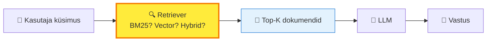

**Punane** kast = kõige rohkem mõjutab kvaliteeti. Kõik allpool on selle valiku üksikasjad.

---

## 1. Kolm strateegiat ühe pildiga

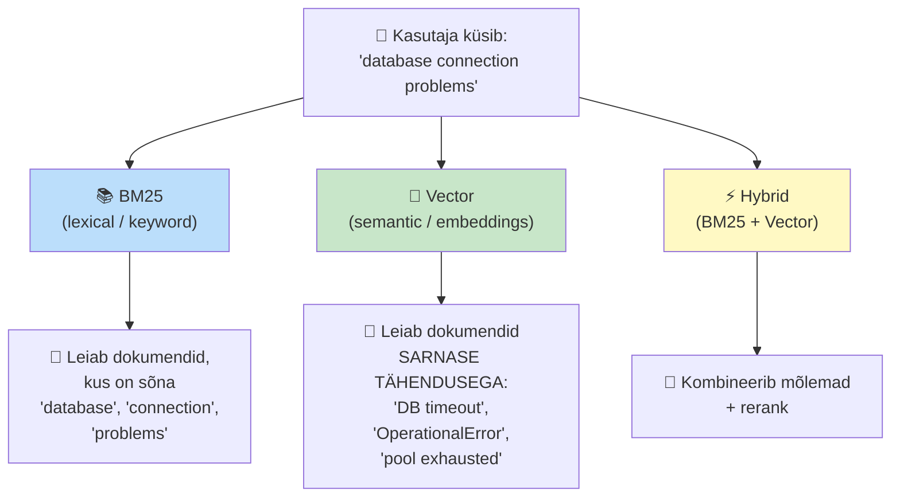

Iga strateegia leiab **eri asju samale küsimusele.** See ei ole hea/halb — see on **eri tööriistad eri kontekstidesse.**

---

## 2. BM25 RAG-is — näide ja jõud

### Kuidas BM25 töötab (lihtsalt)

BM25 ehitab **inverted index** — sõnaraamatu kus iga sõna teab, millistes dokumentides ta on. Skoor sõltub kolmest asjast:

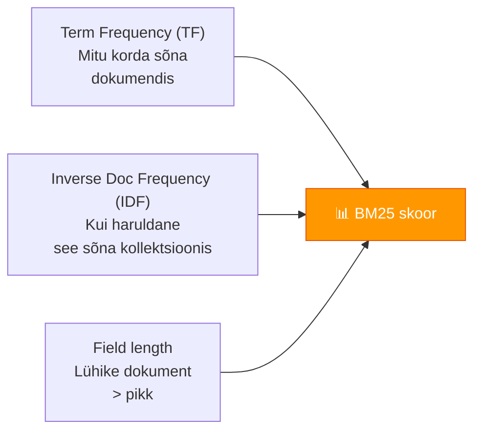

### Konkreetne näide — runbook RAG

**Kasutaja küsib:** `"how to restart nginx safely"`

**Sinu runbook-kollektsioonis** on need 4 dokumenti:

| ID | Sisu (lühend) |
|----|----------------|
| `RB-001` | "Safely restart nginx without dropping connections — use SIGQUIT or `nginx -s reload`..." |
| `RB-042` | "Graceful service restart procedures for production..." |
| `RB-099` | "Apache httpd troubleshooting guide..." |
| `RB-103` | "Database recovery after crash — restart PostgreSQL..." |

**BM25 tulemus:**

```
RB-001  score: 12.4   ← "nginx", "restart", "safely" - kõik kohal
RB-042  score: 4.1    ← "restart" kohal, "nginx" pole
RB-099  score: 0.8    ← pole "nginx", pole "restart" tähendust
RB-103  score: 3.2    ← "restart" kohal, "nginx" pole
```

✅ **BM25 saab õige vastuse** — `RB-001` on top-1.

### Kus BM25 RAG-is läbi kukub

**Sama kasutaja küsib hiljem:** `"how to apply config changes without downtime"`

| ID | Sisu (lühend) |
|----|----------------|
| `RB-001` | "Safely restart nginx without dropping connections — use SIGQUIT or `nginx -s reload`..." |
| `RB-042` | "Graceful service restart procedures..." |

**BM25 tulemus:** Tagastab MIDAGI MUUD, sest tema vaatab ainult sõnu.

- "config" — pole RB-001-s
- "changes" — pole
- "downtime" — pole

**Aga `RB-001` ON SAMAL TEEMAL** — `nginx -s reload` ON täpselt see, kuidas konfiguratsiooni muuta downtime'ita. BM25 ei tea seda. **Vocabulary mismatch.**

### BM25 + RAG monitooringus

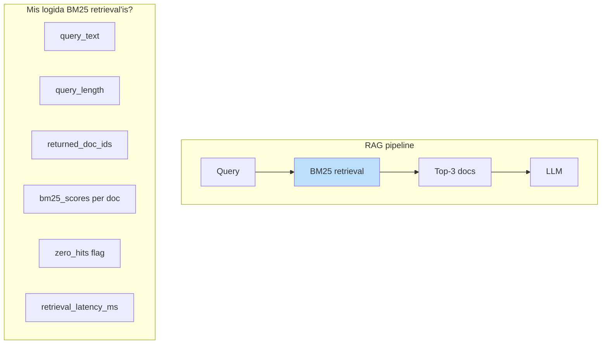

**Punktid jälgimiseks BM25 RAG-is:**

1. **Zero-hits ratio** — protsent päringutest, kus BM25 tagastab vähem kui K relevantset dokumenti. Kõrge zero-hits = vocabulary mismatch probleem, vector aitaks.
2. **Score distribution** — kui top-1 ja top-2 skoorid on lähedal, tähendab et BM25 pole kindel
3. **Query length** — BM25 töötab paremini lühikeste keyword-päringutega (2-5 sõna). Pikad konversatsiooni-päringud (>10 sõna) annavad sageli kehvasid tulemusi

---

## 3. Vector RAG-is — näide ja jõud

### Kuidas vector töötab (lihtsalt)

Embedding-mudel (näiteks `text-embedding-3-small` või ELSER) paneb iga teksti **vektoriks** — 384-, 768- või 1536-dimensionaalseks numbri-jadaks.

```
"nginx restart"         →  [0.82, 0.14, 0.05, ..., 0.31]  (768 dim)
"apply config changes"  →  [0.79, 0.18, 0.07, ..., 0.28]  (768 dim)
"database backup"       →  [0.05, 0.91, 0.42, ..., 0.11]  (768 dim)
```

**Sarnased tähendused → vektorid lähedal cosine-ruumis.**

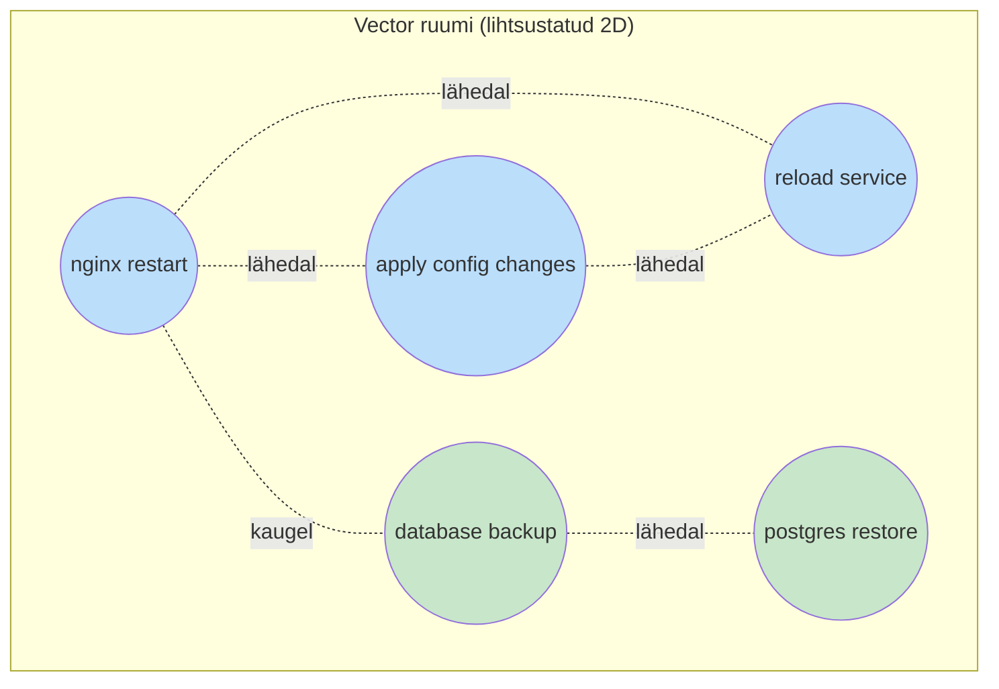

**Tulemus:** Otsing "apply config changes without downtime" **leiab `RB-001`-i** ka kui see sõna "config" ei sisalda. Vector mõistab tähendust.

### Kus vector RAG-is läbi kukub

**Kasutaja küsib:** `"show errors from host web-prod-01"`

Vector embedding mudel "ei näe" et `web-prod-01` on KONKREETNE host-nimi. Ta kohtleb seda lihtsalt mingi tekst-stringina. Tagastab dokumente, kus mainitakse "host", "web", "errors" — aga **võib kaotada täpse hosti.**

**BM25 oleks seda lihtsalt teinud** — `host.name: "web-prod-01"` annab täpselt selle hosti.

### Vector RAG monitooringus

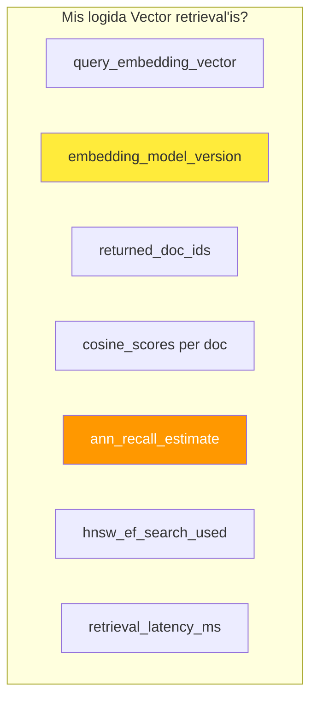

**Punktid jälgimiseks Vector RAG-is:**

1. **Embedding model version drift** — kui sa uuendad mudelit (`v1` → `v2`), tuleb KOGU indeks ümber arvutada. Vana ja uue versiooni segamine = katastroof. Logi `embedding_model_version` igale dokumendile.
2. **ANN recall** — HNSW on **approximate** lähimnaabri-otsing, mitte täpne. Mõõda kui palju ta exact-kNN-iga võrreldes ühtib. Tavaliselt 95-99% (sobib), aga kui kukub 80%-ni, on midagi valesti (heap pressure, indeksi kahjustus).
3. **`ef_search` parameter** — HNSW kvaliteedi vs kiiruse trade-off. Vaikimisi 100, kõrgemad väärtused = parem recall aga aeglasem päring. Mooniooringu dashboard peaks näitama selle väärtust ja päringu-latentsust.

---

## 4. Hybrid — kombineeritud strateegia

Hybrid kasutab **mõlemad** retrievers paralleelselt ja kombineerib tulemused. **3 peamist meetodit:**

### 4a. Score fusion — kaalutud kokku-liitmine

Lihtsaim viis: võta BM25 skoor, võta vector skoor, normaliseeri, võta kaalutud keskmine.

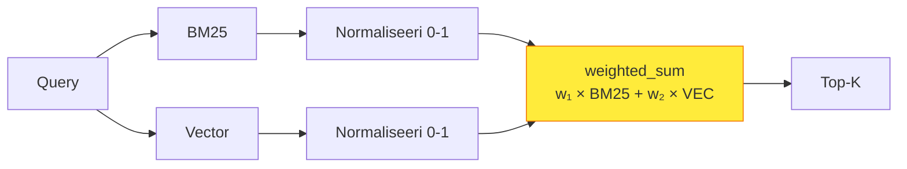

**Kood (Elasticsearch näide):**

```json
{
  "query": {
    "script_score": {
      "query": {
        "match": { "content": "database connection problems" }
      },
      "script": {
        "source": """
          double bm25_score = _score;
          double vec_score = cosineSimilarity(params.q_vec, 'embedding') + 1.0;
          return 0.3 * bm25_score + 0.7 * vec_score;
        """,
        "params": {
          "q_vec": [0.91, 0.12, /* ... 768 dim */]
        }
      }
    }
  }
}
```

**Kaalud `0.3` ja `0.7`** — leiad katsetamisega oma andmetega. Tüüpiline algus: 50/50, siis kohanda.

**Probleem:** BM25 skoorid ja cosine-skoorid on **eri skaalal**. Normaliseerimine ei ole täiuslik — mõni päring annab BM25 skoori 25, mõni 2, vector skoor 0-1 vahemikus. Score fusion'i tulemused on kvaliteediselt **käsitsi tuunimist nõudvad.**

### 4b. Reciprocal Rank Fusion (RRF) — robustne ilma tuunimiseta

RRF ei vaata skoore vaid **järjekorda** (rank). Töötab täpselt-paika ka erinevatel skoori-skaaladel.

**Valem:** Iga dokumendi RRF-skoor = sum(1 / (k + rank_i)) üle kõikide retrievers.

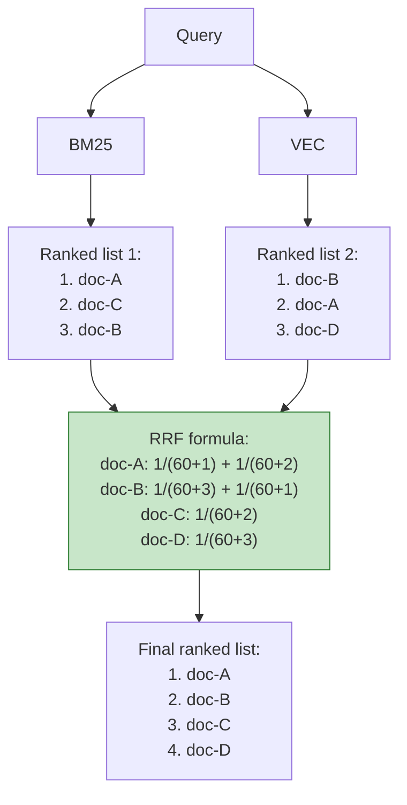

**`k = 60`** on standard-väärtus (paberist Cormack et al. 2009). Ei vaja kaalude-tuunimist. **Töötab kohe.**

OpenSearch 2.10+, Elasticsearch 8.8+ — mõlemal `rrf` natively built-in:

```json
{
  "query": {
    "rrf": {
      "queries": [
        { "match": { "content": "database connection problems" } },
        { "knn": { "field": "embedding", "query_vector": [/*...*/], "k": 10 } }
      ],
      "rank_constant": 60,
      "window_size": 100
    }
  }
}
```

**RRF on tüüpiline soovitus tootmiseks** — robustne, ei vaja kaalude tuunimist, töötab kohe.

### 4c. Two-stage retrieval (retrieve + rerank)

Esmalt laia recall'iga, siis tagasi reranker'iga (eraldi mudel, mis vaatab query ja dokumenti koos).

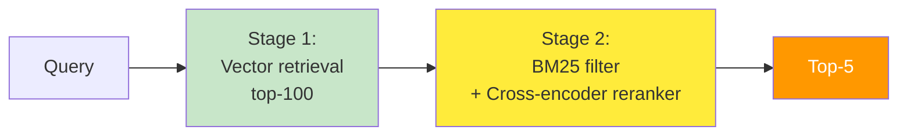

**Stage 1** võtab 100 kandidaati kiire vector-search'iga.
**Stage 2** käib läbi 100 dokumendi **cross-encoder reranker'iga** (näiteks `ms-marco-MiniLM-L-12-v2` HuggingFace'ist) — palju aeglasem aga **palju kvaliteetsem.** Tagastab top-5.

**Kus see sobib RAG-is:** Enterprise-otsing dokumentatsioonis, juriidilistes tekstides, ravimi-andmebaasides — kus retrieval-kvaliteet > latentsus.

**Latentsuse hind:** Stage 1 = ~10ms, Stage 2 = ~100-500ms (sõltub reranker mudelist).

---

## 5. Praktiline näide — runbook RAG monitooringule

Kujutle, et sa ehitad RAG-süsteemi oma operations-tiimile: kasutaja küsib küsimuse loomulikus keeles, süsteem otsib runbook'ist õige protseduuri.

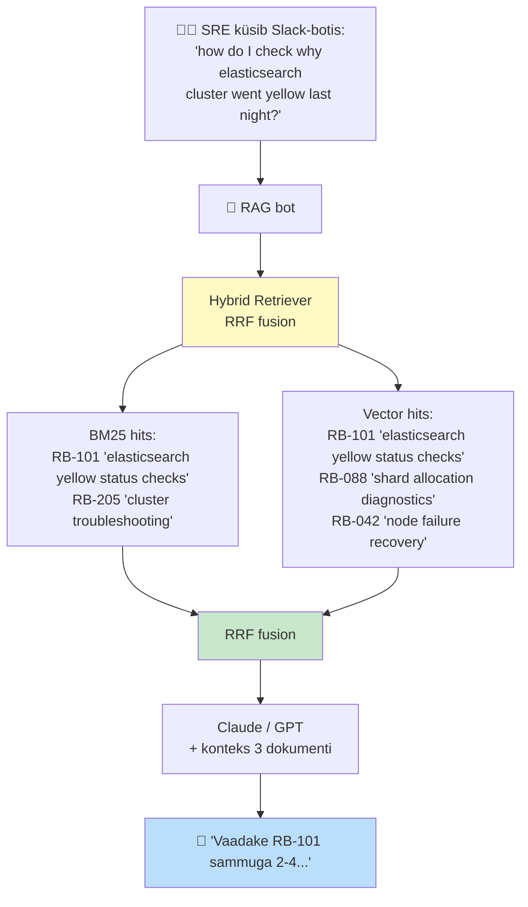

**Mis logida igast päringust:**

```json
{
  "@timestamp": "2026-05-23T10:34:12Z",
  "request_id": "rag-abc-123",
  "user_id": "sre@firma.ee",
  "query": "how do I check why elasticsearch cluster went yellow last night?",
  "query_length_tokens": 14,
  "retriever_type": "hybrid_rrf",
  "embedding_model": "text-embedding-3-small@v2",

  "bm25_results": [
    {"doc_id": "RB-101", "rank": 1, "score": 14.2},
    {"doc_id": "RB-205", "rank": 2, "score": 9.1}
  ],
  "vector_results": [
    {"doc_id": "RB-101", "rank": 1, "score": 0.87},
    {"doc_id": "RB-088", "rank": 2, "score": 0.83},
    {"doc_id": "RB-042", "rank": 3, "score": 0.79}
  ],
  "final_results": [
    {"doc_id": "RB-101", "rrf_score": 0.0322, "source": "both"},
    {"doc_id": "RB-088", "rrf_score": 0.0161, "source": "vector"},
    {"doc_id": "RB-205", "rrf_score": 0.0156, "source": "bm25"}
  ],

  "latency_ms": {
    "bm25": 12,
    "vector": 28,
    "fusion": 2,
    "llm_generation": 1840,
    "total": 1882
  },

  "user_feedback": null,
  "feedback_collected_at": null
}
```

**Tähtsad väljad:**

- `source` (bm25 / vector / both) — vajalik et hiljem analüüsida millisest kanalist tuleb väärtus
- `latency_ms` jaotis etappide kaupa — pudelikaela tuvastamiseks
- `embedding_model` versioon — drift'i ja segamise vältimiseks
- `user_feedback` — populaarsem dokumendi-paar = parem retrieval

---

## 6. Kibana dashboard RAG monitooringule

**4 paneelilist dashboardi:**

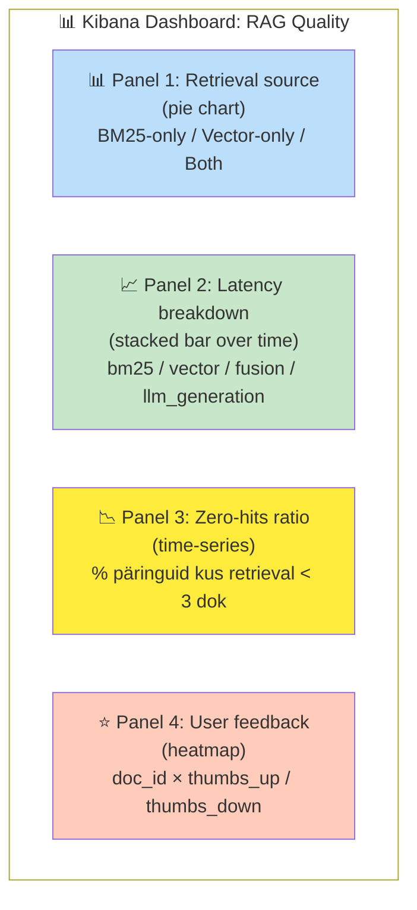

**Kuidas iga paneel räägib midagi olulist:**

| Paneel | Mida näitab | Mis tegevus |
|--------|-------------|-------------|
| Source | Kas BM25 ja vector annavad sama tulemuse? | Kui 95% "both", võib-olla vector lisa kasuga? Kui 80% "vector-only", BM25 võib-olla tuuningu vajab |
| Latency | Kus on bottle neck? | LLM generation kõige aeglasem (oodatud), aga kui vector retrieval >100ms, vaata HNSW `ef_search` |
| Zero-hits | RAG ebaõnnestumise näitaja | Kui >5%, kogu kollektsioon vaatama, paljud küsimused puuduvad vastust |
| Feedback | Kvaliteedi-mõõdik | Top-feedback dokumendid → võimalik et indekseerimine prioriseerida |

---

## 7. Otsustamise raam

```mermaid
flowchart TD
    START["Mis küsimustele RAG vastab?"] --> Q1{Keyword-täpsus<br/>oluline?<br/>(error-koodid, host-nimed,<br/>API-endpoint'id)}

    Q1 -->|Jah, alati| BM25SOLO["BM25 ainult<br/>+ filtrid"]
    Q1 -->|Mõnikord| HYB1

    Q1 -->|Ei, loomulik keel| Q2{Eelarve<br/>vector + LLM<br/>jaoks olemas?}

    Q2 -->|Jah| HYB1["Hybrid (RRF)<br/>= soovitus tootmiseks"]
    Q2 -->|Ei| BM25SOLO

    HYB1 --> Q3{Latency<br/>nõue &lt; 200ms?}
    Q3 -->|Jah| RRF["RRF<br/>(kiire fusion)"]
    Q3 -->|Ei, &lt; 2s OK| TWOSTAGE["Two-stage<br/>retrieval +<br/>reranker"]

    style BM25SOLO fill:#bbdefb
    style RRF fill:#c8e6c9
    style TWOSTAGE fill:#ffeb3b
```

**Kokkuvõte tabelis:**

| Olukord | Vali | Miks |
|---------|------|------|
| Operatiivlogide otsing Discoveris | **BM25 ainult** | Sa tead sõnu, otsid sõnu. Vector kallis ilma kasuta |
| Audit/compliance otsing | **BM25 + filtrid** | Vector = valeoht. Audit nõuab täpset |
| Runbook/wiki RAG (loomulik keel) | **Hybrid RRF** | Standard valik, ei vaja tuunimist |
| Enterprise dokumentatsioon RAG | **Two-stage + rerank** | Kvaliteet > latentsus |
| Incident response AI | **Hybrid + RAG** | Mitme allika kontekst |
| Alert-korrelatsioon | **Vector + LLM** | Sõnastikud erinevad agentide vahel |

---

## 8. Mida monitooringus pead kindlasti logima

✅ **Kohustuslikud väljad iga RAG-päringu kohta:**

- `query` (algne tekst)
- `retriever_type` (bm25 / vector / hybrid_rrf / two_stage)
- `embedding_model` (versiooniga!)
- `returned_doc_ids` koos `source` väljaga (bm25 / vector / both)
- `latency_ms` per stage
- `user_feedback` (kui kogud)

✅ **Soovitatud lisad:**

- `bm25_scores`, `vector_scores`, `rrf_scores` per doc
- `ann_recall_estimate` (kui kasutad HNSW)
- `top_k` ja `window_size` parameetrid
- `tokens_in_context_window` (LLM kulu kontrolliks)

❌ **Mida ÄRA logi (privaatsus):**

- Embedding vektoreid täies ulatuses (768 dim × float = 3 KB per päring)
- Kasutaja täis-isikuandmeid päringus
- LLM-i täis-vastust (kui see sisaldab dokumendi sisu)

---

## Kokkuvõte

**Lihtsalt:**

- **BM25** = "sa tead mida otsid sõnaga". Kiire, soodne, täpne. Vali esimesena, kui sõnad on stabiilsed.
- **Vector** = "sa tead tähendust, mitte täpset sõna". Lahendab vocabulary mismatch'i. Maksab RAM-i ja embedding-API kulu.
- **Hybrid (RRF)** = "tahad mõlemad". Standard tootmiseks. Logi mõlema kanali tulemused eraldi, et hiljem näha kus väärtus tuleb.

**Monitooringus:**

- Logi `source` väli (bm25 / vector / both) — kõige tähtsam üks väli
- Mõõda zero-hits ratio'd — varajane signaal probleemidest
- Hoia embedding-mudeli versioon dokumendile lisatud — drift'i vältimiseks
- Kibana dashboard 4 paneeliga: source / latency / zero-hits / feedback

**Igapäevatöös:**

Sa pole vendor, sa oled platvormi-haldaja. Sinu eesmärk on **mõista kus väärtus tuleb** — kui retrieval kanalist X tuleb 90% kvaliteedist, võib-olla saad teise välja lülitada ja kulu vähendada. Hybrid on standard, aga mooniooring annab vastuse: kas sul on ikka **mõlemad** vaja, või piisab ühest.

---

## Allikad

- [Reciprocal Rank Fusion outperforms Condorcet and individual Rank Learning Methods](https://plg.uwaterloo.ca/~gvcormac/cormacksigir09-rrf.pdf) — algupärane RRF-paber (Cormack et al. 2009)
- [Elasticsearch RRF query](https://www.elastic.co/guide/en/elasticsearch/reference/current/rrf.html)
- [OpenSearch hybrid query + RRF](https://opensearch.org/docs/latest/search-plugins/hybrid-search/)
- [Hybrid Search Explained — MongoDB](https://www.mongodb.com/resources/products/capabilities/hybrid-search)
- [Hybrid Retrieval for Enterprise RAG — When to Use BM25, Vectors, or Both](https://ragaboutit.com/hybrid-retrieval-for-enterprise-rag-when-to-use-bm25-vectors-or-both/)
- [Hybrid Search and Re-Ranking in Production RAG — Towards Data Science](https://towardsdatascience.com/hybrid-search-and-re-ranking-in-production-rag/)
- [Full-text search for RAG apps — Redis](https://redis.io/blog/full-text-search-for-rag-the-precision-layer/)

--8<-- "_snippets/abbr.md"
