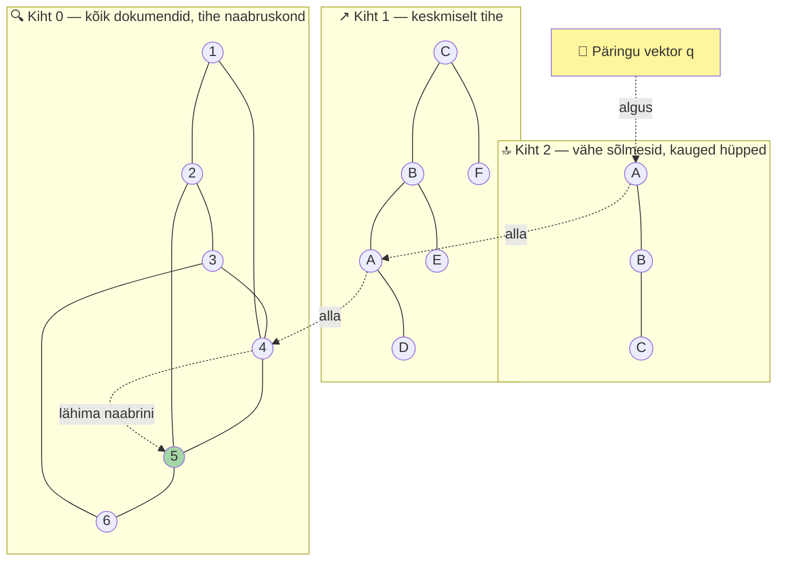
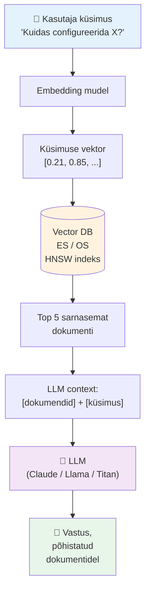

---
tags:
  - Elasticsearch
  - OpenSearch
  - VectorSearch
  - AI
  - RAG
  - Day3
  - Lisalugemine
---

# Päev 3 — Lisalugemine: Vector search, RAG ja AI monitooringus

> **Tase:** Edasijõudnud. Eeldab, et Päev 3 põhi-loeng on läbi loetud (sõlmerollid, shardid, BM25 inverted index).  
> **Kestus:** ~25–30 min lugemist.  
> **Miks see eraldi:** kursuse põhi-teema on monitooring ja observability, mitte AI/RAG. Aga 2024+ on vector search ja RAG saanud osaks observability tööriistadest (Elastic AI Assistant, Splunk AI Assistant, AWS Bedrock + OpenSearch). Sellest peatükist saad ülevaate, **kuidas see töötab ja kus monitooringus sobib**, ilma et peaksid kursuse põhi-aega kulutama.

---

## Sisu

1. Miks vector search? — mida lexical otsing ei suuda
2. Vector embedding — tähendus numbritena
3. HNSW algoritm — kuidas leida lähemaid vektoreid kiiresti
4. FAISS — Facebook AI Similarity Search
5. Elastic ELSER + `semantic_text`
6. OpenSearch ML Commons + Neural Search
7. RAG — Retrieval-Augmented Generation
8. RAG monitooringus — 5 kasutusjuhtu
9. Hybrid search — BM25 + vector koos
10. Otsustamise raam — millal mida valida
11. Allikad

---

## Miks vector search?

Põhi-loengu [§10](paev3-elk-loeng.md#10-otsing-lexical-bm25-vs-vector-ja-kuidas-need-tootavad) kirjeldasin näidet, kus sa otsid logist `database connection problems` ja BM25 ei leia kirjeid, mis on sõnastatud teisiti — `pool exhausted`, `OperationalError`, `lost connection`. See on **vocabulary mismatch** — sinu mentaalne sõnastik ja logi-rea sõnastik on erinevad.

**Vector otsing lahendab selle**, sest ei võrdle sõnu, vaid **tähendusi**. Vaatame, kuidas see töötab.

---

## Vector embedding — tähendus numbritena

**Embedding mudel** (nt sentence-transformer, OpenAI text-embedding, ELSER, BGE, E5) võtab teksti ja annab tagasi vektori — tüüpiliselt **384 … 1536 dimensiooniga** liugujuturuga arve. See vektor esindab teksti **tähendust** geomeetrilises ruumis.

Näide (lihtsustatud, ainult 3 dimensiooni):

| Tekst | Vector |
|---|---|
| "DB timeout" | [0.78, 0.10, 0.45] |
| "connection pool exhausted" | [0.81, 0.09, 0.47] |
| "lost connection to database" | [0.79, 0.11, 0.44] |
| "user logged in" | [0.12, 0.85, 0.21] |
| "successful authentication" | [0.14, 0.83, 0.23] |

Näha — kolm esimest (DB-probleemid) on **lähedal** üksteisele. Kaks viimast (login-tegevused) on **lähedal** üksteisele. DB-probleem ja login on **kaugel**.

Mudel õppis selle treenimise käigus miljarditelt teksti-paaridelt.

Päringu vektor `database connection problems` arvutatakse sama mudeli abil — saame teise vektori. Otsing leiab dokumendid, mille vektor on päringuvektorile **kõige lähemal** — ehk `DB timeout`, `pool exhausted`, `lost connection`.

**Sarnasuse-meetrika:** cosine similarity, dot product või euclidean distance. Cosine on kõige levinum normaliseeritud vektorite jaoks.

### Probleem: kuidas leida lähemaid vektoreid kiiresti

Kui sul on **1 miljon dokumenti**, igaks 384-dimensiooniline vektor, ja küsid "leia 10 sarnasemat", **täpne lahendus** on:

1. Arvuta päring → vektor
2. Arvuta cosine similarity päring-vektori ja iga 1M dokumendi vektori vahel
3. Järjesta

See on **brute force kNN** (k Nearest Neighbors). 1M dokumendi puhul = miljon cosine-arvutust iga päringu kohta. **Liiga aeglane.**

Lahendus: **ANN — Approximate Nearest Neighbors**. Loobume väikese täpsuse-protsendi nimel kiirusest. Saame 95% "õigeid" tulemusi, aga 100–1000× kiiremini.

---

## HNSW algoritm

**Hierarchical Navigable Small World** — algoritm, mida nii Elasticsearch (Lucene 9+ kaudu) kui OpenSearch kasutavad. Idee:

1. Ehita **graaf**, kus iga sõlm = dokumendi vektor. Sõlm ühendatakse oma lähemate naabritega.
2. Tee see graaf **mitmel kihil**: ülemine kiht vähe sõlmedega (kauged hüpped), alumine kiht kõik sõlmed (lähedased naabrid).
3. Otsing: alusta ülemiselt kihilt suvaliselt sõlmelt, liigu alati lähema naabrini. Sample down kihtide kaupa.



Otsing jälgib **logaritmilist teed** — algab ülemiselt vähe-sõlme-kihilt suure hüppega, lihvitakse iga kihiga täpsemaks. Päring 1M-vektori kollektsioonis ~5ms, mitte 500ms.

**Kompromiss:** HNSW eelistab **mälus** vektoreid hoida (RAM kallis). Lucene HNSW kasutab graafe, mis on osa Lucene'i segment-failidest. **Off-heap mälu nõue** on suur — RAM-koormus 1 miljardi vektori puhul on märkimisväärne ja seda tuleb arvestada klastri dimensioneerimisel.

---

## FAISS

**Facebook AI Similarity Search Library** — alternatiiv HNSW-le. OpenSearch ML Commons toetab nii **NMSLIB HNSW** kui **FAISS**'i (sh **IVF** ja **PQ** algoritmid).

FAISS-i tugev külg on **mälukasutuse vähendamine** kompressiooniga (Product Quantization):

- IVF (Inverted File Index): jagab vektorid klastritesse, otsing puudutab ainult mõnda klastrit
- PQ (Product Quantization): kompressioon, mis kaotab pisut täpsust mälu säästmise nimel — väike täpsuse-langus, aga 4–8× väiksem mälukulu

Suurte vector DB-de jaoks oluline. AWS Bedrock + OpenSearch Serverless kasutab FAISS-i sees.

---

## Elastic ELSER + `semantic_text`

Elastic-i strateegia on **lihtne API**.

**ELSER** (Elastic Learned Sparse EncodeR) — Elastic-i enda treenitud mudel, mis annab **sparse** vektoreid (mitte dense). Töötab pre-trained, ei pea fine-tune'ima. Esmane versioon on inglise keele, **multilingual ELSER (e5-multilingual)** lisandus 2024. Kasutamiseks lihtsalt download'id mudeli ja laed klastri.

**`semantic_text` field type** (Elasticsearch 8.13+, 2024) — mapping-level abstraktsioon, mis teeb kaks asja korraga:

```json
PUT my-index
{
  "mappings": {
    "properties": {
      "content": {
        "type": "semantic_text",
        "inference_id": "my-elser-endpoint"
      }
    }
  }
}
```

Kui sa indekseerid dokumendi `content` väljaga, **Elastic teeb automaatselt**:

1. BM25 inverted indeksi (lexical otsing)
2. ELSER-i kaudu sparse vektori (semantic otsing)

Päring:

```json
GET my-index/_search
{ "query": { "semantic": { "field": "content", "query": "database connection problems" } } }
```

Elastic teeb **hybrid otsingu** ja annab kombineeritud skoori. **Üks API, kaks otsingumeetodit.**

---

## OpenSearch ML Commons + Neural Search

OpenSearch on **paindlikum, aga rohkem konfigureerimist**.

**ML Commons** — plugin, mis lubab klastrisse laadida ja käivitada ML-mudeleid. Toetab:

- HuggingFace mudelid (text embedding)
- ONNX mudelid (custom)
- Remote inference: Amazon SageMaker, Bedrock, OpenAI, Cohere, DeepSeek

**Neural Search plugin** — high-level abstraktsioon, mis kasutab ML Commons'i sees. Sa konfigureerid **ingest pipeline'i**, mis lisab dokumentidele vektorid:

```json
PUT _ingest/pipeline/text-embedding
{
  "processors": [{
    "text_embedding": {
      "model_id": "my-embedding-model",
      "field_map": { "content": "content_embedding" }
    }
  }]
}
```

Seejärel: `neural` query type päringuks. **Üle nelja sammu, mitte ühe — aga sa kontrollid iga sammu** ja võid panna oma kohandatud mudeli, fine-tune'itud sinu spetsiifilisele andmekorpusele.

---

## RAG — Retrieval-Augmented Generation

Muster, kus LLM enne vastamist küsib **relevante dokumente** vector storage'st. Põhjus: LLM-i koolitusandmed on lõplikud (ja vananenud), aga sinu organisatsiooni dokumendid (runbookid, postmortemid, logid) on uued ja spetsiifilised.

Tüüpiline RAG arhitektuur:



!!! info "Amazon Bedrock Knowledge Bases"
    AWS-i ametlik RAG-mootor **Bedrock Knowledge Bases** kasutab **Amazon OpenSearch Serverless'i** vaikimisi vector DB-na alates 2024. Sa upload'id dokumente S3-le, valid mudeli (Claude, Llama, Titan, DeepSeek jne), ja AWS teeb embedding'u + indekseerimise + päringu-loogika automaatselt. See on **viiteid arhitektuur** AWS-i klientidele.

RAG **ei asenda LLM-i koolitamist** — ta annab LLM-ile kontekstit. LLM-il pole vaja teada sinu firma 2026 juhendid; ta saab need vector DB-st kontekstina, vastab nende baasil.

---

## RAG monitooringus — 5 kasutusjuhtu

See osa on **tähtis sysadminile** — siin tulevad päris kasutusjuhud, mida Elastic AI Assistant ja Splunk AI Assistant 2024+ teevad:

### 1. Incident response AI assistant

Sa küsid `mis juhtus eile õhtul kell 19:00?`, AI Assistant leiab vector storage'st (sinu logid + traces + alerts) relevante andmed ja võtab kokku tõevi-mustri.

**Elastic AI Assistant** ja **Splunk AI Assistant** teevad täpselt seda 2024+. AI ei "leiuta" — ta leiab kontekstit sinu enda logidest.

### 2. Runbook-otsing

Sa küsid `kuidas taaskäivitada Redis cluster kui see kukub?`, AI leiab sinu organisatsiooni Confluence'ist või wiki-st konkreetse runbooki ja annab vastuse koos sammudega.

Sobib, kui runbookid on tekstilised ja Confluence/Notion/Markdown-kujul. Pildid ja diagrammid läbivad halvemini.

### 3. Alert-korrelatsioon ja summarization

1000 alerti tuli ühe tunni jooksul, AI Assistant ütleb "kõik on seotud `cassandra-cluster-3` split-brain'iga, põhjus on võrgu-lüli `sw-rack-12`".

See on **alert fatigue lahendus** — selle asemel, et SRE peab 1000 alertit käsitsi läbi vaatama, AI grupeerib ja annab juur-põhjuse.

### 4. Semantic log pattern matching

Sa küsid `leia kõik database connectivity issues`, vector otsing leiab nii:

- `connection refused`
- `pool exhausted`
- `OperationalError`
- `lost connection to host`
- `Cannot acquire connection`

— isegi kui sa pole neid sõnu otsisõnas kasutanud. See on **vocabulary mismatch problem'i lahendus** sinu logides.

### 5. Postmortem auto-draft

Incident'i järel AI Assistant kirjutab esimese mustandi:

> 19:03 alert tekkis `api-prod-3` host'il...  
> 19:07 root cause oli `cassandra-cluster-3` split-brain...  
> 19:15 lahendus oli network-switch reboot...

Sinu ülesanne on üle vaadata, parandada faktid ja lisada lessons-learned osa. Mustand säästab ~70% kirjutamise aega.

---

## Hybrid search — BM25 + vector koos

Praktikas ei vali sa "lexical või vector" — **kõige paremad tulemused tulevad mõlema kombineerimisest**. Sellepärast on Elasticsearchi `semantic_text` ja OpenSearchi hybrid search query disainitud nii, et nad annavad **mol-skoori**: BM25 osa + vector cosine osa, kaalutud kokku.

**Miks kombineerida monitooringus?**

- **BM25 on kõva match'iga täpne** — kui otsid `error code 1023`, leiad logid, kus see konkreetselt esineb. Vector mudel ei pruugi numbri-koodi seostada.
- **Vector on tähenduse-poolt täpne** — kui otsid `slow database`, leiad logid, kus on `performance degradation in PostgreSQL`, `query timeout`, `slow response time`. BM25 ei seostaks.

Kaalud (typical default): 0.3 × BM25 + 0.7 × vector — aga see oleneb kasutusjuhust ja sa kalibreerid neid testidega.

---

## Otsustamise raam — millal mida valida

| Monitooringu kasutusjuhus | Soovitus | Miks |
|---|---|---|
| Operatiivlogid (`error`, `host=X`, `timeout`) | **BM25 (lexical)** | Sa tead sõna, otsid sõna. Vector lisab kulu ilma kasuta. |
| Audit / compliance logid (`kes muutis seda 6 kuud tagasi?`) | **BM25 + filtrid** | Sa tahad täpset matchi. Audit-logide jaoks vector on isegi **valeoht** — ei tohi anda "sarnast" tulemust, kui küsija tahab täpset. |
| Wiki / runbook / Confluence otsing | **Hybrid** | Kasutaja sõnastik ≠ dokumendi sõnastik |
| Incident-investigation ("mis juhtus eile?") | **Vector + RAG** | Vajab semantic matchi üle logide ja traces |
| Pattern matching error-logides (`database issues`) | **Vector** | Kasutaja küsib mustrit, leiab seoseid eri formuleeringutes |
| Alert-korrelatsioon ja root cause | **Vector + RAG** | LLM korrelats mitut alerti ja annab juur-põhjuse |
| Runbook AI Assistant | **Vector + RAG (Bedrock või `semantic_text`)** | Standard RAG-setup |

---

## Kokkuvõte

Lexical (BM25) on **kiire, täpne, soodne** — logide ja täpse-matchi-otsingu jaoks parim. Vector on **tähenduselt täpne, kallim resurssidelt** — RAG, runbook-otsingu ja semantic pattern matching'u jaoks parim. **Hybrid kombineerib mõlemad** ja annab tavaliselt parima tulemuse RAG kasutusjuhtudes.

ELSER + `semantic_text` Elastic'is on lihtsam, OpenSearch ML Commons + Neural Search + FAISS on paindlikum.

**Sinu monitooringu igapäevatöös:**

- Logide otsing Kibana Discover'is = BM25, kasuta nagu praegu
- AI Assistant (Elastic AI Assistant, Splunk AI Assistant) = vector + RAG taustal
- Anomaalia-tuvastus ja alert-korrelatsioon = vector + LLM, kui sinu vendor seda toetab
- Postmortem auto-draft = RAG, kui sa upload'id postmortemid vector DB-sse

---

## Allikad

**Vector search ja embeddings:**

- [Elasticsearch `dense_vector` field](https://www.elastic.co/guide/en/elasticsearch/reference/current/dense-vector.html)
- [Elasticsearch `semantic_text` field](https://www.elastic.co/guide/en/elasticsearch/reference/current/semantic-text.html)
- [OpenSearch Neural Search plugin](https://opensearch.org/docs/latest/search-plugins/neural-search/)
- [OpenSearch ML Commons](https://opensearch.org/docs/latest/ml-commons-plugin/)
- [Facebook AI Similarity Search (FAISS)](https://github.com/facebookresearch/faiss)
- [HNSW: Hierarchical Navigable Small World](https://arxiv.org/abs/1603.09320) — algupärane teadusartikkel

**RAG ja AI Assistant:**

- [Amazon Bedrock Knowledge Bases + OpenSearch Serverless](https://docs.aws.amazon.com/bedrock/latest/userguide/knowledge-base.html)
- [Elastic AI Assistant — Observability](https://www.elastic.co/observability/ai-assistant)
- [Splunk AI Assistant for SPL](https://www.splunk.com/en_us/products/splunk-ai.html)

**Üldine kontekst:**

- [Coralogix: ES vs OS — Key Differences](https://coralogix.com/guides/elasticsearch/elasticsearch-vs-opensearch-key-differences/)
- [tecRacer: OpenSearch vs Elasticsearch 2024](https://www.tecracer.com/blog/opensearch-vs-elasticsearch-2024/)

--8<-- "_snippets/abbr.md"
