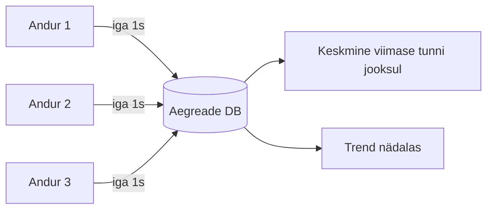
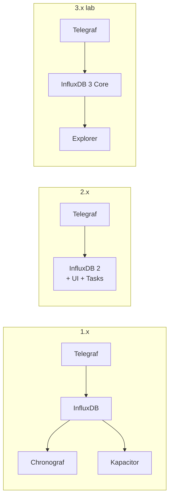
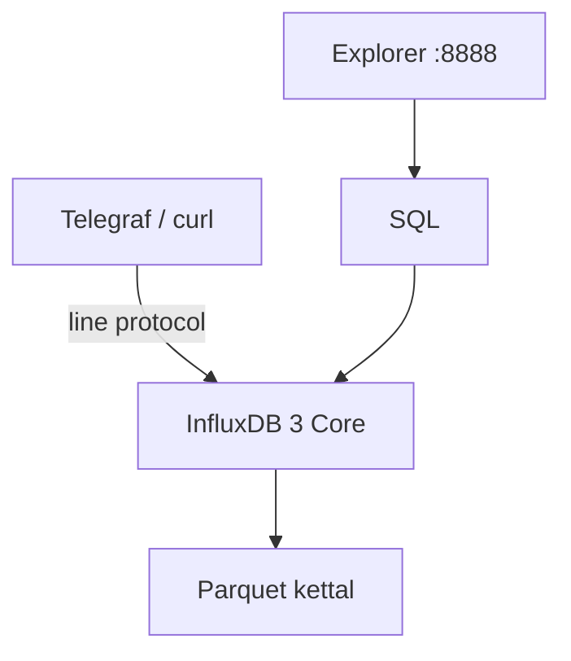
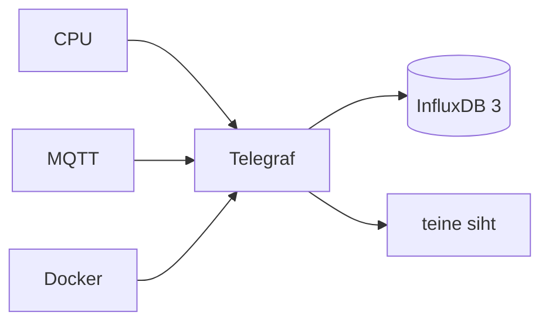
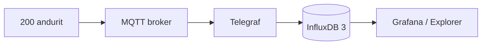
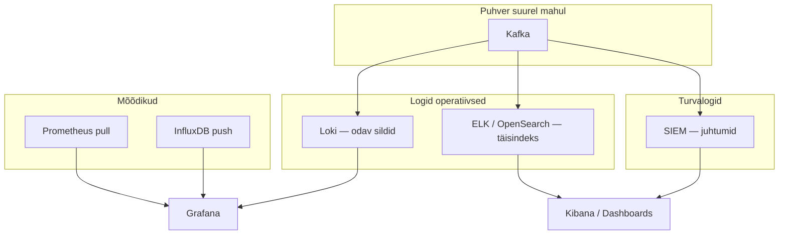
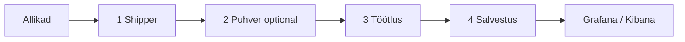
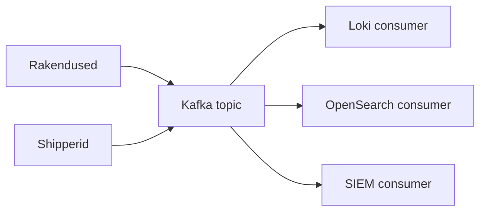
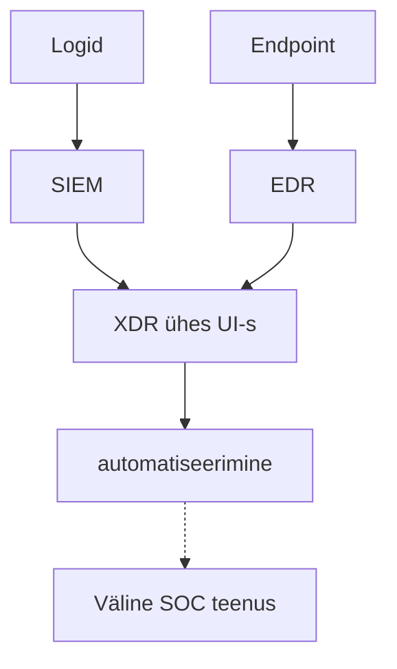
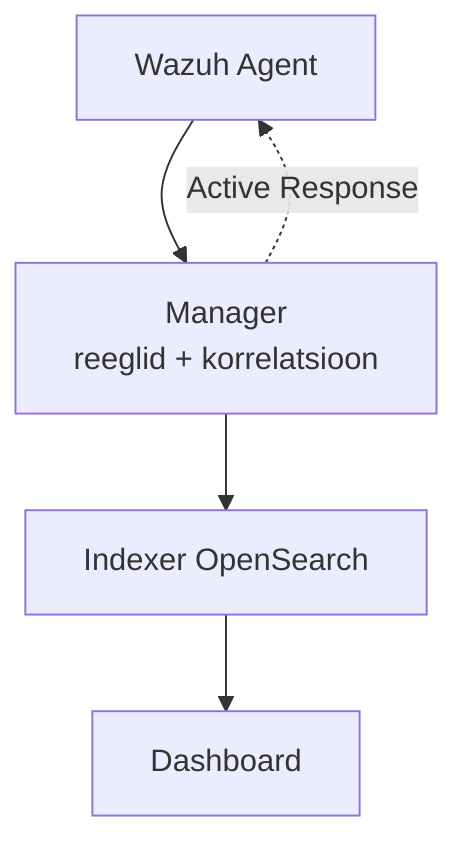

---
tags:
  - Day4
  - TICK
  - InfluxDB
  - SIEM
  - Wazuh
  - Kafka
  - lugemismaterjal
---

# Päev 4: Aegread, keskne logimine ja SIEM

**Kursus:** Kaasaegne IT-süsteemide monitooring ja jälgitavus
**Tase:** Kesktase — eeldame, et tunned Docker Compose'i ja oled näinud eelmiste päevade tööriistu
**Eeldused:** Päev 1 (Prometheus, Grafana) · Päev 2 (Loki) · Päev 3 (Elasticsearch, OpenSearch)
**Labor:** [tick_lab.md](../../labs/04_tick_keskne_logimine/tick_lab.md) · **Otsustustabelid:** [cheat sheet](paev4-cheat-sheet.md)

See on monitooringu, mitte turvaakadeemia päev. Hommikupool on aegread — kuidas mõõdikud spetsiaalsesse andmebaasi voolavad. Pärastlõuna on logitoru ja küsimus, millal logimisele lisandub SIEM. Sysadminina ei pea sa tundma kahtsada Wazuhi reeglit; pead oskama öelda, kuhu su logid lähevad ja millal läheb vaja korrelatsiooni. Turvameeskond kirjutab reeglid — sina ehitad toru, mis sinna voolab.

## Õpiväljundid

Pärast seda peatükki oskad:

- **selgitada**, miks aegread vajavad eraldi andmebaasi — ja millal Prometheus piisab, millal InfluxDB
- **lugeda** line protocol rida ja kirjutada SQL-päring aegridade peal
- **kirjeldada** keskse logimise nelja kihti ja paigutada sinna Loki, ELK ja OpenSearch
- **eristada** operatiivset logimist ja SIEM-i ning nimetada Wazuhi nelja komponenti
- **põhjendada**, miks suure mahuga logitorudes on Kafka vahel

---

# Osa I — Aegread ja TICK Stack

## Prometheus ütleb „CPU on kõrge“ — aga mitte kõike

Päev 1 panid Prometheuse püsti. Ta tõmbab iga viieteistkümne sekundi tagant `/metrics`-ist numbreid, Grafana joonistab graafiku, ja kui midagi läheb valesti, saad sellest enne kasutajat teada — eeldusel, et dashboard on õigesti seatud. Serverite ja konteinerite jaoks töötab see suurepäraselt; Prometheus on Kubernetese ja cloud-native maailma loomulik valik.

Aga kujuta teistsugust olukorda. Eesti tootmisliinil on kakssada temperatuuriandurit, igaüks saadab väärtuse iga sekund — umbes seitseteist miljonit punkti päevas. Iga mõõtmine on uus rida ajas: keegi ei „uuenda“ vana väärtust, vaid lisab uue. Andur ütleb „23,5 kraadi“, ja see jääb ajalukku. Sama loogika kehtib Skeleton Technologiesi superkondensaatorite testimisel või Bolti sõidukite GPS-, kiiruse- ja akuandmete voos.

Kui paned sellise voo PostgreSQL-i, hakkab andmebaas aeglaselt lämbuma. PostgreSQL on ehitatud tehingute jaoks — tellimus, muudatus, kustutamine. Aegread on aga peamiselt **append-only**: miljonid kirjed sekundis, ja küsimus pole „mis on praegune seis?“, vaid „mis juhtus ajas?“.

| | PostgreSQL / MySQL | Aegrea-andmebaas (InfluxDB) |
|--|-------------------|----------------------------|
| Mida hoiab | praegune seis | sündmused ajas |
| Kirjutamine | muudetakse, kustutatakse | peamiselt ainult lisatakse |
| Tüüpiline küsimus | „Mis on saldo?“ | „Mis oli keskmine eile öösel?“ |
| Maht | sajad kirjed/sek | miljonid/sek |
| Vanad andmed | jäävad | retention + downsampling |

See pole PostgreSQL-i puudus, vaid tööriista vale valik — umbes nagu lüüa naela kruvikeerajaga. Andureid jälgib aegrea-andmebaas, mis on ehitatud just selleks:



## Paul Dix ja TICK Stacki sünd

2012. aastal töötab Paul Dix San Franciscos monitooringufirmas. Kliendid tahavad hoida miljoneid mõõtmisi, aga PostgreSQL ja MySQL ei skaleeru. 2013. aastal sünnib **InfluxDB** — nimi tuleb sõnast *influx*, sissevool.

Ainult andmebaasist ei piisanud, ja nii kasvas selle ümber ökosüsteem neljast tükist: **Telegraf** kogus andmeid, **InfluxDB** hoidis neid, **Chronograf** joonistas graafikuid ja **Kapacitor** saatis hoiatusi. Nende nelja esitähe järgi: **TICK Stack**. Alguses olid need neli eraldi programmi, igaühel oma config, andmekaust ja taaskäivitus.

Aastatega muutus see kolm korda:

| Põlvkond | Mis muutus | Päring | Mootor |
|----------|------------|--------|--------|
| **1.x TICK** | 4 eraldi programmi | InfluxQL | TSM — kardinaalsus piiratud |
| **2.x** | C ja K **sisse** andmebaasi; üks binaar + UI | Flux + InfluxQL | TSM |
| **3.x** | **uus mootor** (nullist) | SQL + InfluxQL; Flux **ei toeta** | Apache Arrow + Parquet |



Tasub teada, mis igast tähest sai. **Telegraf** jäi alles ja kirjutab tänini sama line protocoli, mis 1.x ajal. **InfluxDB** on endiselt tuum, aga 3.x mootor on hoopis teine (Rust, Parquet, S3-võimekus). **Chronograf** asendus **Exploreriga** — see on 3.x ametlik veebiliides. **Kapacitor** sulandus esmalt 2.x Tasks'i ja siis 3.x Processing Engine'i sisse. Lihtne viis seda meeles pidada: 1.x oli neli tööriista, 2.x üks kast sama mootoriga, 3.x uus mootor sama kütusega (line protocol) ja uue rooliga (SQL).

1.x ja 2.x on tänaseks hooldusrežiimis — uued projektid lähevad 3.x peale, kuigi tööl võid kohata kõiki kolme, ja 2.x Flux tuleb migreerimisel SQL-iks ümber kirjutada. Kui keegi ütleb „meil on TICK“, on esimene küsimus alati „mis põlvkond?“. Meie laboris kasutame InfluxDB 3 Core'i koos Telegrafi ja Exploreriga; alates 2026. aasta maist osutab Docker `influxdb:latest` 3 Core'ile, aga laboris kinnitame versiooni tag'iga `influxdb:3-core`.

## InfluxDB 3 — TSM-ist Parquetini

Vanem InfluxDB (1.x ja 2.x) kasutas **TSM**-mootorit. Iga unikaalne siltide kombinatsioon — üks **seeria** — võttis mälu, ja just sellepärast oli **kardinaalsus** range piirang. InfluxDB 3 on ehitatud **Apache Arrow** ja **Parquet** peale: andmed seisavad kettal veergude kaupa. Kui päring küsib „anna `usage_user` viimase tunni jooksul“, loeb mootor ainult ühe veeru, mitte terveid ridu — see on kiirem, pakib paremini kokku, ja seeriate arv ei piira enam samamoodi.



Päringukeel on ajas vahetunud kolm korda: 1.x kasutas InfluxQL-i, 2.x tõi Fluxi (funktsionaalne „torude“ keel, mida tööl veel kohtad), ja 3.x läks SQL-i peale, jättes Fluxi maha ning hoides InfluxQL-i ainult tagasiühilduvuseks. Üks päring, mille sa täna laboris kirjutad, näeb välja nii:

```sql
SELECT
  DATE_BIN(INTERVAL '1 minute', time) AS minut,
  AVG(usage_user)
FROM cpu
WHERE time > now() - INTERVAL '1 hour'
GROUP BY minut
```

`DATE_BIN` jagab aja minutilisteks ämbriteks — sama, mida vana InfluxQL tegi `GROUP BY time(1m)`-iga. SQL-i kasuks räägib see, et seda oskab iga IT-inimene ja see kandub üle teistele andmebaasidele; kontseptsioonid (agregeerimine, aja-aknad, tag-filter) on kõigis kolmes keeles samad, erinev on vaid süntaks.

## Line protocol ja kardinaalsus

Kõik, mis InfluxDB-sse jõuab, on **line protocol** — üks tekstirida punkti kohta:

```
cpu,host=server01,region=tallinn usage_user=23.5 1705312200000000000
│   └── tag'id (indekseeritud)        └── field    └── ajatempel (ns)
└── tabel
```

Rea võib lugeda nagu kompaktse CSV-rea. **Tabel** (`cpu`) on kategooria — mõtle sellele nagu andmebaasi tabelinimele. **Tag'id** (`host`, `region`) on indekseeritud sildid, mille järgi hiljem filtreerid — sama roll, mis Loki label'il (Päev 2) või Prometheuse label'il (Päev 1). **Field** (`usage_user`) on tegelik mõõdetav number, mida ei indekseerita. **Ajatempel** on viimane, nanosekundites; kui selle ära jätad, paneb server hetke `now()`.

Siit tuleb aegrea-andmebaasi tähtsaim disainimõiste: **kardinaalsus**, ehk unikaalsete seeriate arv. Iga unikaalne siltide kombinatsioon on üks seeria. `temperatuur,ruum=saal1,andur=a1` on üks seeria; tuhat ruumi korda viiskümmend andurit teeb viiskümmend tuhat seeriat — see on veel hallatav. Aga kui paned sildiks midagi, millel on miljoneid võimalikke väärtusi — `trace_id`, `user_id`, IP-aadress — plahvatab kardinaalsus laele. Reegel on lihtne ja sama, mis Lokis ja Prometheuses: sildiks pane see, mille järgi filtreerid ja millel on piiratud arv väärtusi; kõik muu läheb field'iks.

Kuna aegandmeid koguneb kiiresti, kustutab **retention** vana toorandme automaatselt, ja **downsampling** hoiab minutikeskmisi kauem kui sekundi-täpsust. Prometheuses teeb sama recording rules koos Thanose või Mimiriga; InfluxDB teeb seda andmebaasi sees. Mõte mõlemal: salvesta detail lühikeseks ajaks, agregaat pikaks.

Mõned vead korduvad nii sageli, et tasub neid ette teada:

| Viga | Mida näed | Selgitus |
|------|----------|----------|
| Tag ja field segamini | päring ei leia `host` | tag on filter (`WHERE host=...`), field on number (`AVG(usage_user)`) |
| Ajatempel vales formaadis | rida ei salvestu | nanosekundid; võib ära jätta, siis server paneb `now()` |
| Liiga kõrge kardinaalsus | DB aeglane, mälu täis | ära pane `user_id` sildiks — sama reegel Lokis ja Prometheuses |
| Token puudub või vale | `401` Exploreris | 3.x **nõuab** tokenit — see on turvavaikimisi, mitte viga |

## Telegraf ja Explorer

Kui Prometheus **tõmbab** mõõdikud ise, siis Telegraf **saadab** need. Telegraf on agent, mis jookseb serveris ja kogub CPU-d, Dockerit, MQTT-andurite voogu, Modbus-i — üle kolmesaja sisend-plugina. Üks tema väärtuslikumaid omadusi on dual-output: sama mõõdikuvoog läheb korraga mitmesse sihtkohta, nii et TSDB või arhiivi saab vahetada ilma agente ümber seadistamata.



Graafikute nägemiseks on InfluxDB 3-l oma veebiliides, **Explorer** (port 8888), mis asendab vana Chronografi. Ta ühendub serveriga (URL, token, andmebaas) ja lubab kirjutada SQL-i ning näha tulemust tabeli või graafikuna. Token on 3.x juures uus ja kohustuslik — server ei tee midagi ilma autentimiseta, mis tootmises on mõistlik vaikimisi.

Laboris paned InfluxDB 3 Core'i (port 8181), Telegrafi ja Exploreri ise Docker Compose'iga püsti. Kõigepealt kirjutad esimese line protocol rea käsitsi `curl`-iga ja näed punkti Exploreris — nii saad aru toorvormingust enne, kui Telegraf hakkab sama tegema automaatselt iga kümne sekundi tagant. Enne labi pane Päev 3 stack kinni (`docker compose down`), sest TICK vajab umbes kaks gigabaiti vaba mälu.

## Kaks maailma — tehas ja Prometheus

Tehasepõrandal on kakssada andurit, mis räägivad MQTT-d (kerge sõnumiprotokoll, mitte HTTP) ja toodavad seitseteist miljonit punkti päevas. Toru selleni on lihtne: andurid saadavad MQTT brokerisse, Telegraf loeb sealt ja kirjutab InfluxDB-sse, ja operaator vaatab Grafana või Exploreri graafikut, mitte ei SSH-i ükshaaval masinatesse.



See on sama monitooringu loogika, mis Päev 1 — leia probleem enne kasutajat — lihtsalt teise protokolli ja teise andmebaasiga. Prometheus ja InfluxDB pole konkurendid, vaid eri tööde tööriistad:

| | Prometheus | InfluxDB + Telegraf |
|--|-----------|---------------------|
| Mudel | pull | push |
| Tugevus | K8s, `/metrics`, PromQL | IoT, MQTT, pikk retention |
| Agent | node_exporter | Telegraf |
| Pikk ajalugu | Thanos / Mimir | TSDB ise / Enterprise |

Vale küsimus on „kumb on parem“; õige on „millist probleemi ma lahendan“. Kubernetese klaster `/metrics`-iga on Prometheuse maailm. Tootmisliin Modbus-anduritega on InfluxDB maailm. CI-runnerid, mille eluiga on viis minutit, on Pushgateway erandjuht, kus pull ei jõua. Ja viie aasta ajaloolised trendid suudavad mõlemad, ainult erineva halduskoormusega. Paljudes majades elavad mõlemad kõrvuti.

## Kus InfluxDB-d päriselt kasutatakse

Eelmine näide tehasest oli mõtteline. Päris elus katab InfluxDB terve rea valdkondi: võrgu- ja taristumonitooring, IoT-analüütika ja ennetav hooldus, satelliiditelemeetria, energia- ja akusalvestussüsteemid, finantsturg ning klassikaline tööstuse „data historian“. DB-Enginesi edetabelis on InfluxDB aegrea-andmebaaside kategoorias pikalt esikohal — see ei tee teda automaatselt „parimaks“, aga näitab, et selles nišis on ta de facto standard, mille oskust tasub tööturul omada.

Üks konkreetne lugu seob need mõisted paremini kokku kui ükski tabel. **LeoLabs** ehitab pidevalt uuenevat „elavat kaarti“ madalast Maa-orbiidist ja jälgib üle kahekümne viie tuhande objekti — aktiivsetest satelliitidest kuni kosmoseprügini — et hoiatada kokkupõrgete eest. Andmed tulevad globaalsest radarivõrgust (Austraalia, Alaska, Uus-Meremaa, Maui), mis töötab autonoomselt ilma kohapealse personalita; ainus viis süsteemi tervist jälgida on reaalajatelemeetria.

Tehniliselt on see täpselt seesama väljakutse, millest hommikul rääkisime. Igal radaril on tuhandeid riistvarakomponente ja kogu võrgus kahe- kuni kolmetuhande operatsioonisüsteemiga seadme telemeetria — **kõrge kardinaalsus** — ning seda hoitakse **kolm aastat täisresolutsioonis**, et uurida riistvararikkeid ja kõrvutada radari käitumist hooajaliste muutustega. Koguja on **Telegraf**, mille konfiguratsioone genereerib ja paigaldab automaatselt **Ansible** (allikatõena NetBox, käivitajana GitHub Actions) — sama Infrastructure-as-Code mõte, mida sa infra-repos ise kasutad. Salvestus eraldab arvutuse ja andmed (S3-tagune), mis teeb kolmeaastase ajaloo majanduslikult mõistlikuks — täpselt see kompromiss, mida Parquet ja objektisalvestus võimaldavad.

Tulemus pole mitte „vau-efekt“, vaid igavus heas mõttes: insenerid kirjeldavad süsteemi suurima eelisena seda, et see lihtsalt töötab taustal ja skaleerub ise. Üks väike tiim haldab üle tuhande alarmi ilma kohapealse personalita. Kui tahad mustrit ühe pildina meeles hoida: seadmed → Telegraf → InfluxDB (pikk retention, S3) → alarmid ja Python-analüütika. See on sama kuju, mille sa laboris väiksemas mahus kokku paned.

---

# Osa II — Logid ja SIEM

## Maastiku kaart — viis päeva ühes pildis

Enne kui lähme edasi, tasub kõik seni nähtu ühte pilti panna. Iga päev on katnud ühe tükki samast maastikust:

| Päev | Mis jäi kätte | Tänane seos |
|------|---------------|-------------|
| 1 | Prometheus pull, Grafana, alarmid | numbrid — sama sammas mis InfluxDB, teine mudel |
| 2 | Loki odav logi, LogQL, Alloy | operatiivne logi — üks neljast maailmast |
| 3 | OpenSearch täisindeks, ECS | salvestuskiht — Wazuh kasutab sama mootorit |
| 4 hommik | InfluxDB push, line protocol | kolmas „numbrite“ tee |
| 4 pärastlõuna | toru + SIEM | kuidas logid liiguvad ja millal tekivad juhtumid |



Täna me uut logistacki ei ehita — seome olemasoleva teadmise kokku. Päev 3 OpenSearch on alus, mille peal Wazuh hiljem töötab.

## Viiskümmend serverit — keskne logimine

Kujuta ette tavalist ööd. Telefon heliseb — veeb on aeglane. Zabbix näitab CPU-piiki hostil `web-03`. Sa SSH-id sinna, aga viga oli hoopis `api-07`-s, mis `web-03`-le helistas. Ilma keskse logita kulub tund serverite vahel hüppamiseks ja `grep ERROR` ajamiseks viiekümnes kohas. Keskse logiga teed ühe päringu — `service=api AND level=error` — ühes kohas, ja vastus tuleb minutitega.

See ongi keskse logimise mõte: üks koht, kust otsid, et leida probleem enne kasutajat (sama MTTD-loogika, mis Päev 1). Konteinerite ajastul pole see luksus, vaid vajadus — konteineri logid kaovad taaskäivitusel. Toru, mille sa ehitad, peab kandma vähemalt nelja asja: rakenduslogid (JSON, tasemed, stack trace), access-logid (nginx, load balancer), süsteemilogid (syslog, `auth.log` — nii operatiiv kui turva) ja konteinerilogid (stdout/stderr). Hea harjumus algusest peale: logid JSON-ina ja korrelatsiooni-ID, mis seob logi jäljega (Päev 5).

## Neli kihti — shipper, puhver, töötlus, salvestus

Iga suurem logitoru, olgu selle salvestuseks Loki, ELK või SIEM, järgib sama nelja-kihilist mustrit. Kui selle korra selgeks teed, oskad lugeda ükskõik millist logi-arhitektuuri.



Esimene kiht on **shipper** — kerge agent, mis jookseb igal masinal, loeb logifaili või konteineri väljundit ja saadab edasi. Fluent Bit on neist kõige kergem (umbes ühe megabaidi mäluga) ja seda kohtab Kubernetese sidecar'ina; Alloy kuulub Grafana maailma ja kannab korraga logisid, mõõdikuid ja jälgi (Päev 5); Filebeat on Elasticu oma; rsyslog on klassikaline Linuxi syslog-server. Väikeses majas läheb shipper otse Lokisse või OpenSearchi, ja puhvri ning töötluse lisad alles siis, kui maht kasvab.

Kolmandat kihti, töötlust, teeb sageli **Vector**, mis on ühtaegu shipper ja marsruteerija: ta saadab warn-taseme logid Lokisse, kõik logid odavasse S3-arhiivi ja turvasündmused SIEM-i, ning filtreerib ääres — viskab debug-logid minema enne, kui need salvestusse jõuavad. See on sama mõte, mida nägid Telegrafi dual-output'i juures, ainult terve logitoru tasemel.

| Kiht | Analoogia | Millal vajalik |
|------|-----------|----------------|
| 1 Shipper | postkast igas majas | alati — ilma selleta jäävad logid masinale |
| 2 Puhver (Kafka) | sorteerimiskesk | suur maht, mitu tarbijat |
| 3 Töötlus (Logstash / Vector) | puhastus ja sortimine | JSON-parse, PII maskeerimine, sample |
| 4 Salvestus | arhiiv | Loki / OpenSearch / S3 |

Viiesaja konteineriga Kubernetese keskkonnas näeb see välja nii: Fluent Bit igas podis, sealt Kafkasse, Logstash parsib, OpenSearch salvestab. Viie kuni kahekümne serveriga tiimis piisab aga Alloy'st või Fluent Bitist otse Lokisse ja Grafanasse — Kafka pole kohustus, vaid asi, mille lisad siis, kui maht või tarbijate arv seda nõuab.

## Kafka — puhver suurel mahul

Kui logimaht on tuhandeid sõnumeid sekundis — suure finants- või riigiasutuse, suure IT-keskkonna skaalal — ei pruugi shipper otse salvestusse enam piisata. Probleem on selles, et kui ELK, Loki või SIEM hoolduse ajal aeglustub või taaskäivitub, lähevad sõnumid kaotsi. **Kafka** istub vahel puhvrina: producer kirjutab oma tempos, consumer loeb oma tempos, ja kui consumer on maas, ootavad sõnumid Kafkas, kuni ta naaseb.



Kolm sõna piisab algatuseks: **topic** on üks voog (nt `app-logs`), **partition** jagab voo paralleelseteks osadeks, ja **consumer group** lubab mitmel lugejal töö omavahel ära jagada. Hea analoogia: shipper on kuller, Kafka on sorteerimiskesk. Kui OpenSearch on hoolduses — ladu suletud — viskaks kuller pakid muidu maha ja logid kaoksid; Kafkaga ootavad pakid riiulil, ja kui ladu avaneb, võtab consumer need järjekorras ära.

Tasub teada, et Kafka hoiab sõnumeid teatud arv päevi või gigabaite — see on **puhver, mitte pikaajaline arhiiv**, ega asenda OpenSearchi retentionit. Ja kuna Kafkal endal on mõõdikud — consumer lag, offset — kehtib siin sama alarmiloogika, mis Päev 1: kui lag kasvab, ei jõua SIEM või ELK järele. Reegel, millal Kafka üldse vahele võtta: logimaht üle umbes saja gigabaidi päevas, mitu eri tarbijat, ja nõue, et hooldus ei tohi andmeid kaotada.

## Logimine vs SIEM

Loki või OpenSearch ütleb sulle fakti: „viis ebaõnnestunud ssh-katset hostis `web-01`“. SIEM ütleb mustri: „juhtum #4821 — brute force, sellele järgnes edukas login ja siis `useradd`. Reageeri.“ Andmed on samad; vahe on selles, et SIEM teab reegleid, mille järgi üksikud sündmused juhtumiks kokku panna. Praktikas lisab ta logihaldusele neli asja: logid kõikjalt kokku (server, tulemüür, AD, pilv), normaliseerimise ühtsesse vormi (Linuxi `failed password` ja Windowsi sündmus `4625` saavad võrreldavaks — sama ECS-i mõte, mis Päev 3), korrelatsioonireeglid ja alarmid juhtumitena, mitte üksiksündmustena.

Juhtumi elukaart on lihtne jälgida näite varal. Kell 09:00 tekib `auth.log`-i viiskümmend ebaõnnestunud ssh-katset — üksik sündmus, veel mitte juhtum. Kell 09:02 logib sama IP edukalt sisse, ja SIEM korreleerib: brute force, millele järgnes õnnestumine. Kell 09:05 tuleb samal hostil `useradd`, mis mustrit täiendab. Kell 09:06 avab SIEM juhtumi #4821, severity High, seotud MITRE tehnikaga T1110. Edasi tuleb triage — kas tegu on testija või ründajaga — ja siis reageerimine: IP blokeerimine või hosti isoleerimine. Operatiivne logimine peatuks esimese sammu juures: sa näeksid ridu, aga keegi ei ütleks, et see on juhtum.

Kriitilises taristus nõuab **NIS2** logimist ja juhtumite dokumenteerimist (vt [Päev 1 §10](paev1-observability.md#10-regulatiivne-kontekst)), ja SIEM aitab sellega: juhtumi number, ajajoon, kes reageeris. Just sellepärast eraldavad paljud majad turvalogid operatiivlogidest — neil on erinev retention, juurdepääs ja GDPR-i kaalutlused. Sysadminina ei pea sa kirjutama viitsada reeglit; pead tagama, et `auth.log`, tulemüüri ja AD sündmused jõuavad torusse, mitte ainult rakenduse debug-logi.

Turvasõnavara on akronüüme täis, aga need on kihid, mitte konkurendid. **EDR** istub endpoint'i peal ja jälgib protsesse seestpoolt; **SIEM** korreleerib logisid; **XDR** ühendab EDR-i ja SIEM-i ühte liidesesse; **SOAR** lisab automaatsed reageerimis-playbook'id; ja **MDR** on teenus, kus keegi teine peab su turvavalvet.



Keskmises majas on tavaliselt EDR ja SIEM, ja sysadmini roll on hoolitseda, et logid SIEM-i voolaksid. Tööl kohtad neid Splunk ES-i, Microsoft Sentineli, Elastic Security või Wazuhi nime all — erinev hind, sama roll.

## Wazuh — OpenSearch elus

Wazuh on hea näide, sest see on avatud lähtekoodiga ja toetub asjale, mille sa eile ehitasid: **Wazuhi Indexer on OpenSearch**. Eile oli see tühi platvorm; siin näed, mis selle peal reaalselt töötab.



| Komponent | Roll |
|-----------|------|
| **Agent** | kogub logid, faili-muutused, protsessid, paketid |
| **Manager** | rakendab reegleid ja korreleerib |
| **Indexer** | salvestab — sinu Päev 3 OpenSearch |
| **Dashboard** | OpenSearch Dashboards-põhine liides |

Peale tavalise logikogumise teeb Wazuh veel kolme asja: **FIM** jälgib katalooge nagu `/etc` ja annab alarmi, kui `/etc/passwd` muutub (sysadminile küsimus: kas paigaldus või rünnak?); **Vulnerability Detector** võrdleb paigaldatud pakette CVE-andmebaasiga, nii et sama agent, mis logib, oskab öelda ka „see CVE on sinu serveris“; ja **SCA** kontrollib konfiguratsiooni CIS-i benchmark'ide vastu.

Kõige kõnekam on **Active Response**. Kui ründaja teeb hostile hulga ssh-katseid, matchib Wazuhi reegel mustri, tekitab alarmi (seotud MITRE tehnikaga T1110, Brute Force) ja Active Response käivitub: agent blokeerib ründaja IP automaatselt, ilma inimese sekkumiseta. Sellega muutub logimine reageerimiseks. Wazuhi dashboardil näed viimaseid alarme severity järgi värvituna; ühe juhtumi avades näed ajajoont (ebaõnnestumised → edukas login → käsk) ja selle MITRE-vastendust — see on koht, kus SIEM räägib ründaja keelt, mitte ainult logiridu.

Kui ehitaksid Wazuhi piloodi, ei alustaks sa viiesajast serverist, vaid viiest kuni kümnest, sest reeglid vajavad tuunimist. Loomulik järjekord lähtub väärtusest ja eksponeeritusest:

| Prioriteet | Host | Miks |
|------------|------|------|
| 1 | avalik veeb / DMZ | ssh- ja veebirünnakud |
| 2 | AD / LDAP | identiteet |
| 3 | andmebaasid | andmete väärtus |
| 4 | töölauad | pigem EDR-i tsoon, vähem SIEM-agente |

## Kuidas valida — neli maailma

Sa oled nüüd näinud nelja maailma, ja need pole järjestatud halvast paremaks — neil on erinev fookus:

| | Fookus | Kus kasutad |
|--|--------|-------------|
| **Loki** | odav, sildid, Grafana | operatiivne debug |
| **ELK / OpenSearch** | täisindeks, analüütika | forensika, keerukad päringud |
| **SIEM** | juhtumid, reeglid | turva, NIS2 |
| **InfluxDB** | aegread, IoT | mõõdikud push-mudelis |

Enamik maju ei vali ühte, vaid hoiab operatiivlogi ja turvalogi eraldi, vahel Kafka nende vahel. Valik sõltub ka organisatsiooni suurusest: väike maja (1–10 serverit) saab hakkama Loki ja Grafanaga ning SIEM-i piloodi või pilveteenusega; keskmine lisab eraldi turvalogi (Wazuh või Sentinel); suur ehitab Kafka peale mitme consumer'iga toru, mida hooldavad eri meeskonnad SLA-de all.

Enne otsust tasub vastata viiele küsimusele: kui suur on logimaht päevas (see määrab Loki vs ELK vs Kafka), kes seda hooldab (üks sysadmin vs eraldi platvormitiim), kas vaja on forensikat (täistekst, pikk retention), kas kehtivad turvanõuded (NIS2, eraldi juhtumid), ja kas Grafana on juba maja standard (Loki vs Kibana). Lihtne kokkuvõte kogu päevast mälupildiks:

```
Mõõdikud:  Prometheus (pull) | InfluxDB (push)
Logid:     Loki (odav) | OpenSearch (täis) | SIEM (juhtumid)
Toru:      Shipper → [Kafka] → Töötlus → Salvestus
Lab:       Telegraf → InfluxDB 3 → Explorer + SQL
```

Valmis otsustustabelid on koondatud eraldi: [cheat sheet](paev4-cheat-sheet.md).

## Kodutöö ja Päev 5 sild

Laboris jõuad osadeni üks kuni neli; kodus jäävad osad viis kuni seitse: SQL sügavamalt (`DATE_BIN`, agregeerimine), dual-output (tootmismuster, kus sama voog läheb kahte kohta) ja MQTT-andur (IoT maitseproov). Päev 5 toob kolmanda samba — jäljed Tempo ja OpenTelemetry'ga — ja seob mõõdikud, logid ja jäljed kokku LGTM-iks.

---

## Kokkuvõte

**Aegread ei ole tehingud.** InfluxDB on ehitatud append-only maailmale, PostgreSQL tehingutele.
**TICK on läbinud kolm põlvkonda:** 1.x neli programmi, 2.x üks kast, 3.x uus mootor. Meie lab kasutab Telegrafi, InfluxDB 3 Core'i, Exploreri ja SQL-i.
**Prometheus tõmbab, Telegraf saadab** — ja mõlemad võivad korraga elada.
**Keskne logimine on neli kihti:** shipper → (Kafka) → töötlus → salvestus.
**SIEM lisab logidele korrelatsiooni ja juhtumid.** Wazuh on OpenSearch + reeglid + Active Response.

---

## Küsimused enesetestiks

<details>
<summary><strong>Küsimused (vastused all)</strong></summary>

1. Miks kahesaja anduri voog ei sobi PostgreSQL-i?
2. Mis vahe on 1.x TICK ja 3.x stackil?
3. Mis on kardinaalsus?
4. Push vs pull — näide kummastki?
5. Nimeta keskse logimise neli kihti.
6. Mis vahe on logimisel ja SIEM-il?
7. Millal võtta Kafka vahele?
8. Wazuhi neli komponenti?

??? note "Vastused"

    1) Append-only, miljonid kirjed päevas, küsimus on ajas — mitte saldo.
    2) 1.x: neli programmi, InfluxQL, TSM. 3.x: Telegraf + Core + Explorer, SQL, Parquet-mootor.
    3) Unikaalsete seeriate arv. Liiga palju silte (nt `trace_id`) teeb DB aeglaseks.
    4) Pull: Prometheus `/metrics`. Push: Telegraf, MQTT-andurid.
    5) Shipper → puhver → töötlus → salvestus.
    6) Logimine annab fakti; SIEM teeb mustrist juhtumi.
    7) Suur maht, mitu consumer'it, hooldus ei tohi sõnumeid kaotada.
    8) Agent, Manager, Indexer, Dashboard.

</details>

---

## Allikad

| Allikas | URL |
|---------|-----|
| InfluxData platform | <https://docs.influxdata.com/platform/> |
| InfluxDB 3 Core | <https://docs.influxdata.com/influxdb3/core/> |
| Line protocol | <https://docs.influxdata.com/influxdb3/core/reference/line-protocol/> |
| Telegraf | <https://docs.influxdata.com/telegraf/v1/> |
| LeoLabs kasutuslugu | <https://www.influxdata.com/customer/leolabs/> |
| InfluxDB kasutusalad | <https://www.influxdata.com/solutions/> |
| DB-Engines — TSDB edetabel | <https://db-engines.com/en/ranking/time+series+dbms> |
| Wazuh | <https://documentation.wazuh.com/> |
| MITRE ATT&CK — T1110 | <https://attack.mitre.org/techniques/T1110/> |
| Vector | <https://vector.dev/docs/> |
| Apache Kafka | <https://kafka.apache.org/documentation/> |
| OpenSearch | <https://opensearch.org/docs/latest/> |

**Versioonid:** InfluxDB 3 Core · Telegraf 1.34 · Explorer 1.8.0

---

*Labor: [tick_lab.md](../../labs/04_tick_keskne_logimine/tick_lab.md) · Järgmine: Päev 5 — Tempo + OpenTelemetry*
