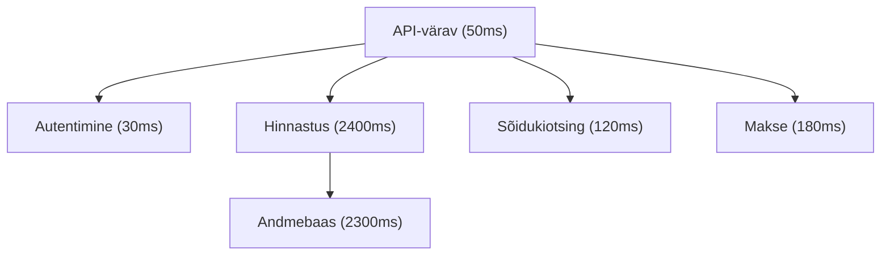
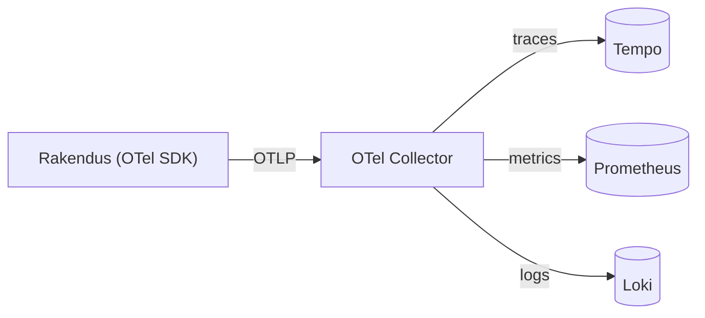

---
tags:
  - Day5
  - Tracing
  - OpenTelemetry
  - Tempo
  - LGTM
  - SLO
  - lugemismaterjal
---

# Päev 5: Hajutatud jälgimine, LGTM ja kuhu monitooring liigub

**Kursus:** Kaasaegne IT-süsteemide monitooring ja jälgitavus
**Tase:** Kesktase — eeldame, et tunned Docker Compose'i ja oled neli päeva tööriistu ehitanud
**Eeldused:** Päev 1 (Prometheus, Grafana) · Päev 2 (Loki) · Päev 3 (Elasticsearch, OpenSearch) · Päev 4 (aegread, keskne logimine, SIEM)
**Labor:** [lab.md](../../labs/05_tempo_otel/lab.md) · **Trendid:** [trendid.md](../../labs/05_tempo_otel/trendid.md)

Neli päeva oled kogunud mõõdikuid ja logisid. Mõlemad ütlevad, *et* midagi on valesti — Prometheus näitab, et latentsus tõusis, Loki näitab vealogi. Aga kui üks päring läbib seitset mikroteenust, ei ütle kumbki, *kus* aeg kulus. Täna lisame kolmanda samba — jäljed (traces) — ja paneme metrics, logs ja traces ühte Grafanasse kokku. Pärastlõuna vaatab, kuhu valdkond 2026. aastal liigub: OpenTelemetry kui standard, konsolideerimine, SLO-d kui keel, millega arendaja ja äri omavahel räägivad.

## Õpiväljundid

Pärast seda peatükki oskad:

- **selgitada**, mis on span ja trace ning miks hajutatud jälgimine vastab küsimusele, millele mõõdikud ja logid ei vasta
- **kirjeldada** OpenTelemetry rolli — miks üks standard asendab vendor-spetsiifilised agendid
- **paigutada** Tempo LGTM-stacki ja põhjendada, miks jäljed lähevad odavasse objektisalvestusse
- **eristada** kolme samba (metrics, logs, traces) tugevusi ja teada, millal kumbki vastab
- **defineerida** SLI, SLO ja veaeelarve ning põhjendada, miks need on alarmeerimisest parem viis prioritiseerida
- **hinnata** kriitiliselt turundusväiteid AI-põhise jälgitavuse kohta

---

# Osa I — Hajutatud jälgimine

## Mõõdik ütleb „aeglane", logi ütleb „viga" — aga kus?

Päev 1 panid Prometheuse mõõtma ja Grafana joonistas latentsuse graafiku. Kui `checkout` muutub aeglaseks, näed seda kohe — joon tõuseb. Päev 2 lisasid Loki, et leida vastav vealogi. See töötab, kui süsteem on üks-kaks teenust.

Aga vaata Bolti tellimust. Kasutaja vajutab „telli sõit"; päring läbib API-värava, autentimisteenuse, hinnastusteenuse, sõidukite-otsingu, makseteenuse ja teavitusteenuse — kuus-seitse eraldi teenust, võib-olla eri serverites. Mõõdik ütleb „checkout võttis 4 sekundit". Logi ütleb „payment OK". Aga kus need 4 sekundit kulusid? Hinnastuses, mis küsis aeglaselt andmebaasist? Makses, mis ootas välist API-d? Mõõdik ja logi ei tea — kumbki näeb ainult oma teenust.

**Hajutatud jälgimine** (distributed tracing) vastab just sellele. Iga päring saab unikaalse `trace_id`, mis kantakse kaasa läbi kõigi teenuste. Iga teenus kirjutab oma osa — **span** — millal ta päringu sai, mida tegi, millal vastas. Span'id kokku moodustavad **trace'i**: ühe päringu täisteekonna, kus näed iga sammu kestust.

Selle trace'i pealt on kohe näha: 4 sekundit ei kulunud maksele ega otsingule, vaid hinnastuse andmebaasipäringule. Ilma jäljeta oleks see tundide jagu logide kammimist; jäljega on see üks pilk.

Tööl tähendab see, et kui klient kurdab „rakendus on aeglane", ei pea sa arvama, milline teenus süüdi on. Avad trace'i, vaatad, milline span on pikim, ja tead, kuhu vaadata.

## Span, trace, context propagation

Span on jälje vähim ühik — üks operatsioon koos algusaja, kestuse ja siltidega (`service.name`, `http.status_code`, `db.statement`). Trace on span'ide puu, mida seob ühine `trace_id`. Üks span on alati juur (kasutaja päring); ülejäänud on lapsed, igaüks viitab oma vanemale.

Et `trace_id` teenuste vahel kaasa läheks, peab iga teenus selle päringus edasi andma — see on **context propagation**. Praktikas käib see HTTP-päises (`traceparent`), mille standardi annab W3C Trace Context. Kui teenus seda päist edasi ei kanna, katkeb trace ja sa näed kaht eraldi tükki ühe asemel.

Sa ei pea seda käsitsi kirjutama. Kaasaegsed teegid (OpenTelemetry SDK-d) teevad propagatsiooni automaatselt — instrumenteerid teenuse korra ja `trace_id` liigub edasi ise.

---

# Osa II — OpenTelemetry

## Üks standard agentide asemel

Päev 2 nägid Promtaili (logid Lokisse), päev 4 Telegrafi (mõõdikud InfluxDB-sse). Iga tööriist tõi oma agendi, oma vormingu, oma konfiguratsiooni. Kui vahetad backend'i — Loki asemel ELK, InfluxDB asemel Mimir — vahetad ka agendi ja instrumenteerid rakenduse ümber.

OpenTelemetry (OTel) lahendab selle. See on üks standard kõigi kolme signaali jaoks: mõõdikud, logid, jäljed. Instrumenteerid rakenduse **korra** OTel SDK-ga, ja andmed liiguvad standardvormingus (OTLP) ükskõik millisesse backend'i. Vahetad Tempo Jaegeri vastu — rakendust ei puutu, muudad ainult, kuhu collector saadab.

See on vendor-neutraalsuse otsustuspunkt, mida nägime juba päev 4 cheat-sheetis: vendor-spetsiifiline (Application Insights, Datadog agent) vs avatud standard (OTel). Vendor-agent on kohati mugavam ja annab rohkem out-of-the-box, aga seob su selle tootjaga. OTel maksab natuke rohkem seadistust, aga rakenduse instrumenteering jääb samaks ka siis, kui tööriista vahetad. CNCF-i projektina on OTel tänaseks de facto standard — enamik uusi süsteeme alustab sellest.

## OTel Collector — vahekiht, mis hoiab valikud lahti

Collector on eraldi protsess, mis võtab OTLP andmed vastu, töötleb (filtreerib, rikastab, batch'ib) ja saadab edasi. Rakendus saadab collector'ile; collector saadab backend'idele. See vahekiht tähendab, et rakendus ei pea teadma, kuhu andmed lõpuks lähevad — saad backend'i vahetada collector'i konfist, rakendust puutumata.

Tööl tähendab see paindlikkust: kui homme tahad jäljed Tempost Jaegerisse kolida, muudad collector'i ühte rida, mitte iga rakenduse koodi.

---

# Osa III — LGTM-stack tervikuna

## Kolm sammast, üks Grafana

Kogu kursus on ehitanud ühte mustrit, ilma et seda alguses nimetasime. Nüüd on tükid koos:

| Sammas | Küsimus | Tööriist | Päev |
|--------|---------|----------|------|
| **Metrics** | Kas midagi on valesti? | Prometheus / Mimir | 1 |
| **Logs** | Mis täpselt juhtus? | Loki | 2 |
| **Traces** | Kus aeg kulus? | Tempo | 5 |

Grafana Labs nimetab oma stacki tähtede järgi: **L**oki (logs), **G**rafana (visualiseerimine), **T**empo (traces), **M**imir (metrics) — LGTM. See pole ainus võimalik valik (mõõdikuteks võib jääda Prometheus, jälgedeks Jaeger), aga komplektina on ta levinuim avatud lähtekoodiga vaadeldavuse stack.

Mimirit me eraldi ei püsti pane — see on Prometheuse pikaajaline, skaleeruv salvestus, ja Prometheus üksi piisab kursuse mahus. Tähtis on muster: kolm signaali, üks UI, üks päringukogemus.

## Tempo: jäljed lähevad sinna, kus salvestus on odav

Tempo on Grafana jälgede-backend. Tema disainiotsus on lihtne: jäljed on suuremahulised, aga neid päritakse harva ja peamiselt `trace_id` järgi. Seega ei indekseeri Tempo trace'i sisu — ta paneb jäljed otse objektisalvestusse (S3, GCS, kohalik ketas) ja toetab põhiliselt otsingut ID järgi. See on sama loogika, mida nägime Lokis päev 2: ära indekseeri seda, mida sa enamasti ei pärigi, ja salvestus läheb odavaks.

Just seetõttu jookseb Tempo ka meie lab-riistvaral. Erinevalt InfluxDB 3-st (mida päev 4 ei saanud kasutada, sest Sandy Bridge CPU-l puudub AVX2) on Tempo Go-binaar ega nõua uusi käsustikke — käivitub vanemalgi serveril.

## Korrelatsioon — see, mis teeb stackist terviku

Kolm tööriista eraldi on kasulik. Aga väärtus tuleb sellest, et nad on seotud. Grafanas saad latentsuse-graafikult (mõõdik) klõpsata punktile, hüpata sama hetke logidesse (Loki), ja logist `trace_id` kaudu otse trace'i (Tempo). Üks uurimisteekond, kolm signaali, ilma et vahetaksid tööriista või kopeeriksid ID-sid käsitsi.

See on jälgitavuse tegelik lubadus — mitte „meil on kolm dashboard'i", vaid „ma saan ühe probleemi puhul liikuda sümptomilt põhjuseni minutitega".

---

# Osa IV — SLI, SLO ja veaeelarve

## „Saada alarm, kui CPU > 80%" on vale küsimus

Päev 1 seadsid alarmi läve peale. See on alustuseks hea, aga peidab probleemi: 80% CPU ei tähenda iseenesest, et kasutajal on halb. Server võib olla 95% koormatud ja kasutaja saab vastuse 100 ms-ga; või CPU on 30% ja päring võtab 8 sekundit, sest ootab lukku. Lävi mõõdab masinat, mitte kasutaja kogemust.

Google'i SRE-praktikast tuli teine viis mõelda, ja see on tänaseks tööstuse keel. Selle asemel et alarmida igal lävel, defineerid, *mida lubad kasutajale*, ja mõõdad, kas pead lubadust.

**SLI** (Service Level Indicator) — mõõdetav näitaja kasutaja kogemusest. Näiteks „päringute osakaal, mis vastavad alla 300 ms" või „edukate päringute osakaal". Mitte CPU — vaid see, mida kasutaja tunneb.

**SLO** (Service Level Objective) — eesmärk SLI-le. „99,9% päringutest vastab alla 300 ms kuus." See on lubadus, mille annad.

**Veaeelarve** (error budget) — SLO tagakülg. Kui lubad 99,9%, lubad ühtlasi, et 0,1% tohib ebaõnnestuda. See 0,1% on eelarve. Kui sa pole seda ära kulutanud, on süsteem piisavalt töökindel — võid julgelt uut välja lasta. Kui oled eelarve ületanud, peatad uued väljalasked ja parandad stabiilsust.

## Miks see paremini prioritiseerib

Veaeelarve teeb otsuse mõõdetavaks, mitte arvamuseks. „Kas me lükkame väljalaske edasi?" ei ole enam tunde küsimus — vaatad eelarvet. Eelarve alles? Lase välja. Eelarve otsas? Stabiliseeri.

Sama loogika vaigistab alarmimüra. Selle asemel et iga lühike piik äratab kedagi öösel, alarmid siis, kui veaeelarve **kulub liiga kiiresti** (burn rate). Lühike piik, mis eelarvet oluliselt ei söö, ei vaja öist väljakutset. See on otse seotud kasutaja kogemusega, mitte masina hetkeseisuga.

Tööl tähendab see ühist keelt arendaja ja äri vahel. Äri ei mõista „p99 latentsus 280 ms", aga mõistab „lubasime 99,9% ja oleme 99,94% — eelarve on alles". SLO on tõlge tehnikast otsuseks.

---

# Osa V — Kuhu monitooring liigub (2026)

Pärastlõunane lugemine sügavamalt on [trendid.md](../../labs/05_tempo_otel/trendid.md). Lühidalt neli suunda, mida tasub teada:

**Konsolideerimine.** Eraldi tööriist iga signaali jaoks koondub. LGTM, Grafana koondplatvormid, OpenSearch observability — kõik liiguvad „üks koht kõigele" poole. See ei tähenda, et best-of-breed kaob; tähendab, et integratsioon on müügiargument.

**OpenTelemetry kui vaikevalik.** Uued süsteemid alustavad OTel-ist, mitte vendor-agendist. See on aeglane, aga selge nihe — instrumenteering muutub kaasaskantavaks.

**AI + jälgitavus.** Siin on palju turundust. Müüakse „agentic AI vähendab MTTR-i 90%". Aus pilt: lihtsate juhtumite puhul (disk täis, OOM, ilmne anomaalia) aitab mustrituvastus tõesti ja säästab aega. Keeruliste hajutatud bugide puhul jääb lahendajaks inimene — AI viitab, kuhu vaadata, aga ei mõista süsteemi äriloogikat. Iga kord, kui näed protsenti, küsi: kelle juhtumitel, mis tingimustel.

**Kardinaalsus ja kulu.** Mida rohkem silte ja signaale, seda kallim salvestus ja aeglasem päring. Kardinaalsuse ohjamine (mida päev 4 mainis tag-disaini juures) on muutumas keskseks oskuseks — mitte „kogu kõik", vaid „kogu see, mida sa tegelikult pärid".

---

## Kokkuvõte — mis on täna tähtis

**Trace vastab küsimusele „kus aeg kulus".** Mõõdik ütleb *et* aeglane, logi ütleb *mis* juhtus, trace ütleb *kus* — läbi mitme teenuse.

**Span on jälje ühik, trace on span'ide puu.** Neid seob `trace_id`, mis kantakse teenuste vahel context propagation'iga (`traceparent` päis).

**OpenTelemetry on üks standard kõigile kolmele signaalile.** Instrumenteerid korra, vahetad backend'i ilma rakendust puutumata. OTel Collector on vahekiht, mis hoiab valikud lahti.

**LGTM = Loki + Grafana + Tempo + Mimir.** Kolm sammast, üks UI. Väärtus on korrelatsioonis — liigud mõõdikult logile ja jäljele ühe uurimisena.

**Tempo ei indekseeri trace'i sisu.** Jäljed lähevad odavasse objektisalvestusse, otsing käib peamiselt `trace_id` järgi — sama loogika mis Loki.

**SLO mõõdab kasutaja kogemust, mitte masinat.** SLI on näitaja, SLO on eesmärk, veaeelarve on lubatud ebaõnnestumine. Eelarve teeb „kas lasta välja" mõõdetavaks otsuseks.

**AI-väited vajavad konteksti.** Lihtsatel juhtumitel aitab, keerulistel jääb inimene. Iga protsent küsib „kelle juhtumitel".

---

## Allikad

### Ametlik dokumentatsioon

| Allikas | URL |
|---------|-----|
| Grafana Tempo | <https://grafana.com/docs/tempo/latest/> |
| OpenTelemetry | <https://opentelemetry.io/docs/> |
| OTLP spetsifikatsioon | <https://opentelemetry.io/docs/specs/otlp/> |
| W3C Trace Context | <https://www.w3.org/TR/trace-context/> |
| Grafana LGTM stack | <https://grafana.com/about/grafana-stack/> |

### Teooria ja kontekst

| Allikas | URL |
|---------|-----|
| Google SRE — SLO peatükk | <https://sre.google/sre-book/service-level-objectives/> |
| Google SRE — veaeelarve | <https://sre.google/workbook/implementing-slos/> |
| Dapper (Google'i trace-paber) | <https://research.google/pubs/dapper-a-large-scale-distributed-systems-tracing-infrastructure/> |
| OpenTelemetry — miks üks standard | <https://opentelemetry.io/docs/what-is-opentelemetry/> |

### Praktiline

| Allikas | URL |
|---------|-----|
| Grafana intro-to-mltp demo | <https://github.com/grafana/intro-to-mltp> |
| Tempo + OTel Collector näide | <https://grafana.com/docs/tempo/latest/getting-started/> |

**Versioonid (testitud, juuni 2026):**
- Tempo: `grafana/tempo:2.6.1`
- OTel Collector: `otel/opentelemetry-collector-contrib:0.117.0`
- Grafana: `grafana/grafana:11.1.0`

---

*Labor: [lab.md](../../labs/05_tempo_otel/lab.md) · Trendid: [trendid.md](../../labs/05_tempo_otel/trendid.md) · See on kursuse viimane päev.*
