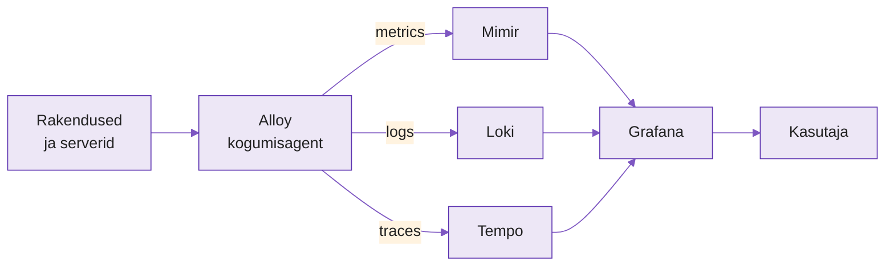

---
tags:
  - Grafana
  - LGTM
  - Observability
  - Loki
  - Tempo
  - Mimir
  - Alloy
---

# Grafana Stack — LGTM ja kogu ökosüsteem

## Miks see reader on olemas?

Kursuse käigus kohtud Grafana komponentidega tükkhaaval — Grafanaga Day 1, Lokiga Day 2, Tempo ja OpenTelemetryga Day 5. See lühike reader kogub nad kokku ühele lehele, et näeksid suurt pilti: **mis on LGTM stack, miks see eksisteerib, ja kuidas komponendid omavahel räägivad.**

Selleks ajaks, kui jõuad päev 5 juurde, on pool stackist sul juba selge. See leht aitab ülejäänud tükid paika panna.

---

## Kust see kõik tuli?

2014. Torkel Ödegaard töötab Stockholmis eBay-s ja on rahulolematu Kibana graafikutega — need on tehtud logide jaoks, mitte mõõdikute (metrics) jaoks. Ta lahendab oma probleemi nädalavahetustel: võtab Kibana, tõstab selle lahti, kirjutab metrics-esmase vaatajalhti. Ühel reedel avaldab GitHubis nime all **Grafana**.

Viikonna jooksul on esimene pull request sees. Kuu ajaga kasutab seda paar kümmend inimest. Aasta pärast on Grafana de facto dashboarding-tööriist kogu tööstuses.

**Grafana alati oli visualiseerija** — andmeid ta ise ei hoia. Ta küsib neid mujalt: Prometheusest, InfluxDB-st, Elasticsearchist, PostgreSQL-ist, suvalisest andmeallikast, millele on olemas plugin. See on Grafana superjõud: **sa ei pea vahetama oma andmelattu, et saada ilus UI**.

Aastatel 2018–2022 firma (Grafana Labs) mõistab, et ainult visualiseerijaks jäämine on ebamugav koht — Prometheus, Elastic, InfluxData kõik ehitavad oma UI-d. Grafana Labs teeb vastupidise liigutuse: **ehitab oma andmesalved**, mis on API-ühilduvad turuliidrite omadega.

- **Loki** (2018) — logidele, sarnaneb Elasticsearchile aga miljoneid kordi odavam
- **Tempo** (2020) — trace'idele, OpenTelemetry natiivne
- **Mimir** (2022) — metrics, Prometheus-API-ühilduv, kuid paremini skaleeruv

Neli komponenti — **L**oki + **G**rafana + **T**empo + **M**imir — moodustavad **LGTM stack**. Kõik on avatud lähtekoodiga (AGPLv3), kõik kirjutatud Go-s, kõik skaleeruvad horisontaalselt.

---

## Kolm signaalitüüpi ühes pildis

Observability raamistikus räägitakse **kolmest signaalitüübist** (three pillars of observability): metrics, logs, traces. Kui räägid süsteemi tervise eest, vajad kõiki kolme — ja LGTM stack on just selle ümber ehitatud:

<figure markdown="span">

  <figcaption>Joonis 1. LGTM stacki üldine andmevoog (Talvik, 2026). Loodud tehisintellekti abil.</figcaption>
</figure>

Loogika on lihtne: **üks agent kogub**, **kolm salve hoiavad**, **üks UI näitab**. Agent on Alloy (endine Grafana Agent), kolm salve on Mimir/Loki/Tempo, UI on Grafana.

---

## Komponendid lähemalt

### Grafana — UI ja häirete keskus

Grafana on see, millega kasutaja igapäevaselt suhtleb. Ta teeb kolme asja:

1. **Päringud andmeallikatele** — üle 100 ametliku plugini (Prometheus, Loki, Tempo, Mimir, Elasticsearch, InfluxDB, PostgreSQL, CloudWatch jt)
2. **Dashboarde** — graafikud, tabelid, stat-paneelid, kaardid
3. **Häired (alerts)** — reeglid "kui tingimus X, saada teade Y-le"; alates Grafana 10-st on see ühtne keskne alerting-süsteem, mis oskab päringut teha mistahes andmeallikale

Oluline punkt eksamiks: **Grafana ei hoia mõõdikuid ega logisid**. Kui Grafana kustub, dashboarde ja häireid kaotad (need on tema enda PostgreSQL-is või SQLite-is). Metrics, logs ja traces on turvalisena endiselt Mimiris, Lokis, Tempos.

### Loki — logid odavamalt

Loki on **logide salv**, mille põhiidee on sõnastatud Grafana Labs-i enda tootemoto's: *"Like Prometheus, but for logs."*

Kui Elasticsearch indekseerib kogu logisõnumi teksti (full-text search), siis Loki indekseerib **ainult silte (labels)** — nagu host, rakendus, keskkond. Sõnumi sisu ise pannakse tihendatud plokkidena kõvakettale või objektisalve (S3, MinIO).

Tulemus: **10–100× odavam kui Elasticsearch**, aga pead oskama labelid ette mõelda. Kui otsid "errorit sõnumi sees sõnaga `database`", Loki grepib — see töötab, aga aeglasem kui indekseeritud otsing.

Loki kasutab oma päringukeelt **LogQL**, mis süntaksilt sarnaneb PromQL-ile:

```logql
{app="nginx", env="prod"} |= "error" | json | status >= 500
```

Tõlge: "nginx-i prod-keskkonna logidest need, mis sisaldavad sõna error, parse JSON-ina, näita kus status ≥ 500."

### Tempo — distributed tracing

Tempo on **trace'ide salv**. Trace on üks konkreetne päring läbi mitme teenuse — klient teeb API-kutse, see läheb gateway kaudu auth-teenusele, sealt DB-sse, sealt tagasi. Iga samm on **span** (ajalõik ajatempliga), ja spanide kogum moodustab trace'i.

Kasutaja näeb Grafanas "ajaskaala" vaadet (Gantt-tüüpi graafik), kus on näha, mis samm võttis kui kaua ja kus aega kulus.

Tempo eristub kahes asjas:

- **OpenTelemetry-natiivne** — võtab vastu OTLP (OpenTelemetry Protocol), Jaegeri ja Zipkini formaate ilma konverteerimiseta
- **Ei indekseeri** — trace'id lähevad otse objektisalve (S3, GCS), otsing toimub trace ID järgi või Lokist/Mimirist tulevate linkide kaudu

See teeb Tempost ehedalt odava — säilitad miljoneid trace'e päevas ilma Elasticsearchi-maksuta. Vastutasu: **kui sa ei tea trace ID-d, pead leidma selle metrics- või log-päringu kaudu**. Grafana sisseehitatud "exemplars" ja "logs-to-traces" lingid lahendavad selle elegantselt.

### Mimir — Prometheus, aga skaalal

Mimir on Prometheuse **horisontaalselt skaleeruv** sõbruand. Prometheus ise on üks-serveri süsteem: ühes kastis on nii kogumine, salvestus kui päring. See töötab suurepäraselt kuni mingi suuruseni, aga kui sul on kümneid tuhandeid sihtmärke ja aastaid säilitusperioodi, tuleb mingi piir vastu.

Mimir lahendab selle mikroteenuste arhitektuuriga: eraldi komponendid kirjutamiseks (ingester), päringuks (querier), plaanimiseks (query-frontend), indekseerimiseks (store-gateway). Andmed lähevad S3-ühilduvasse objektisalve.

Oluline detail: **API on 100% Prometheuse-ühilduv**. Prometheus saab Mimirisse kirjutada `remote_write` kaudu, Grafana päringud on täpselt samasugused kui Prometheusele. Mimir sobib nii olemasolevate Prometheus-paigalduste laiendamiseks (jätad Prometheus paigale, lisad Mimiri pikaajaliseks säilitamiseks) kui ka täielikuks asenduseks.

### Alloy — üks agent kõigeks

Alloy on **kogumisagent**, mis asendab kolme vanemat tööriista: Grafana Agent (metrics), Promtail (logs Lokile), ja OpenTelemetry Collector. Üks binaary, üks konfifail, üks protsess kõigi kolme signaalitüübi jaoks.

Alloy oskab:

- Koguda metrics Prometheuse exporteritelt ja OTLP-st
- Koguda logisid failidest, journaldist, Dockerist, Kubernetese podidest
- Koguda trace'e OTLP, Jaegeri, Zipkini kujul
- Teha **enne saatmist töötlust** — labelite lisamine, filtreerimine, sämpling, relabel-reeglid

See on Grafana Labs-i vastus küsimusele "mitu agenti peab installima?" — vastus on üks.

---

## Kaks eri maailma: üks-kast vs hajutatud

Grafana komponendid (Loki, Tempo, Mimir) tulevad kõik **kahes paigaldusrežiimis**:

| Režiim | Kes kasutab | Omadused |
|---|---|---|
| **Monolithic** (üks kast) | Algajad, väikesed meeskonnad, õppelaborid | Üks konteiner, kõik moodulid sisemiselt. Lihtne seadistada, piiratud skaala. |
| **Microservices** (hajutatud) | Tööstus, SaaS-pakkujad | Iga moodul eraldi deployment. Horisontaalselt skaleeruv, vastupidav, aga keeruline. |

Meie laboris kasutame **monolithic** režiimi — õppeesmärgil. Tootmises Bolt, Veriff või Wise kasutaks microservices-paigaldust Kubernetesel.

---

## Kuidas see erineb teistest stackidest, mida õpid?

Kursuse jooksul näed nelja-viit erinevat monitooringu lähenemist. Siin on lühike orienteerumisjuhend:

| Stack | Fookus | Parim koht |
|---|---|---|
| Prometheus + Grafana | Metrics | Kubernetes, mikroteenused |
| Zabbix | Metrics + taristu monitooring | Klassikaline IT, serverid, võrgud |
| ELK / Elastic Stack | Logid + täistekstiotsing | Suuremahuline logianalüüs, SIEM |
| TICK Stack | Aegread (IoT, tööstus) | Sensorid, tootmine, DevOps |
| **LGTM Stack** | Kolm signaali (metrics + logs + traces) | Cloud-native, observability-esmane |

LGTM-i tugev külg on **ühtsus**: üks UI, üks agent, üks vendor. Nõrk külg on **noorus** — Tempo on 2020-st, Mimir 2022-st, Alloy 2024-st. Tööturul näed rohkem Prometheus+Grafana+Loki kombinatsiooni kui täielikku LGTM-i.

---

## Pordid ja protokollid (kiire meelespidamine)

Kui hakkad lab-is komponente käivitama, kohtad neid porte:

| Komponent | Vaikeport | Protokoll |
|---|---|---|
| Grafana UI | 3000 | HTTP |
| Loki API | 3100 | HTTP |
| Tempo OTLP gRPC | 4317 | gRPC |
| Tempo OTLP HTTP | 4318 | HTTP |
| Tempo Jaeger compatible | 14268 | HTTP |
| Mimir HTTP | 9009 | HTTP |
| Alloy UI | 12345 | HTTP |

4317 ja 4318 on OTLP **standard-portid** — iga OpenTelemetry-natiivne tööriist kuulab neid. Kui näed neid porte, tead kohe: tegemist on tracing- või telemeetria-liidesega.

---

## Kokkuvõte

LGTM stack on Grafana Labs-i terviklik lahendus observability'le: **L**oki logidele, **G**rafana visualiseerimisele, **T**empo trace'idele, **M**imir mõõdikutele. Alloy on ühtne kogumisagent kõigi kolme signaali jaoks. Iga komponent on eraldi kasutatav — sa võid võtta Loki ilma Tempota, Grafana ilma Mimirita — ja samas toimib tervikuna ilma integratsiooniprojektita.

Tööstuses on LGTM üks kolmest suurest valikust cloud-native observability jaoks (teised: Datadog kommertslahendusena, Elastic Observability). Eestis kasutavad seda täielikult või osaliselt näiteks Bolt, Wise, Pipedrive, Veriff.

Päev 5 laboris paneme Tempo ja Alloy tööle ning ühendame need Lokiga (mis on juba Day 2 käigus tuttav) ja Grafanaga (Day 1). Mimir'i kursuse raames ise ei käivita — vaatame seda kontseptuaalselt, sest Prometheus, mis Day 1-l paigaldasid, katab kursuse vajadused.

---

## Küsimused enesetestiks

1. Mille poolest erineb Grafana oma rollilt Prometheusest või Lokist?
2. Mida tähendab akronüüm LGTM ja mis on iga tähe taga?
3. Miks on Loki odavam kui Elasticsearch, kui mõlemad hoiavad logisid?
4. Mis on span ja mis on trace? Kuidas nad omavahel seotud on?
5. Miks on Tempo "odav", kui ta on trace-salv? Mis on selle kompromissi hind päringul?
6. Mis on Mimiri suhe Prometheuse-ga? Kas see asendab Prometheuse või täiendab?
7. Millise kolme vanema tööriista Alloy asendab?
8. Mis vahe on monolithic ja microservices paigaldusel? Kumma valid tootmises?
9. Nimeta kaks OTLP standard-porti ja kus neid kohtad.
10. Kui Grafana server kustub, mis andmed kaovad ja mis jäävad?
